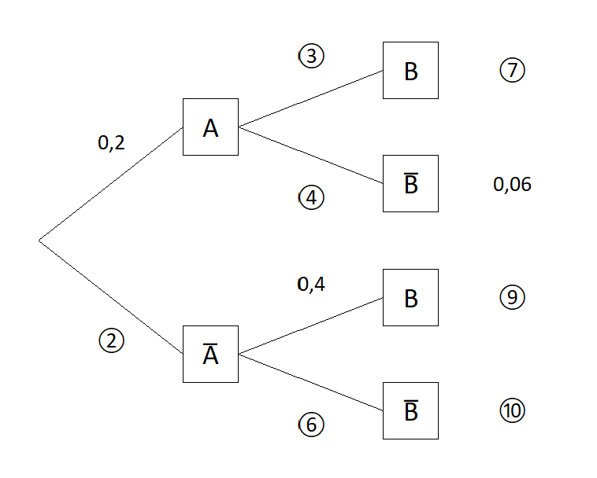
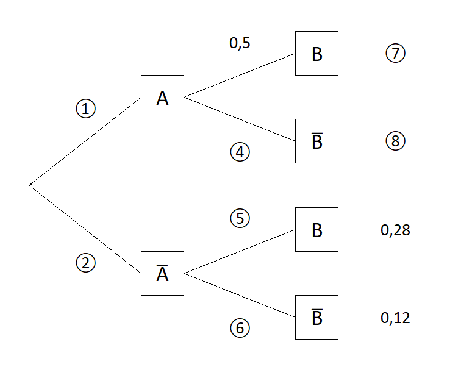
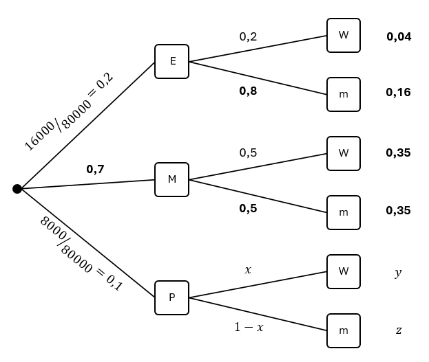
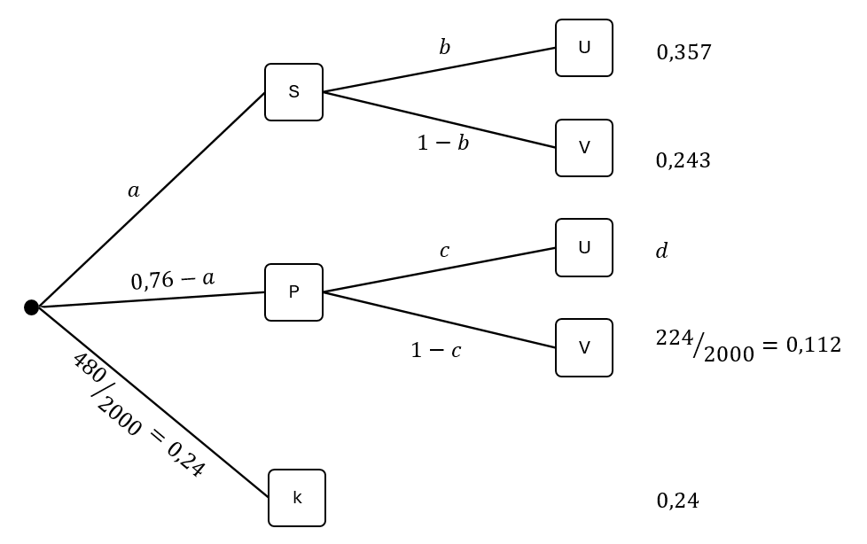

## Einführung

Wenn mehrere Zufallsexperimente nacheinander durchgeführt werden, sprechen wir von einem mehrstufigen Zufallsexperiment. Zur übersichtlichen Darstellung nutzen wir häufig Baumdiagramme. Für jede Stufe des Zufallsexperiments werden die Ergebnisse des einzelnen Zufallsexperiments als Knotenpunkte dargestellt. Die Stufen werden dann durch Pfade miteinander verbunden. Ein Ergebnis des mehrstufigen Zufallsexperiments entspricht dann einem vollständigen Pfad im Baumdiagramm. An den einzelnen Pfaden stehen die entsprechenden Wahrscheinlichkeiten. Es gibt zwei wichtige Regeln:

- **Pfadmultiplikationsregel:** Die Wahrscheinlichkeit eines Ergebnisses ist das Produkt der Wahrscheinlichkeiten entlang des entsprechenden Pfades.
- **Pfadadditionsregel:** Die Wahrscheinlichkeit eines Ereignisses ist die Summe der Wahrscheinlichkeiten der Ergebnisse, die zu diesem Ereignis führen.

Da generell die Summe aller Wahrscheinlichkeiten eines Zufallsexperiments immer gleich 1 ist, ist auch die Summe der Wahrscheinlichkeiten aller Pfade, die von einem Knotenpunkt starten, gleich 1. Ebenso ist auch die Summe der Endwahrscheinlichkeiten gleich 1.

### Beispiel: Zweimaliger Münzwurf

Kopf ($K$) und Zahl ($Z$) treten bei einem einmaligen Wurf beide mit einer Wahrscheinlichkeit von 50&nbsp;% auf. Daraus ergibt sich folgendes Baumdiagramm:



Nach der Pfadmultiplikationsregel haben wir jede Endwahrscheinlichkeit mit $0{,}5\cdot 0{,}5=0{,}25$ berechnet.

Betrachten wir z.B. das Ereignis $E$: "Es wird zweimal das Gleiche geworfen.", so ist $E=\\{KK, ZZ\\}$, und nach der Pfadadditionsregel folgt nun

$$
\begin{align*}
P(E)&=P(\{KK\})+P(\{ZZ\})\\
&=0{,}25+0{,}25\\
&=0{,}5.
\end{align*}
$$

## Baumdiagramme vervollständigen

Häufig stehen wir vor der Aufgabe, ein unvollständiges Baumdiagramm zu vervollständigen. Dazu verwenden wir, dass die Summe der Wahrscheinlichkeiten der Pfade, die von einem Knotenpunkt starten, gleich 1 ist. Außerdem wenden wir die Pfadregeln geschickt an.









## Baumdiagramme interpretieren

Häufig liegt eine Situation vor, in der zwei Ereignisse $A$ und $B$ und deren Gegenereignisse auftreten. Zum Beispiel:

- $A$: Eine Person putzt sich regelmäßig die Zähne.
- $B$: Eine Person hat gesunde Zähne.

Das Baumdiagramm habe die Gestalt


Hinweise:

- Die Ergebnismenge ist $S=\\{AB, A\overline{B}, \overline{A}B, \overline{A}\overline{B}\\}$.
- Es gilt $A=\\{AB, A\overline{B}\\}$ und $B=\\{AB, \overline{A}B\\}$.
- Auf der ersten Stufe stehen die Wahrscheinlichkeiten von $A$ und $\overline{A}$: $P(A)=0{,}5$ und $P(\overline{A})=0{,}5$.
- Auf der zweiten Stufe stehen die Wahrscheinlichkeiten von $B$ und $\overline{B}$ **in Abhängigkeit** davon, ob $A$ eingetreten ist oder nicht (diese Wahrscheinlichkeiten sind im Allgemeinen nicht $P(B)$ und $P(\overline{B})$).
- Da $B=\\{AB, \overline{A}B\\}$ haben wir $P(B)=0{,}2+0{,}05=0{,}25$. Die Wahrscheinlichkeit, dass eine Person gesunde Zähne hat, beträgt also 25&nbsp;%.
- "$\cap$-Ereignisse": Wegen $A\cap B=\\{AB\\}$ etc. entspricht jeder Pfad genau dem entsprechenden "$\cap$-Ereignis". Dann folgt $P(A\cap B)=0{,}2$. Die Wahrscheinlichkeit, dass eine Person sich regelmäßig die Zähne putzt und gesunde Zähne hat, beträgt also 20&nbsp;%.
- "$\cup$-Ereignisse": Wegen $\overline{A}\cup B=\\{AB, \overline{A}B, \overline{A}\overline{B}\\}$ etc. gehören zu jedem "$\cup$-Ereignis" immer genau drei Pfade. Dann folgt

  $$
  \begin{align*}
  P(\overline{A}\cup B)&=P(\{AB\}) + P(\{\overline{A}B\}) + P(\{\overline{A}\overline{B}\})\\
  &=0{,}2+0,05+0{,}45\\
  &=0{,}7.
  \end{align*}
  $$

  Die Wahrscheinlichkeit, dass eine Person sich nicht regelmäßig die Zähne putzt oder gesunde Zähne hat, beträgt also 70&nbsp;%.

{% include info.html
index="4"
frage="Bestimmung von Wahrscheinlichkeiten anhand eines Baumdiagramms (1. Stufe A und 2. Stufe B):
"
antwort="

$$
\begin{align*}
P(A)&: \text{entsprechnde Wkt. auf der 1. Stufe}\\
P(B)&: \text{Achtung: Diese Wahrscheinlchkeit kann nicht direkt abgelesen werden (wenn $A$ und $B$ stochastisch abhängig sind). Stattdessen verwenden wir $P(B)=P(A\cap B)+P(\overline{A}\cap B)$.}\\
P(A\cup B)&: \text{Summe der drei entsprechenden Pfadendwahrscheinlichkeiten}\\
P(A\cap B)&: \text{entsprechende Pfadendwahrscheinlichkeit}\\
P(A\cup B)-P(A\cap B) \text{ oder } P(A\cap\overline{B})+P(\overline{A}\cap B)&: \text{Summe der zwei entsprechenden Pfadendwahrscheinlichkeiten}\\
\end{align*}
$$

"
%}

## Weitere Baumdigramme

Baumdiagramme eignen sich auch dazu, komplexere Zufallsexperimente zu veranschaulichen. Wichtig ist, den Text gründlich zu lesen, um die Struktur des Zufallsexperiments zu verstehen. Dann können wir das Baumdiagramm zeichnen, die im Text gegebenen Wahrscheinlichkeiten notieren und schließlich die Pfadregeln anwenden.

{%include info.html
index="5"
frage="Für eine statistische Untersuchung wurden in einem großen Elektronikfachmarkt Aufzeichnungen über die Verkäufe von Laptops mit Windows (W)- bzw. macOS (m)-Betriebssystem geführt. Zusätzlich wurden drei Gerätekategorien erfasst: Einsteigergeräte (E), Mittelklassegeräte (M) und Premiumgeräte (P). Von den Einsteigergeräten liefen ein Fünftel und von den Mittelklassegeräten die Hälfe mit Windows. Von den insgesamt 80.000 erfassten Laptops waren 45 % mit Windows ausgestattet, es wurden 16.000 Einsteigergeräte und 8.000 Premiumgeräte verkauft. Wie sieht das Baumdiagramm aus?"
antwort="
Zunächst erstellen wir das Baumdiagramm und tragen die gegebenen Wahrscheinlichkeiten ein:

  <figure>
    
 </figure>

### Welchen Wert hat $y$ ?

Da insgesamt 45 % der Laptops mit Windows ausgestattet sind, gilt
$$
0{,}04+0{,}35+y=0{,}45 \Rightarrow y=0{,}06.
$$

### Welchen Wert hat $x$ ?

Die Multiplikationsregel auf den $PW$-Pfad angewendet ergibt
$$
0{,}1\cdot x = 0{,}06 \Rightarrow x=0{,}6.
$$

### Welchen Wert hat $z$ ?
Die Multiplikationsregel auf den $Pm$-Pfad angewendet ergibt
$$
z=0{,}1\cdot (1-0{,}6)=0{,}04.
$$
            
Nun können wir Wahrscheinlichkeiten im Sachzusammenhang berechnen. Zum Beispiel die Wahrscheinlichkeit, des Ereignisses $E$, dass ein zufällig ausgewählter Laptop mit Windows läuft:
  
$$
\begin{align*}
  P(E)&=P(\{EW\})+P(\{Em\})+P(\{Mm\})+P(\{Pm\})\\
  &=0{,}04+0{,}16+0{,}35+0{,}04\\
  &=0{,}59
\end{align*}
$$

"
%}

{%include info.html
index="6"
frage="Was halten Jugendliche von Lern-Apps? Zu dieser Frage wurde eine Befragung unter 2.000 Schülerinnen und Schülern durchgeführt. 35,7&nbsp;% der Befragten nutzen kostenlose Starter-Versionen (S) von Lern-Apps zur Unterhaltung (U), beispielsweise für Quizspiele. 24,3&nbsp;% verwenden Starter-Versionen gezielt zur Vorbereitung auf Prüfungen (V). 224 Jugendliche nutzen kostenpflichtige Pro-Versionen (P) zur gezielten Vorbereitung auf Prüfungen. Darüber hinaus gibt es auch einige Jugendliche mit Pro-Versionen, die die App lediglich zur Unterhaltung nutzen. 480 Befragten haben bislang noch keine Lern-App (k) verwendet. Wie sieht das Baumdiagramm aus? "
antwort="
Zunächst erstellen wir das Baumdiagramm und tragen die gegebenen Wahrscheinlichkeiten ein:

  <figure>
    
 </figure>

### Welchen Wert hat $d$ ?

Da die Summe aller Pfadenwahrscheinlichkeiten 1 ergeben muss, haben wir
$$
d=1-0{,}357-0{,}243-0{,}112-0{,}24=0{,}048.
$$

### Welchen Wert hat $a$ ?

Die Pfadadditionsregel auf den $SU$- und  $SV$-Pfad angewendet ergibt
$$
a=0{,}357+0{,}243=0{,}6. 
$$

### Welchen Wert hat $b$ ?
Die Multiplikationsregel auf den $SU$-Pfad angewendet ergibt
$$
0{,}6\cdot b=0{,}357 \Rightarrow b=0{,}595.
$$

### Welchen Wert hat $c$ ?

Die Multiplikationsregel auf den $PU$-Pfad angewendet ergibt
$$
(0{,}76-0{,}6)\cdot c=0{,}048 \Rightarrow c=0{,}3.
$$
  
$$
\begin{align*}
  P(E)&=P(\{EW\})+P(\{Em\})+P(\{Mm\})+P(\{Pm\})\\
  &=0{,}04+0{,}16+0{,}35+0{,}04\\
  &=0{,}59
\end{align*}
$$

Nun können wir Wahrscheinlichkeiten im Sachzusammenhang berechnen. Zum Beispiel die Wahrscheinlichkeit, des Ereignisses $E$, dass ein zufällig ausgewählter Schüler eine Lern-App zur Unterhaltung nutzt:
$$
\begin{align*}
  P(F)&=P(\{SU\})+P(\{PU\})\\
  &=0{,}357+0{,}048\\
  &=0{,}405
\end{align*}
$$
"
%}

<!--### Urnenmodelle
Ein wichtiges Beipsiel für mehrstufige Zufallsexperimente sind das Ziehen von Kugeln aus einer Urne. Hier müssen wir unterscheiden, ob Kugeln zurückgegelgt werden oder nicht.

#### Beispiel: Ziehen mit Zurücklegen
In einer Urne

und dann ein alltägliches zufallsexpeirment, das als urnenmodell interpretiert werden kann

-->
