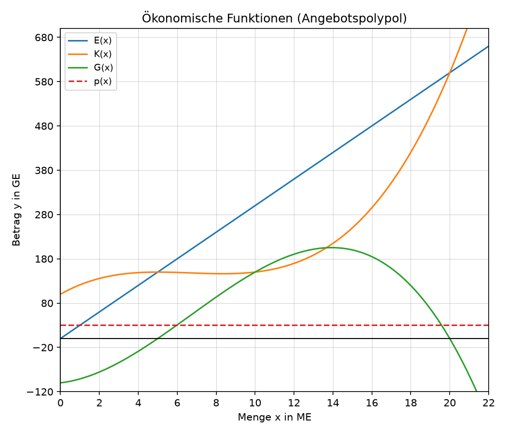
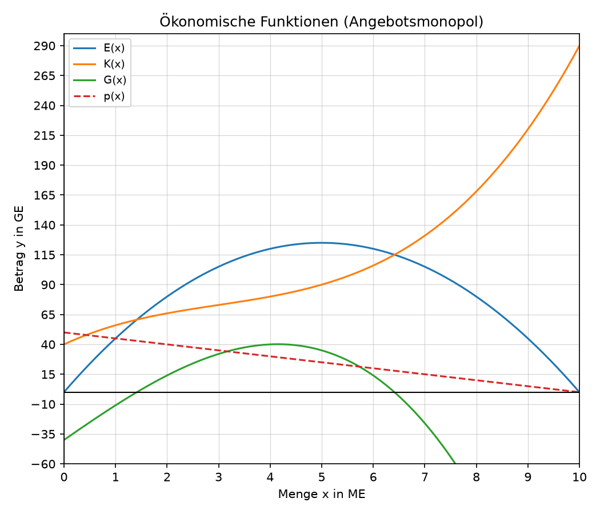
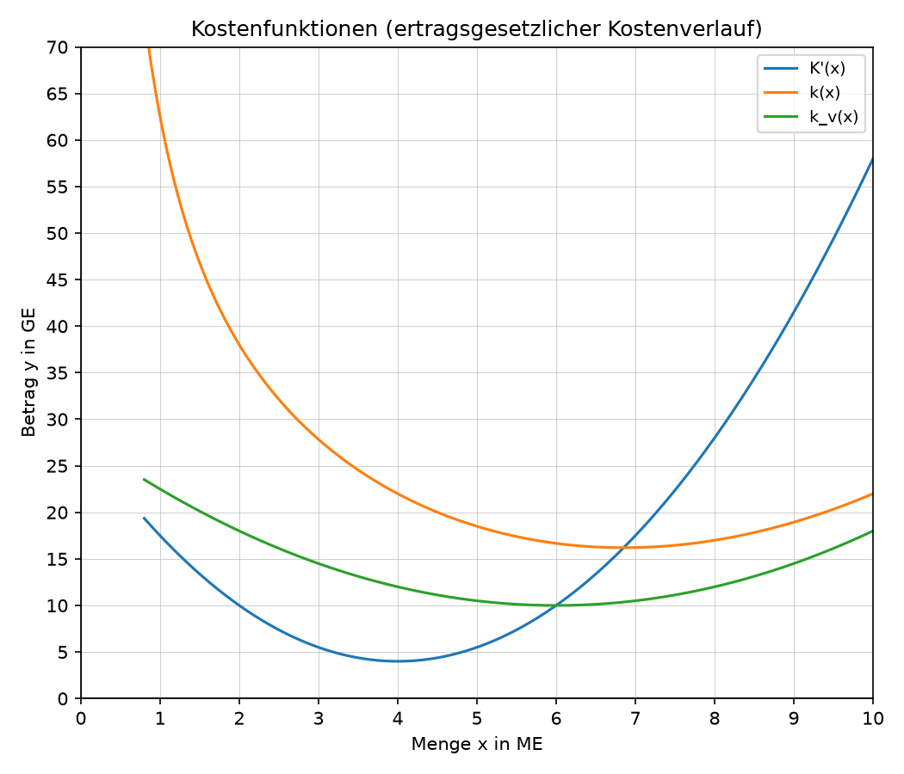

# Aufgaben

## Aufgabe 1

Die Frischkost Sonntal GmbH verkauft in einer ihrer Betriebsstätten Bio-Apfelsaft auf einem Markt mit vollständiger Konkurrenz (Angebotspolypol) zum Marktpreis $p=44$ GE/ME. Die Kostenfunktion lautet

$$
K(x)=0{,}25x^3-6x^2+40x+96 \quad (\text{in GE, } x \text{ in ME}).
$$

Die Kapazitätsgrenze der Anlage liegt bei 30 ME.

a) Bestimmen Sie die Erlösfunktion $E(x)$ und die Gewinnfunktion $G(x)$. \punkte{2}

b) Berechnen Sie den Übergang vom degressiven zum progressiven Kostenwachstum. \punkte{5}

c) Begründen Sie, warum die erlösmaximale Menge mit der Kapazitätsgrenze übereinstimmt. \punkte{2}

c) Berechnen Sie die Gewinnschwelle und die Gewinngrenze. \punkte{2}

\newpage

## Aufgabe 2

Eine zweite Betriebsstätte der Frischkost Sonntal GmbH stellt Bio-Kartoffeln her, die ebenfalls auf einem Polypolmarkt zum Marktpreis $p=30$ GE/ME verkauft werden; die Kapazitätsgrenze liegt bei 22 ME. Das folgende Diagramm zeigt die Erlös-, Kosten-, Gewinn- und Preisfunktion.

{width=70%}

a) Geben Sie den Marktpreis und die Fixkosten an. \punkte{2}

b) Lesen Sie den Übergang vom degressiven zum progressiven Kostenwachstum sowie die Gewinnschwelle und die Gewinngrenze ab. \punkte{3}

c) Lesen Sie die gewinnmaximale Menge und den maximalen Gewinn ab. \punkte{3}

\newpage

## Aufgabe 3

Mit dem patentierten Fruchtgummi „Sonntaler" ist die Frischkost Sonntal GmbH alleinige Anbieterin auf dem Markt (Angebotsmonopol). Die Preis-Absatz-Funktion lautet $p(x)=-3x+54$, die Kostenfunktion

$$
K(x)=0{,}3x^3-4{,}5x^2+30x+60 \quad (\text{in GE, } x \text{ in ME}).
$$

a) Bestimmen Sie die Erlösfunktion $E(x)$ und die Gewinnfunktion $G(x)$. \punkte{3}

b) Berechnen Sie den Höchstpreis, die Sättigungsmenge, die erlösmaximale Menge und den maximalen Erlös. \punkte{6}

c) Berechnen Sie die gewinnmaximale Menge, den maximalen Gewinn und den gewinnmaximalen Preis. \punkte{5}

\newpage

## Aufgabe 4

Mit dem Energieriegel „SonntalPower" bringt die Frischkost Sonntal GmbH ein zweites patentiertes Produkt auf den Markt (Angebotsmonopol) mit der Preis-Absatz-Funktion $p(x)=-5x+50$. Das Diagramm zeigt die zugehörige Erlös-, Kosten-, Gewinn- und Preisfunktion.

{width=70%}

a) Lesen Sie den Höchstpreis, die Sättigungsmenge, die erlösmaximale Menge und den maximalen Erlös ab. \punkte{3}

b) Lesen Sie die Fixkosten und den Übergang vom degressiven zum progressiven Kostenwachstum ab. \punkte{2}

c) Lesen Sie die Gewinnschwelle, die Gewinngrenze, die gewinnmaximale Menge, den maximalen Gewinn sowie den gewinnmaximalen Preis (Cournotscher Punkt) ab. \punkte{4}

\newpage

## Aufgabe 5

Die Controlling-Abteilung der Frischkost Sonntal GmbH prüft vier mögliche Kostenfunktionen (jeweils in GE, $x$ in ME) für geplante neue Produktionslinien auf einen ertragsgesetzlichen Verlauf.

a) $K_1(x)=5x^2+20x+40$ \punkte{1}

b) $K_2(x)=0{,}3x^3-6x^2+20x+50$ \punkte{2}

c) $K_3(x)=0{,}4x^3+3x^2+10x+40$ \punkte{2}

d) $K_4(x)=0{,}5x^3-6x^2+28x+36$ \punkte{3}

\newpage

## Aufgabe 6

Die Produktionsanlage für Bio-Apfelsaft der Frischkost Sonntal GmbH hat die Kostenfunktion

$$
K(x)=0{,}4x^3-7{,}2x^2+54x+90 \quad (\text{in GE, } x \text{ in ME}).
$$

a) Berechnen Sie den Übergang vom degressiven zum progressiven Kostenwachstum. \punkte{2}

b) Berechnen Sie das Betriebsminimum und die kurzfristige Preisuntergrenze. \punkte{3}

c) Berechnen Sie das Betriebsoptimum und die langfristige Preisuntergrenze. \punkte{3}

\newpage

## Aufgabe 7

Das folgende Diagramm zeigt die Grenzkosten-, Stückkosten- und variable Stückkostenfunktion der Produktionsanlage für Kartoffelchips der Frischkost Sonntal GmbH, die ebenfalls einen ertragsgesetzlichen Kostenverlauf aufweist.

{width=70%}

a) Lesen Sie den Übergang vom degressiven zum progressiven Kostenwachstum ab. \punkte{1}

b) Lesen Sie das Betriebsminimum und die kurzfristige Preisuntergrenze ab. \punkte{2}

c) Lesen Sie das Betriebsoptimum und die langfristige Preisuntergrenze ab. \punkte{2}

\newpage

# Lösungen

## Aufgabe 1

a) $E(x)=44x$

   $G(x)=E(x)-K(x)=-0{,}25x^3+6x^2+4x-96$

b) Fixkosten: $K(0)=96$ GE.

   Übergang: $K''(x)=1{,}5x-12=0 \Rightarrow x=8$ ME ($K'''(8)=1{,}5>0$).

   Gewinnschwelle/-grenze: $G(x)=0 \Rightarrow x=4$ ME bzw. $x=24$ ME.

   Gewinnmaximale Menge: $G'(x)=-0{,}75x^2+12x+4=0 \Rightarrow x\approx16{,}33$ ME ($G''(16{,}33)<0$), maximaler Gewinn $G(16{,}33)\approx480{,}66$ GE.

   Maximaler Erlös: Erlösmaximale Menge = Kapazitätsgrenze (E monoton wachsend im Polypol), $E(30)=1320$ GE.

## Aufgabe 2

a) Marktpreis $p=30$ GE/ME; Fixkosten $K(0)=100$ GE.

b) Übergang bei $x\approx6{,}67$ ME; Gewinnschwelle bei $x=5$ ME; Gewinngrenze bei $x=20$ ME.

c) Gewinnmaximale Menge bei $x\approx13{,}93$ ME, maximaler Gewinn $\approx205{,}22$ GE.

## Aufgabe 3

a) $E(x)=p(x)\cdot x=-3x^2+54x$

   $G(x)=E(x)-K(x)=-0{,}3x^3+1{,}5x^2+24x-60$

b) Höchstpreis $p(0)=54$ GE; Sättigungsmenge: $p(x)=0 \Rightarrow x=18$ ME.

   Erlösmaximale Menge: $E'(x)=-6x+54=0 \Rightarrow x=9$ ME ($E''(9)=-6<0$), maximaler Erlös $E(9)=243$ GE.

c) Gewinnschwelle $x\approx2{,}32$ ME, Gewinngrenze $x\approx10{,}72$ ME (Nullstellen von $G(x)$).

   Gewinnmaximale Menge: $G'(x)=0 \Rightarrow x\approx7{,}09$ ME ($G''(7{,}09)<0$), maximaler Gewinn $G(7{,}09)\approx78{,}64$ GE, gewinnmaximaler Preis $p(7{,}09)\approx32{,}72$ GE.

## Aufgabe 4

a) Höchstpreis $p=50$ GE; Sättigungsmenge $x=10$ ME; erlösmaximale Menge $x=5$ ME, maximaler Erlös $E(5)=125$ GE.

b) Fixkosten $K(0)=40$ GE; Übergang bei $x=3$ ME.

c) Gewinnschwelle $x\approx1{,}41$ ME, Gewinngrenze $x\approx6{,}41$ ME, gewinnmaximale Menge $x\approx4{,}15$ ME, maximaler Gewinn $\approx40{,}15$ GE, gewinnmaximaler Preis $\approx29{,}24$ GE (Cournotscher Punkt $C(4{,}15\mid29{,}24)$).

## Aufgabe 5

a) $K_1(x)=5x^2+20x+40$: keine Funktion dritten Grades. 👉 nicht-ertragsgesetzlich.

b) $K_2(x)=0{,}3x^3-6x^2+20x+50$: $K_2'(x)=0{,}9x^2-12x+20=0 \Rightarrow x\approx1{,}95$ und $x\approx11{,}38$. Es existieren Extremstellen, die Funktion ist also nicht monoton wachsend. 👉 nicht-ertragsgesetzlich.

c) $K_3(x)=0{,}4x^3+3x^2+10x+40$: $K_3'(x)=1{,}2x^2+6x+10$ hat keine reellen Nullstellen (Diskriminante $<0$), die Funktion ist monoton wachsend und $K_3(0)=40>0$. Die Wendestelle liegt bei $K_3''(x)=2{,}4x+6=0 \Rightarrow x=-2{,}5$, also negativ. 👉 nicht-ertragsgesetzlich.

d) $K_4(x)=0{,}5x^3-6x^2+28x+36$: ganzrational dritten Grades ✔️, $K_4(0)=36>0$ ✔️, $K_4'(x)=1{,}5x^2-12x+28$ hat keine reellen Nullstellen (Diskriminante $<0$), also monoton wachsend ✔️, Wendestelle $K_4''(x)=3x-12=0 \Rightarrow x=4>0$ ✔️. Alle Kriterien erfüllt. 👉 ertragsgesetzlich.

## Aufgabe 6

a) $K''(x)=2{,}4x-14{,}4=0 \Rightarrow x=6$ ME ($K'''(6)=2{,}4>0$).

b) $k_v(x)=0{,}4x^2-7{,}2x+54$, $k_v'(x)=0{,}8x-7{,}2=0 \Rightarrow x=9$ ME ($k_v''(9)=0{,}8>0$). Kurzfristige Preisuntergrenze: $k_v(9)=21{,}6$ GE/ME.

c) $k(x)=0{,}4x^2-7{,}2x+54+\frac{90}{x}$, $k'(x)=0{,}8x-7{,}2-\frac{90}{x^2}=0 \Rightarrow x\approx10{,}10$ ME. Langfristige Preisuntergrenze: $k(10{,}10)\approx30{,}99$ GE/ME.

## Aufgabe 7

a) Übergang bei $x=4$ ME.

b) Betriebsminimum bei $x=6$ ME, kurzfristige Preisuntergrenze $10$ GE/ME.

c) Betriebsoptimum bei $x\approx6{,}85$ ME, langfristige Preisuntergrenze $\approx16{,}20$ GE/ME.
