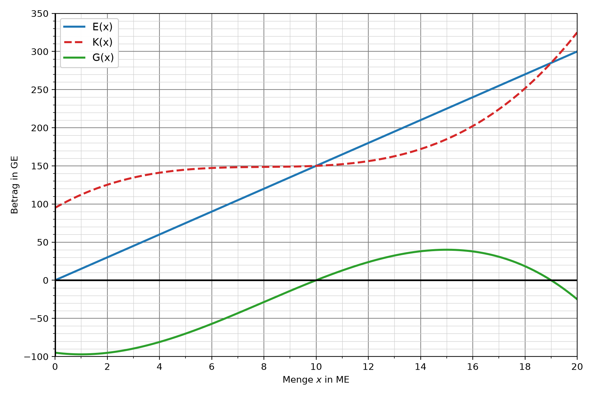
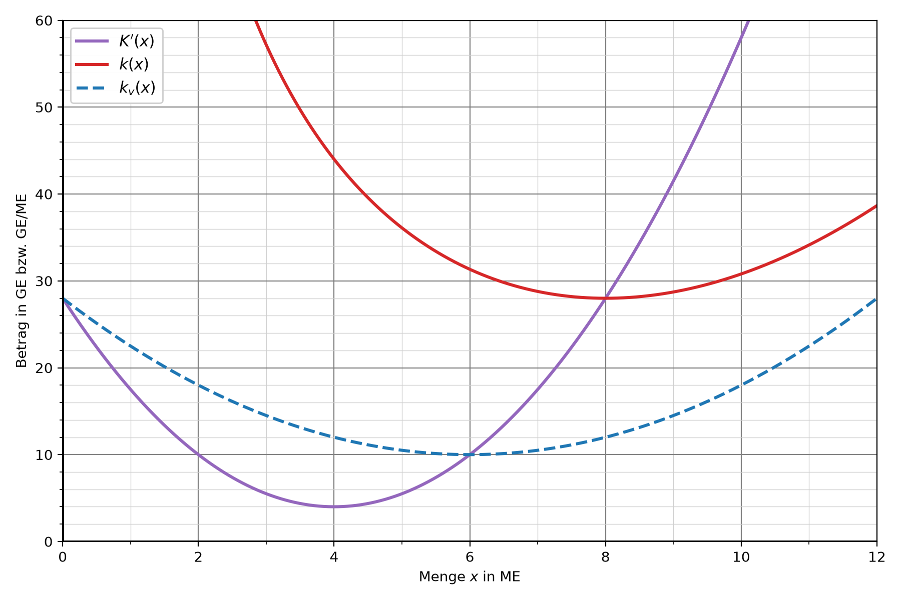

# Teil A (ohne Hilfsmittel)

Die **Nordlicht Möbelwerk GmbH** stellt Möbel verschiedener Serien her. In allen Aufgaben bezeichnet ME die Mengeneinheit und GE die Geldeinheit.

\newpage

## Aufgabe 1

Der Stuhl „Lina“ wird auf einem Markt mit vielen Anbietern verkauft (Angebotspolypol). Die Kapazitätsgrenze der Produktion liegt bei 18 ME. Das Diagramm zeigt die Erlösfunktion $E$, die Kostenfunktion $K$ und die Gewinnfunktion $G$.

{width=80%}

a) Bestimmen Sie den Marktpreis (in GE pro ME) und die Fixkosten. \punkte{2}

b) Bestimmen Sie die Gewinnschwelle und die Gewinngrenze. \punkte{2}

c) Bestimmen Sie den maximalen Erlös und begründen Sie, warum er im Angebotspolypol an der Kapazitätsgrenze erreicht wird. \punkte{3}

\newpage

## Aufgabe 2

Der patentierte Designsessel „Aurora“ wird von der Nordlicht Möbelwerk GmbH als Monopolist angeboten (Angebotsmonopol). Das Diagramm zeigt die Preis-Absatz-Funktion $p$, die Erlösfunktion $E$, die Kostenfunktion $K$ und die Gewinnfunktion $G$.

{width=80%}

a) Geben Sie den Höchstpreis und die Sättigungsmenge an. \punkte{2}

b) Geben Sie die erlösmaximale Menge und den maximalen Erlös an. \punkte{2}

c) Geben Sie die Koordinaten des Cournotschen Punkts an und interpretieren Sie seine Koordinaten im Sachzusammenhang. \punkte{3}

\newpage

## Aufgabe 3

Für das Regal „Modul“ ist das folgende Diagramm der Grenzkostenfunktion $K'$, der Stückkostenfunktion $k$ und der variablen Stückkostenfunktion $k_v$ gegeben. Die Kostenfunktion $K$ ist ertragsgesetzlich.

{width=80%}

a) Bestimmen Sie das Betriebsminimum und die kurzfristige Preisuntergrenze. \punkte{2}

b) Bestimmen Sie das Betriebsoptimum und die langfristige Preisuntergrenze. \punkte{2}

c) Begründen Sie allgemein, warum die langfristige Preisuntergrenze größer ist als die kurzfristige Preisuntergrenze. \punkte{2}

\newpage

# Teil B (mit Hilfsmitteln)

## Aufgabe 4

Die Nordlicht Möbelwerk GmbH plant weitere Modelle.

a) Der Esstisch „Fjord“ wird zu einem Marktpreis von 30 GE pro ME verkauft (Angebotspolypol). Die Gewinnfunktion lautet
$$G(x)=-0{,}25x^3+4x^2+6x-70.$$
Berechnen Sie die Erlösfunktion $E$ und die Kostenfunktion $K$. \punkte{3}

b) Der patentierte Bürostuhl „Ergo“ wird als Monopolist angeboten (Angebotsmonopol). Die Kostenfunktion und die Gewinnfunktion lauten
$$K(x)=0{,}1x^3-1{,}5x^2+20x+50,\qquad G(x)=-0{,}1x^3-0{,}5x^2+20x-50.$$
Berechnen Sie die Erlösfunktion $E$ und die Preis-Absatz-Funktion $p$. \punkte{3}

\newpage

## Aufgabe 5

Für das Sofa „Relax“ schlägt das Controlling folgende Kostenfunktion vor:
$$K(x)=0{,}5x^3-6x^2+18x+80$$

a) Untersuchen Sie rechnerisch, ob $K$ einen ertragsgesetzlichen Kostenverlauf besitzt. Prüfen Sie dazu alle relevanten Kriterien. \punkte{7}

\newpage

## Aufgabe 6

Der Schrank „Premium“ mit patentiertem Beschlagsystem wird von der Nordlicht Möbelwerk GmbH als Monopolist angeboten (Angebotsmonopol). Die Erlös-Funktion und die Gewinnfunktion lauten
$$E(x)=-2x^2+48x,\qquad G(x)=-0{,}2x^3+0{,}9x^2+16{,}8x-50$$

a) Berechnen Sie die erlösmaximale Menge und den maximalen Erlös. \punkte{3}

b) Berechnen Sie die gewinnmaximale Menge und den gewinnmaximalen Preis. \punkte{4}

\newpage

## Aufgabe 7

Für die Gartenliege „Sonne“ ist die ertragsgesetzliche Kostenfunktion
$$K(x)=0{,}1x^3-1{,}8x^2+14x+120$$
gegeben.

a) Berechnen Sie das Betriebsoptimum und die langfristige Preisuntergrenze. \punkte{4}

b) Der Tiefpunkt der variablen Stückkostenfunktion lautet $T(9\mid 5{,}9)$. Als Verkaufspreis schlägt das Marketing 4 GE vor. Erläutern Sie, ob damit für die Gartenliege „Sonne“ langfristig die variablen und fixen Kosten gedeckt werden können. \punkte{4}

\newpage

# Lösungen

## Teil A

### Aufgabe 1

a) Marktpreis: Steigung von $E$, z. B. $E(10)=180$, also $p=\frac{180}{10}=18$ GE pro ME. Fixkosten ($y$-Achsenabschnitt von $K$): $K_f=75$ GE.

b) Gewinnschwelle (erste positive Nullstelle von $G$): $x_{GS}=5$ ME. Gewinngrenze (zweite positive Nullstelle von $G$): $x_{GG}=15$ ME.

c) Im Polypol ist der Preis konstant, also $E(x)=p\cdot x$ mit $p>0$: eine Gerade mit positiver Steigung. $E$ ist damit streng monoton wachsend und hat kein inneres Maximum. Der größte Erlös wird deshalb bei der größten herstellbaren Menge erreicht, also an der Kapazitätsgrenze von 18 ME: $E_{max}=E(18)=324$ GE.

### Aufgabe 2

a) Höchstpreis ($y$-Abschnitt von $p$): $p_H=50$ GE pro ME. Sättigungsmenge (Nullstelle von $p$): $s_m=20$ ME.

b) Hochpunkt von $E$: erlösmaximale Menge $x_{Emax}=10$ ME, maximaler Erlös $E_{max}=250$ GE.

c) Der Cournotsche Punkt liegt auf $p$ bei der gewinnmaximalen Menge (Hochpunkt von $G$ bei $x=8$): $C(8\mid30)$.

Interpretation: Bei einer Absatzmenge von 8 ME ist der Gewinn maximal (ca. 88 GE). Dazu verkauft die Nordlicht Möbelwerk GmbH den Sessel zum gewinnmaximalen Preis von 30 GE pro ME.

### Aufgabe 3

a) Betriebsminimum: Tiefpunkt von $k_v$ (bzw. Schnittstelle von $K'$ und $k_v$): $x_{BM}=6$ ME. Kurzfristige Preisuntergrenze: $k_v(6)=9$ GE pro ME.

b) Betriebsoptimum: Tiefpunkt von $k$ (bzw. Schnittstelle von $K'$ und $k$): $x_{BO}=10$ ME. Langfristige Preisuntergrenze: $k(10)=33$ GE pro ME.

c) Der Übergang liegt an der Wendestelle von $K$, also beim Tiefpunkt von $K'$: $x_W=4$ ME.

d) Es gilt $k(x)=\frac{K(x)}{x}=k_v(x)+\frac{K_f}{x}$ mit den Fixkosten $K_f>0$. Für $x>0$ ist $\frac{K_f}{x}>0$, also $k(x)>k_v(x)$ für alle $x>0$. Damit gilt insbesondere $\text{LPU}=k(x_{BO})>k_v(x_{BO})\geq k_v(x_{BM})=\text{KPU}$, die langfristige Preisuntergrenze ist also größer als die kurzfristige.

## Teil B

### Aufgabe 4

a) $E(x)=p\cdot x=30x$.

$$
\begin{align*}
K(x)&=E(x)-G(x)\\
&=30x-(-0{,}25x^3+4x^2+6x-70)\\
&=0{,}25x^3-4x^2+24x+70
\end{align*}
$$

b)

$$
\begin{align*}
E(x)&=G(x)+K(x)\\
&=-0{,}1x^3-0{,}5x^2+20x-50+0{,}1x^3-1{,}5x^2+20x+50\\
&=-2x^2+40x
\end{align*}
$$

$$
p(x)=\frac{E(x)}{x}=\frac{-2x^2+40x}{x}=-2x+40
$$

### Aufgabe 5

a) Funktionsart: $K$ ist ganzrational dritten Grades. Fixkosten: $K(0)=80>0$.

Monotonie: $K'(x)=1{,}5x^2-12x+18$.

$$
\begin{align*}
1{,}5x^2-12x+18&=0\quad|:1{,}5\\
x^2-8x+12&=0\quad|\text{ pq-Formel}\\
x_{1,2}&=4\pm\sqrt{16-12}=4\pm2\\
x_1&=2,\quad x_2=6
\end{align*}
$$

Der Term unter der Wurzel ist positiv, also gibt es zwei Extremstellen im ökonomischen Definitionsbereich. $K$ ist daher nicht monoton wachsend (z. B. $K'(3)=-4{,}5<0$, die Kosten würden zwischen 2 ME und 6 ME sinken).

Die Kostenfunktion besitzt also keinen ertragsgesetzlichen Verlauf.

### Aufgabe 6

a) $E'(x)=-4x+48$, $E''(x)=-4$.

$-4x+48=0\Rightarrow x=12$, $E''(12)=-4<0$ (Maximum). Die erlösmaximale Menge beträgt 12 ME.

$E_{max}=E(12)=-288+576=288$ GE.

b) $G'(x)=-0{,}6x^2+1{,}8x+16{,}8$, $G''(x)=-1{,}2x+1{,}8$.

$$
\begin{align*}
-0{,}6x^2+1{,}8x+16{,}8&=0\quad|:(-0{,}6)\\
x^2-3x-28&=0\quad|\text{ pq-Formel}\\
x_{1,2}&=1{,}5\pm\sqrt{2{,}25+28}=1{,}5\pm5{,}5\\
x_1&=7,\quad x_2=-4
\end{align*}
$$

$G''(7)=-6{,}6<0$ (Maximum). Die gewinnmaximale Menge beträgt 7 ME.

Gewinnmaximaler Preis: $p(7)=-2\cdot7+48=34$ GE pro ME.

### Aufgabe 7

a) Gesucht ist die Schnittstelle von $K'$ und $k$ (bzw. der Tiefpunkt von $k$).

$K'(x)=0{,}3x^2-3{,}6x+14$ und $k(x)=\frac{K(x)}{x}=0{,}1x^2-1{,}8x+14+\frac{120}{x}$.

$$
\begin{align*}
K'(x)&=k(x)\\
0{,}3x^2-3{,}6x+14&=0{,}1x^2-1{,}8x+14+\frac{120}{x}\quad|\cdot x\\
0{,}3x^3-3{,}6x^2+14x&=0{,}1x^3-1{,}8x^2+14x+120\quad|-0{,}1x^3+1{,}8x^2-14x-120\\
0{,}2x^3-1{,}8x^2-120&=0
\end{align*}
$$

Taschenrechner: $x\approx12{,}71$ (einzige reelle Lösung). Das Betriebsoptimum beträgt 12,71 ME.

Langfristige Preisuntergrenze: $k(12{,}71)=0{,}1\cdot12{,}71^2-1{,}8\cdot12{,}71+14+\frac{120}{12{,}71}\approx16{,}72$ GE pro ME.

b) Die kurzfristige Preisuntergrenze ist der $y$-Wert des Tiefpunkts von $k_v$: $KPU=5{,}9$ GE pro ME. Der vorgeschlagene Preis von 4 GE pro ME liegt darunter, also werden nicht einmal die variablen Kosten gedeckt, denn $k_v(x)\geq5{,}9>4$ für alle $x$. Die Aussage ist **falsch**: Mit 4 GE pro ME entsteht bei jeder Menge ein Verlust, der über die Fixkosten hinausgeht.

Auch langfristig ist der Preis zu niedrig: Wegen $k(x)>k_v(x)$ gilt $LPU=16{,}72>KPU=5{,}9>4$. Die variablen und die fixen Kosten sind nicht gedeckt.
