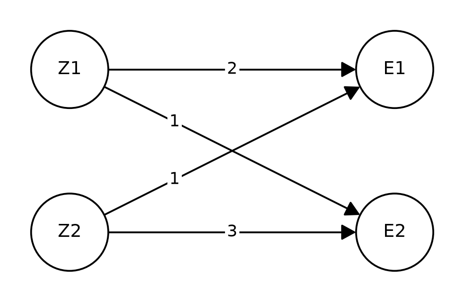
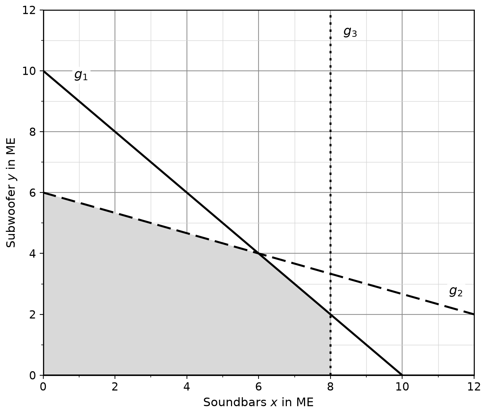
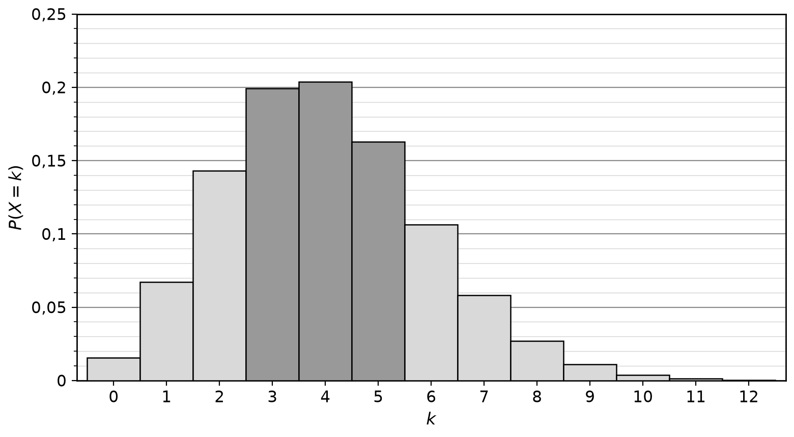
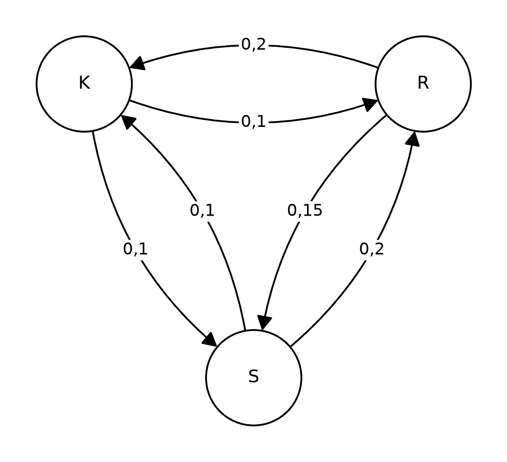
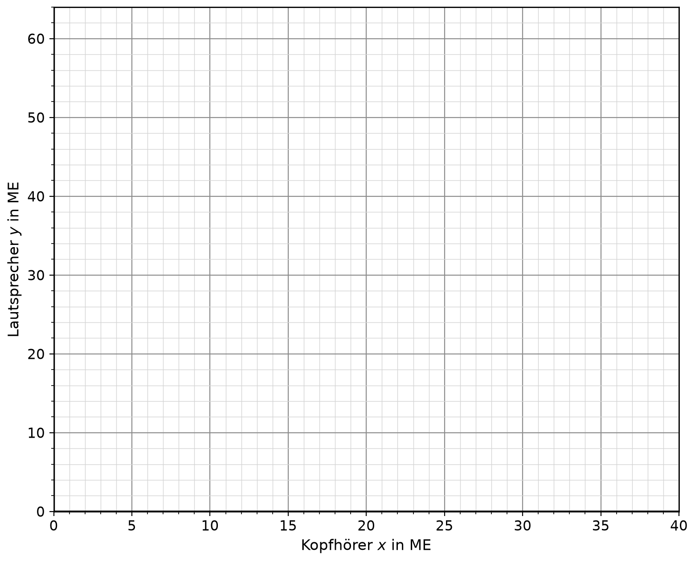

# Aufgaben

Die **Klangwerk GmbH** entwickelt und fertigt Audiotechnik: Bluetooth-Lautsprecher, Kopfhörer und Soundbars. In allen Aufgaben bezeichnet ME die Mengeneinheit und GE die Geldeinheit.

# Teil A (ohne Hilfsmittel)

Bearbeiten Sie die Pflichtaufgaben 1.1 bis 1.4 und zwei der vier Wahlaufgaben 1.5 bis 1.8.

## Aufgabe 1.1

Der Bluetooth-Lautsprecher „Pulse“ wird in vollständiger Konkurrenz zum Marktpreis angeboten. Die Gesamtkosten der Produktion beschreibt die ertragsgesetzliche Kostenfunktion $K$ mit

$$K(x)=x^3-6x^2+15x+32,\qquad x\ge 0.$$

Dabei ist $x$ die Produktionsmenge in ME und $K(x)$ die Gesamtkosten in GE.

a) Berechnen Sie das Betriebsminimum und die kurzfristige Preisuntergrenze. \punkte{3}

b) Der Marktpreis fällt auf 5 GE/ME. Ein Mitarbeiter schlägt vor, trotzdem weiter zu produzieren, denn „die Fixkosten fallen ohnehin an“. Beurteilen Sie diesen Vorschlag. \punkte{2}

\newpage

## Aufgabe 1.2

Der Umsatz des Kopfhörers „Echo“ nach der Markteinführung wird modelliert durch

$$u(t)=3t^2\cdot e^{-0{,}25t},\qquad t\ge 0.$$

Dabei ist $t$ die Zeit in Jahren seit der Markteinführung und $u(t)$ der Jahresumsatz in Mio. GE pro Jahr.

a) Bestätigen Sie, dass $u'(t)=(6t-0{,}75t^2)\cdot e^{-0{,}25t}$ gilt. \punkte{2}

b) Bestimmen Sie den Zeitpunkt des größten Jahresumsatzes und weisen Sie nach, dass es sich um ein Maximum handelt. \punkte{2}

c) Der Controller behauptet: „Der Umsatz mit Echo sinkt nie auf 0 GE, wird aber langfristig beliebig klein.“ Begründen Sie anhand des Funktionsterms, dass die Behauptung zutrifft. \punkte{1}

\newpage

## Aufgabe 1.3

Eine Marktstudie untersucht, welche Produkte die Kundschaft der Klangwerk GmbH besitzt. Ein zufällig ausgewählter Kunde besitzt mit einer Wahrscheinlichkeit von 0,45 Kopfhörer ($K$), mit einer Wahrscheinlichkeit von 0,30 einen Bluetooth-Lautsprecher ($L$) und mit einer Wahrscheinlichkeit von 0,12 beides.

a) Stellen Sie die Situation in einer Vierfeldertafel dar. \punkte{3}

b) Ein Kunde besitzt einen Lautsprecher. Berechnen Sie die Wahrscheinlichkeit, dass er auch Kopfhörer besitzt, und prüfen Sie damit, ob $K$ und $L$ stochastisch unabhängig sind. \punkte{2}

\newpage

## Aufgabe 1.4

Die Kopfhörer E1 und die Lautsprecher E2 werden zweistufig gefertigt: Aus den Rohstoffen R1 und R2 entstehen die Bauteile Z1 und Z2, aus diesen die Endprodukte E1 und E2.

Die Rohstoff-Bauteil-Matrix (Zeilen: Rohstoffe, Spalten: Bauteile) lautet

$$RZ=\begin{pmatrix}3&1\\2&2\end{pmatrix}.$$

Das Diagramm zeigt, wie viele ME der Bauteile für je 1 ME der Endprodukte benötigt werden.

{width=50%}

a) Geben Sie die Bauteil-Endprodukt-Matrix $ZE$ an und berechnen Sie die Rohstoff-Endprodukt-Matrix $RE$. \punkte{3}

b) Für einen Auftrag über 10 ME E1 und 20 ME E2 sollen zunächst die benötigten Bauteile und daraus die benötigten Rohstoffe bestimmt werden. Berechnen Sie die Mengen. \punkte{2}

\newpage

## Aufgabe 1.5 – Wahlaufgabe

Auf dem Markt für Soundbars gelten die Nachfragefunktion $p_N$ und die Angebotsfunktion $p_A$ mit

$$p_N(x)=27-x^2\qquad\text{und}\qquad p_A(x)=2x^2,\qquad x\ge 0.$$

Dabei ist $x$ die Menge in ME und $p_N(x)$ bzw. $p_A(x)$ der Preis in GE/ME.

a) Bestimmen Sie die Gleichgewichtsmenge und den Gleichgewichtspreis. \punkte{2}

b) Berechnen Sie die Produzentenrente im Marktgleichgewicht und erläutern Sie ihre Bedeutung im Sachzusammenhang. \punkte{3}

\newpage

## Aufgabe 1.6 – Wahlaufgabe

Die Zahl der Nutzer der Streaming-App „KlangCloud“ der Klangwerk GmbH wächst exponentiell und wird beschrieben durch

$$N(t)=a\cdot b^t,\qquad t\ge 0,\ a>0,\ b>1.$$

Dabei ist $t$ die Zeit in Jahren seit dem Start der App und $N(t)$ die Nutzerzahl in Tausend. Beim Start hatte die App 40 000 Nutzer, nach drei Jahren 320 000 Nutzer.

a) Bestimmen Sie $a$ und $b$. \punkte{3}

b) Ermitteln Sie, nach wie vielen Jahren die App 1,28 Mio. Nutzer hat. \punkte{2}

\newpage

## Aufgabe 1.7 – Wahlaufgabe

Bei der Fertigung einer neuen Lautsprecherserie weisen erfahrungsgemäß 20 % der Gehäuse einen Lackfehler auf. Es werden 25 Gehäuse zufällig geprüft. Die Zufallsgröße $X$ beschreibt die Anzahl der Gehäuse mit Lackfehler und ist binomialverteilt mit $n=25$ und $p=0{,}2$.

Für die Verteilungsfunktion $F(k)=P(X\le k)$ gilt:

| $k$ | 0 | 1 | 2 | 3 | 4 | 5 | 6 | 7 | 8 | 9 | 10 |
|---|---|---|---|---|---|---|---|---|---|---|---|
| $F(k)$ | 0,004 | 0,027 | 0,098 | 0,234 | 0,421 | 0,617 | 0,780 | 0,891 | 0,953 | 0,983 | 0,994 |

a) Berechnen Sie den Erwartungswert $\mu$ und die Standardabweichung $\sigma$ von $X$. \punkte{2}

b) Bestimmen Sie mithilfe der Tabelle die Wahrscheinlichkeit $P(\mu-\sigma\le X\le\mu+\sigma)$. Es gilt $\mu=5$ und $\sigma=2$. \punkte{3}

\newpage

## Aufgabe 1.8 – Wahlaufgabe

Die Klangwerk GmbH fertigt täglich $x$ ME Soundbars und $y$ ME Subwoofer. Die Abbildung zeigt den Planungsbereich (grau) mit den Randgeraden $g_1$, $g_2$ und $g_3$.

{width=60%}

a) Geben Sie die drei Ungleichungen an, die zusammen mit $x\ge 0$ und $y\ge 0$ den Planungsbereich beschreiben. \punkte{2}

b) Der Stückdeckungsbeitrag beträgt 30 GE/ME für Soundbars und 50 GE/ME für Subwoofer. Bestimmen Sie grafisch das Produktionsprogramm mit dem größten Gesamtdeckungsbeitrag und geben Sie diesen an. Zeichnen Sie dazu eine geeignete Zielfunktionsgerade in die Abbildung ein. \punkte{3}

\newpage

# Teil B (mit Hilfsmitteln)

## Aufgabe 2

Die Klangwerk GmbH untersucht Kosten, Umsatz und Preise ihrer Produkte.

Der Bluetooth-Lautsprecher „Pulse“ wird in vollständiger Konkurrenz zum Marktpreis angeboten. Die Kostensituation lässt sich durch eine ertragsgesetzliche Kostenfunktion $K$ dritten Grades beschreiben, für die gilt:

- Die Fixkosten betragen 36 GE.
- Die Grenzkosten sind bei einer Produktionsmenge von 4 ME am geringsten und betragen dort 3 GE/ME.
- Bei einer Produktion von 8 ME entstehen Gesamtkosten von 92 GE.

a) Bestimmen Sie die Gleichung der Kostenfunktion $K$. \punkte{4}

Im Folgenden gilt $K(x)=0{,}25x^3-3x^2+15x+36$ für $x\ge 0$ (Menge $x$ in ME, Kosten $K(x)$ in GE).

b) Berechnen Sie das Betriebsoptimum und die langfristige Preisuntergrenze. Erläutern Sie die Bedeutung der langfristigen Preisuntergrenze im Sachzusammenhang. \punkte{3}

c) Der Marktpreis beträgt derzeit 14 GE/ME. Bestimmen Sie die gewinnmaximale Menge und den maximalen Gewinn. Beurteilen Sie, ob dieser Marktpreis für die Klangwerk GmbH auf Dauer auskömmlich ist. \punkte{4}

Der Umsatz des Kopfhörers „Echo“ folgt einem Produktlebenszyklus. Er wird beschrieben durch

$$u(t)=(-2t^2+16t)\cdot e^{-0{,}25t},\qquad 0\le t\le 8.$$

Dabei ist $t$ die Zeit in Jahren seit der Markteinführung und $u(t)$ der Jahresumsatz in Mio. GE pro Jahr. Nach $t=8$ Jahren wird das Produkt vom Markt genommen ($u(8)=0$).

d) Bestimmen Sie den Zeitpunkt des größten Jahresumsatzes und die Höhe dieses Umsatzes. \punkte{3}

e) Die Marketingabteilung möchte wissen, wann der Jahresumsatz am stärksten zurückgeht. Bestimmen Sie diesen Zeitpunkt und geben Sie die zugehörige Veränderung des Jahresumsatzes mit Einheit an. \punkte{3}

f) Berechnen Sie den Gesamtumsatz während des gesamten Produktlebenszyklus und den Anteil, der auf die ersten drei Jahre entfällt. \punkte{3}

Die Soundbar „Aura“ ist patentiert; die Klangwerk GmbH ist hier Monopolist. Eine Marktstudie liefert folgende Zusammenhänge zwischen der Absatzmenge $x$ in ME und dem erzielbaren Preis $p$ in GE/ME:

| $x$ in ME | 1 | 2 | 3 | 4 | 6 | 8 |
|---|---|---|---|---|---|---|
| $p$ in GE/ME | 237 | 181 | 140 | 111 | 66 | 41 |

g) Bestimmen Sie mithilfe von Regression eine exponentielle und eine quadratische Preis-Absatz-Funktion. Beurteilen Sie, welche Funktion besser geeignet ist. Berücksichtigen Sie dabei das Bestimmtheitsmaß und die Prognose für $x=12$. \punkte{4}

Im Folgenden gilt $p(x)=300\cdot e^{-0{,}25x}$ und für die Kosten $K(x)=0{,}5x^3-3x^2+30x+120$ (jeweils $x\ge 0$).

h) Bestimmen Sie die gewinnmaximale Absatzmenge, den zugehörigen Preis und den maximalen Gewinn. \punkte{4}

i) Die Klangwerk GmbH verkauft 3,2 ME zum Preis $p(3{,}2)$. Berechnen Sie die Konsumentenrente. \punkte{2}

\newpage

## Aufgabe 3

Das Qualitätsmanagement der Klangwerk GmbH untersucht Beschaffung, Produktion und Prüfverfahren.

Für die Kopfhörer „Echo“ bezieht die Klangwerk GmbH die Akkus von zwei Lieferanten: 70 % der Akkus stammen von Lieferant A, 30 % von Lieferant B. Erfahrungsgemäß sind 2 % der Akkus von A und 5 % der Akkus von B defekt ($D$).

a) Stellen Sie die Situation in einem Baumdiagramm dar und berechnen Sie die Wahrscheinlichkeit, dass ein zufällig gewählter Akku defekt ist. \punkte{3}

b) Bei der Montage wird ein defekter Akku entdeckt. Berechnen Sie die Wahrscheinlichkeit, dass er von Lieferant B stammt, und vergleichen Sie diese mit dem Lieferanteil von B. \punkte{3}

c) Die Klangwerk GmbH möchte erreichen, dass insgesamt höchstens 2,5 % der gelieferten Akkus defekt sind. Die Ausfallquoten der Lieferanten ändern sich nicht. Bestimmen Sie, welchen Anteil der Akkus Lieferant B dann höchstens liefern darf. \punkte{3}

Bei den Bluetooth-Lautsprechern „Pulse“ haben 6 % der gefertigten Geräte einen Kopplungsfehler. Ein fehlerhaftes Gerät, das ausgeliefert wird, verursacht Kosten von 45 € (Austausch, Versand, Kundenservice). Die Klangwerk GmbH vergleicht zwei Varianten:

- Variante 1: Es gibt keine Endkontrolle.
- Variante 2: Jedes Gerät wird kontrolliert (3 € je Gerät). Ein vorhandener Fehler wird mit einer Wahrscheinlichkeit von 90 % erkannt; erkannte Fehler werden vor der Auslieferung für 12 € nachgearbeitet. Nicht erkannte Fehler verursachen wieder 45 €.

d) Die Zufallsgrößen $X_1$ und $X_2$ beschreiben die Kosten je Gerät in Variante 1 bzw. Variante 2. Geben Sie jeweils die Wahrscheinlichkeitsverteilung an, berechnen Sie die erwarteten Kosten je Gerät und empfehlen Sie eine Variante. \punkte{5}

e) Die variablen Herstellkosten betragen 62 € je Gerät. Der Verkaufspreis soll so kalkuliert werden, dass bei Variante 1 je Gerät im Mittel ein Gewinn von 18 € bleibt. Berechnen Sie den Verkaufspreis. \punkte{2}

f) Bestimmen Sie, ab welchem Anteil fehlerhafter Geräte die Endkontrolle (Variante 2) die erwarteten Kosten je Gerät gegenüber Variante 1 senkt. \punkte{2}

\newpage

Bei der Dichtigkeitsprüfung der Kopfhörer „Echo“ sind erfahrungsgemäß 8 % der Geräte undicht. Die Zufallsgröße $X$ beschreibt die Anzahl der undichten Geräte in einer Stichprobe und ist binomialverteilt.

g) Für eine Stichprobe von 50 Kopfhörern gilt: Berechnen Sie die Wahrscheinlichkeiten der folgenden Ereignisse.

- $E_1$: Genau vier Geräte sind undicht.
- $E_2$: Mindestens zwei, aber weniger als sechs Geräte sind undicht.
- $E_3$: Die dunklen Balken in der Abbildung. Zeigen Sie dazu, dass $E_3$ beschrieben werden kann durch „Die Anzahl der undichten Geräte weicht höchstens um eine Standardabweichung vom Erwartungswert ab“.

{width=75%}

\punkte{5}

h) Die Prüfung soll mit einer Wahrscheinlichkeit von mindestens 90 % mindestens ein undichtes Gerät entdecken. Ermitteln Sie den kleinsten dafür nötigen Stichprobenumfang $n$. \punkte{3}

i) Händler erhalten Lieferungen zu je 100 Kopfhörern. Die Klangwerk GmbH garantiert, dass sich in einer Lieferung mit einer Wahrscheinlichkeit von mindestens 90 % höchstens 5 undichte Geräte befinden. Bestimmen Sie die größte Fehlerwahrscheinlichkeit $p$, bei der diese Garantie erfüllt ist (in Prozent, auf zwei Nachkommastellen gerundet). Beurteilen Sie, ob die Garantie bei einer Fehlerquote von 3,5 % eingehalten wird. \punkte{4}

\newpage

## Aufgabe 4

Die Klangwerk GmbH betreibt den Streaming-Dienst „KlangCloud“ ($K$) und konkurriert mit den Anbietern „Rhythmo“ ($R$) und „Songnest“ ($S$). Die Kundschaft kann jährlich den Anbieter wechseln. Das Wechselverhalten ändert sich über die Jahre nicht.

Der Übergangsgraph zeigt die Wechselwahrscheinlichkeiten von einem zum nächsten Jahr. Die Wahrscheinlichkeiten, beim Anbieter zu bleiben, sind nicht eingezeichnet.

{width=55%}

a) Stellen Sie die Übergangsmatrix $M$ auf (Reihenfolge $K$, $R$, $S$; Spalten: von, Zeilen: nach). \punkte{3}

Im Folgenden gilt $\vec v_{\text{neu}}=M\cdot\vec v$ mit

$$M=\begin{pmatrix}0{,}8&0{,}2&0{,}1\\0{,}1&0{,}65&0{,}2\\0{,}1&0{,}15&0{,}7\end{pmatrix}.$$

b) Aktuell haben KlangCloud 30 %, Rhythmo 45 % und Songnest 25 % der Kundschaft. Berechnen Sie die Verteilung nach drei Jahren. \punkte{2}

c) Die Geschäftsleitung möchte wissen, ob KlangCloud langfristig Marktführer wird. Bestimmen Sie dazu die stationäre Verteilung und beurteilen Sie die Frage. \punkte{3}

d) Bei der aktuellen Verteilung (30 % / 45 % / 25 %) soll die Verteilung des Vorjahres bestimmt werden. Berechnen Sie diese mithilfe der inversen Matrix. \punkte{2}

Die Soundbars „Mini“ ($E_1$), „Home“ ($E_2$) und „Pro“ ($E_3$) werden zweistufig gefertigt: Aus den Rohstoffen $R_1$, $R_2$ und $R_3$ entstehen die Bauteile $Z_1$ und $Z_2$, daraus die Soundbars. Die Mengen, die für je 1 ME der Bauteile bzw. der Soundbars benötigt werden, zeigen die folgenden Tabellen:

| $RZ$ | $Z_1$ | $Z_2$ |
|---|---|---|
| $R_1$ | 2 | 1 |
| $R_2$ | 1 | 3 |
| $R_3$ | 0 | 2 |

| $ZE$ | $E_1$ | $E_2$ | $E_3$ |
|---|---|---|---|
| $Z_1$ | 2 | 1 | 3 |
| $Z_2$ | 1 | 2 | 2 |

e) Berechnen Sie die Rohstoff-Endprodukt-Matrix $RE$. \punkte{2}

Die variablen Kosten (in GE/ME) und die Verkaufspreise (in GE/ME) sind:

| | $R_1$ | $R_2$ | $R_3$ | $Z_1$ | $Z_2$ | $E_1$ | $E_2$ | $E_3$ |
|---|---|---|---|---|---|---|---|---|
| Kosten | 3 | 2 | 4 | 5 | 4 | 10 | 14 | 12 |
| Verkaufspreis | | | | | | 90 | 95 | 135 |

f) Bestimmen Sie die variablen Stückkosten und die Stückdeckungsbeiträge der drei Soundbars. \punkte{3}

g) Im Lager liegen noch 120 ME von $Z_1$ und 100 ME von $Z_2$. Diese Bestände sollen vollständig zu Soundbars verarbeitet werden. Bestimmen Sie alle möglichen Produktionsmengen von $E_1$, $E_2$ und $E_3$. Verwenden Sie dabei die Menge von $E_2$ als Parameter $t$ und geben Sie an, in welchem Bereich $t$ liegen darf. \punkte{5}

\newpage

In der Montage werden Kopfhörer ($x$ ME) und Lautsprecher ($y$ ME) pro Woche gefertigt. Es gelten folgende Beschränkungen:

- Montage: Je ME Kopfhörer werden 4 Stunden, je ME Lautsprecher 2 Stunden benötigt; insgesamt stehen 120 Stunden zur Verfügung.
- Löten: Je ME Kopfhörer wird 1 Stunde, je ME Lautsprecher werden 3 Stunden benötigt; insgesamt stehen 90 Stunden zur Verfügung.
- Absatz: Es können höchstens 25 ME Kopfhörer abgesetzt werden.

Die Stückdeckungsbeiträge betragen 40 GE/ME für Kopfhörer und 60 GE/ME für Lautsprecher.

h) Geben Sie das System der Ungleichungen und die Zielfunktion für den Gesamtdeckungsbeitrag an. \punkte{3}

i) Zeichnen Sie den Planungsbereich in das Koordinatensystem ein und ermitteln Sie grafisch das Produktionsprogramm mit dem größten Gesamtdeckungsbeitrag sowie diesen Deckungsbeitrag.

{width=75%}

\punkte{4}

j) Durch Preisdruck sinkt der Stückdeckungsbeitrag der Kopfhörer auf $d$ GE/ME; der der Lautsprecher bleibt bei 60 GE/ME. Das Programm (18 | 24) ist für $d=40$ optimal. Bestimmen Sie den Bereich von $d$, in dem dieses Programm optimal bleibt, und geben Sie das optimale Programm für $d=15$ an. \punkte{3}

\newpage

# Lösungen

## Aufgabe 1.1

a) $k_v(x)=x^2-6x+15$, $k_v'(x)=2x-6=0\Leftrightarrow x=3$, $k_v''(3)=2>0$. Das Betriebsminimum liegt bei 3 ME. Kurzfristige Preisuntergrenze: $k_v(3)=9-18+15=6$ GE/ME.

b) Der Marktpreis von 5 GE/ME liegt unter der kurzfristigen Preisuntergrenze von 6 GE/ME. Jede produzierte ME verursacht mindestens 6 GE variable Kosten, erlöst aber nur 5 GE; die Produktion vergrößert den Verlust über die Fixkosten hinaus. Der Vorschlag ist falsch: Besser ist es, die Produktion einzustellen (Verlust dann nur die Fixkosten von 32 GE).

## Aufgabe 1.2

a) Produktregel: $u'(t)=6t\cdot e^{-0{,}25t}+3t^2\cdot(-0{,}25)\cdot e^{-0{,}25t}=(6t-0{,}75t^2)\cdot e^{-0{,}25t}$.

b) $u'(t)=0\Leftrightarrow t\,(6-0{,}75t)=0\Leftrightarrow t=0$ oder $t=8$ (da $e^{-0{,}25t}>0$). Für $0<t<8$ ist $u'(t)>0$, für $t>8$ ist $u'(t)<0$: Vorzeichenwechsel von $+$ nach $-$, also Maximum bei $t=8$. Der Jahresumsatz ist nach 8 Jahren am größten.

c) Für $t>0$ gilt $3t^2>0$ und $e^{-0{,}25t}>0$, also $u(t)>0$: Der Umsatz wird nie 0. Für $t\to\infty$ geht $e^{-0{,}25t}$ schneller gegen 0, als $t^2$ wächst; daher $u(t)\to 0$.

## Aufgabe 1.3

a)

| | $L$ | $\bar L$ | gesamt |
|---|---|---|---|
| $K$ | 0,12 | 0,33 | 0,45 |
| $\bar K$ | 0,18 | 0,37 | 0,55 |
| gesamt | 0,30 | 0,70 | 1 |

b) $P_L(K)=\dfrac{P(K\cap L)}{P(L)}=\dfrac{0{,}12}{0{,}30}=0{,}4\neq0{,}45=P(K)$. Die Ereignisse sind stochastisch abhängig: Lautsprecherbesitzer besitzen seltener Kopfhörer als der Durchschnitt.

## Aufgabe 1.4

a) Aus dem Diagramm: $ZE=\begin{pmatrix}2&1\\1&3\end{pmatrix}$.

$RE=RZ\cdot ZE=\begin{pmatrix}3\cdot2+1\cdot1&3\cdot1+1\cdot3\\2\cdot2+2\cdot1&2\cdot1+2\cdot3\end{pmatrix}=\begin{pmatrix}7&6\\6&8\end{pmatrix}$.

b) Bauteile: $ZE\cdot\begin{pmatrix}10\\20\end{pmatrix}=\begin{pmatrix}40\\70\end{pmatrix}$, also 40 ME $Z_1$ und 70 ME $Z_2$.

Rohstoffe: $RZ\cdot\begin{pmatrix}40\\70\end{pmatrix}=\begin{pmatrix}190\\220\end{pmatrix}$, also 190 ME R1 und 220 ME R2.

## Aufgabe 1.5 – Wahlaufgabe

a) $27-x^2=2x^2\Leftrightarrow x^2=9\Leftrightarrow x=3$ (wegen $x\ge0$). Gleichgewichtspreis: $p_A(3)=18$. Gleichgewichtsmenge 3 ME, Gleichgewichtspreis 18 GE/ME.

b) $PR=\displaystyle\int_0^3(18-2x^2)\,dx=\Big[18x-\tfrac23x^3\Big]_0^3=54-18=36$ GE. Die Produzentenrente ist der Gesamtvorteil der Anbieter, die bereit wären, schon zu einem niedrigeren Preis als 18 GE/ME zu liefern, aber den Gleichgewichtspreis erhalten.

## Aufgabe 1.6 – Wahlaufgabe

a) $N(0)=a=40$. $N(3)=40\cdot b^3=320\Leftrightarrow b^3=8\Leftrightarrow b=2$. Also $N(t)=40\cdot2^t$.

b) $40\cdot2^t=1280\Leftrightarrow2^t=32\Leftrightarrow t=5$. Nach 5 Jahren hat die App 1,28 Mio. Nutzer.

## Aufgabe 1.7 – Wahlaufgabe

a) $\mu=n\cdot p=25\cdot0{,}2=5$, $\sigma=\sqrt{n\cdot p\cdot(1-p)}=\sqrt{25\cdot0{,}2\cdot0{,}8}=\sqrt4=2$.

b) $P(3\le X\le7)=F(7)-F(2)=0{,}891-0{,}098=0{,}793$. Mit einer Wahrscheinlichkeit von ca. 79 % haben 3 bis 7 Gehäuse einen Lackfehler.

## Aufgabe 1.8 – Wahlaufgabe

a) $g_1$: $x+y\le10$; $g_2$: $x+3y\le18$ (Achsenabschnitte 18 und 6); $g_3$: $x\le8$.

b) Zielfunktion $Z=30x+50y$, also $y=-0{,}6x+\dfrac{Z}{50}$. Zeichnet man z. B. die Zielfunktionsgerade für $Z=300$ (durch $(0\mid6)$ und $(10\mid0)$) und verschiebt sie parallel nach oben rechts, so berührt sie den Planungsbereich zuletzt im Eckpunkt $(6\mid4)$ (Steigung $-0{,}6$ liegt zwischen den Steigungen $-1$ von $g_1$ und $-\frac13$ von $g_2$).

Optimal: 6 ME Soundbars und 4 ME Subwoofer mit $Z=30\cdot6+50\cdot4=380$ GE.

\newpage

## Aufgabe 2

a) Ansatz $K(x)=ax^3+bx^2+cx+d$, $K'(x)=3ax^2+2bx+c$, $K''(x)=6ax+2b$.

- $K(0)=36\Rightarrow d=36$
- $K''(4)=0\Rightarrow24a+2b=0$
- $K'(4)=3\Rightarrow48a+8b+c=3$
- $K(8)=92\Rightarrow512a+64b+8c+36=92$

Lösung des LGS: $a=0{,}25$, $b=-3$, $c=15$, $d=36$, also $K(x)=0{,}25x^3-3x^2+15x+36$.

b) $k(x)=\dfrac{K(x)}{x}=0{,}25x^2-3x+15+\dfrac{36}{x}$, $k'(x)=0{,}5x-3-\dfrac{36}{x^2}=0\Leftrightarrow x\approx7{,}34$; $k''(x)=0{,}5+\dfrac{72}{x^3}>0$, also Minimum. Betriebsoptimum: ca. 7,34 ME. Langfristige Preisuntergrenze: $k(7{,}34)\approx11{,}35$ GE/ME.

Bedeutung: Unterhalb dieses Preises werden auf Dauer nicht alle Kosten (inkl. Fixkosten) gedeckt; er ist der kleinste Preis, bei dem das Unternehmen keinen Verlust macht.

c) $G(x)=14x-K(x)=-0{,}25x^3+3x^2-x-36$, $G'(x)=-0{,}75x^2+6x-1=0\Leftrightarrow x\approx0{,}17$ oder $x\approx7{,}83$. $G''(x)=-1{,}5x+6$, $G''(7{,}83)\approx-5{,}7<0$: Maximum bei $x\approx7{,}83$ ME. Maximaler Gewinn: $G(7{,}83)\approx20{,}08$ GE.

Der Marktpreis von 14 GE/ME liegt über der langfristigen Preisuntergrenze (ca. 11,35 GE/ME): Er ist auf Dauer auskömmlich, es bleibt ein Gewinn von ca. 20 GE.

d) $u'(t)=(0{,}5t^2-8t+16)\cdot e^{-0{,}25t}$. $u'(t)=0\Leftrightarrow t^2-16t+32=0\Leftrightarrow t=8\pm4\sqrt2$; im Definitionsbereich: $t=8-4\sqrt2\approx2{,}34$. $u''(2{,}34)\approx-3{,}1<0$: Maximum. $u(2{,}34)\approx14{,}76$.

Der Jahresumsatz ist nach ca. 2,3 Jahren mit ca. 14,8 Mio. GE/Jahr am größten.

e) Stärkster Rückgang: Tiefpunkt von $u'$, also $u''(t)=0$. $u''(t)=\left(-\tfrac18t^2+3t-12\right)\cdot e^{-0{,}25t}=0\Leftrightarrow t^2-24t+96=0\Leftrightarrow t=12\pm4\sqrt3$; im Definitionsbereich $t=12-4\sqrt3\approx5{,}07$. Hinreichend: $u'''(5{,}07)\approx0{,}49>0$ (Minimum von $u'$). Es gilt $u'(5{,}07)\approx-3{,}30$.

Nach ca. 5,1 Jahren geht der Jahresumsatz am stärksten zurück, und zwar um ca. 3,3 Mio. GE pro Jahr (je Jahr).

f) $\displaystyle\int_0^8u(t)\,dt\approx69{,}29$ Mio. GE. Erste drei Jahre: $\displaystyle\int_0^3u(t)\,dt\approx34{,}01$ Mio. GE, Anteil $\dfrac{34{,}01}{69{,}29}\approx49{,}1\ \%$. Knapp die Hälfte des Gesamtumsatzes wird in den ersten drei Jahren erzielt.

g) Exponentielle Regression: $p_{\exp}(x)\approx300{,}2\cdot e^{-0{,}2503x}$ mit $R^2\approx0{,}9997$.

Quadratische Regression: $p_{\text{quad}}(x)\approx3{,}524x^2-58{,}895x+288{,}557$ mit $R^2\approx0{,}9976$.

Das Bestimmtheitsmaß ist bei der exponentiellen Regression etwas größer. Prognose für $x=12$: $p_{\exp}(12)\approx14{,}9$ GE/ME, $p_{\text{quad}}(12)\approx89{,}3$ GE/ME. Die Parabel hat ihr Minimum bei $x\approx8{,}4$ und steigt danach wieder: Der Preis würde bei wachsendem Absatz steigen, was nicht sinnvoll ist. Die exponentielle Funktion ist besser geeignet.

h) $E(x)=x\cdot p(x)=300x\cdot e^{-0{,}25x}$, $G(x)=E(x)-K(x)$. $G'(x)=300(1-0{,}25x)\,e^{-0{,}25x}-(1{,}5x^2-6x+30)=0\Leftrightarrow x\approx3{,}22$; $G''(3{,}22)\approx-43{,}8<0$: Maximum.

Gewinnmaximale Menge ca. 3,22 ME, Preis $p(3{,}22)\approx134{,}19$ GE/ME, maximaler Gewinn $G(3{,}22)\approx229{,}70$ GE.

i) $p(3{,}2)\approx134{,}80$ GE/ME. $KR=\displaystyle\int_0^{3{,}2}\big(300e^{-0{,}25x}-134{,}80\big)dx=1200\,(1-e^{-0{,}8})-134{,}80\cdot3{,}2\approx229{,}4$ GE.

Die Konsumentenrente beträgt ca. 229 GE; um diesen Betrag könnte der Erlös höchstens steigen, wenn jeder Kunde genau seine Zahlungsbereitschaft zahlen würde.

\newpage

## Aufgabe 3

a) Baumdiagramm: $A$ (0,7) → $D$ (0,02), $\bar D$ (0,98); $B$ (0,3) → $D$ (0,05), $\bar D$ (0,95). Pfadwahrscheinlichkeiten: $A\cap D$: 0,014; $A\cap\bar D$: 0,686; $B\cap D$: 0,015; $B\cap\bar D$: 0,285.

$P(D)=0{,}014+0{,}015=0{,}029$.

b) $P_D(B)=\dfrac{P(B\cap D)}{P(D)}=\dfrac{0{,}015}{0{,}029}\approx0{,}517$. Von den defekten Akkus stammen ca. 51,7 % von Lieferant B, obwohl B nur 30 % der Akkus liefert: B ist überproportional an Defekten beteiligt.

c) Anteil $s$ von B: $0{,}02\,(1-s)+0{,}05\,s\le0{,}025\Leftrightarrow0{,}02+0{,}03s\le0{,}025\Leftrightarrow s\le\tfrac16\approx16{,}7\ \%$. Lieferant B darf höchstens ca. 16,7 % der Akkus liefern.

d) Variante 1: $P(X_1=0)=0{,}94$, $P(X_1=45)=0{,}06$, $E(X_1)=45\cdot0{,}06=2{,}70$ €.

Variante 2:

| $x_i$ in € | 3 | 15 | 48 |
|---|---|---|---|
| $P(X_2=x_i)$ | $0{,}94$ | $0{,}06\cdot0{,}9=0{,}054$ | $0{,}06\cdot0{,}1=0{,}006$ |

$E(X_2)=3\cdot0{,}94+15\cdot0{,}054+48\cdot0{,}006=3{,}918$ €.

Variante 1 verursacht geringere erwartete Kosten (2,70 € gegenüber 3,92 €); empfohlen wird Variante 1 (ohne Endkontrolle).

e) Verkaufspreis $=62+2{,}70+18=82{,}70$ €.

f) Bei Fehleranteil $p$: $E(X_1)=45p$, $E(X_2)=3+p\,(0{,}9\cdot12+0{,}1\cdot45)=3+15{,}3p$. $45p>3+15{,}3p\Leftrightarrow p>\dfrac{3}{29{,}7}\approx0{,}101$. Ab einem Fehleranteil von ca. 10,1 % lohnt sich die Endkontrolle.

g) $n=50$, $p=0{,}08$: $\mu=4$, $\sigma=\sqrt{50\cdot0{,}08\cdot0{,}92}\approx1{,}92$.

$P(E_1)=P(X=4)\approx0{,}204$.

$P(E_2)=P(2\le X\le5)=P(X\le5)-P(X\le1)\approx0{,}709$.

$E_3$: $|X-\mu|\le\sigma\Leftrightarrow2{,}08\le X\le5{,}92\Leftrightarrow X\in\{3;4;5\}$, das sind die dunklen Balken. $P(E_3)=P(3\le X\le5)\approx0{,}566$.

h) $P(X\ge1)=1-0{,}92^n\ge0{,}9\Leftrightarrow0{,}92^n\le0{,}1\Leftrightarrow n\ge27{,}6$. Es gilt $n=27$: $0{,}895$, $n=28$: $0{,}903$. Der kleinste Stichprobenumfang ist $n=28$.

i) Gesucht ist das größte $p$ mit $P(X\le5)\ge0{,}9$ für $n=100$. Mit dem Hilfsmittel ergibt sich $p\approx3{,}18\ \%$ (z. B. $P(X\le5)\approx0{,}900$ bei $p=0{,}0318$).

Bei $p=0{,}035$ ist $P(X\le5)\approx0{,}861<0{,}9$: Die Garantie wird bei einer Fehlerquote von 3,5 % nicht eingehalten.

\newpage

## Aufgabe 4

a) Schleifen: $K$: $1-0{,}1-0{,}1=0{,}8$; $R$: $1-0{,}2-0{,}15=0{,}65$; $S$: $1-0{,}1-0{,}2=0{,}7$.

$M=\begin{pmatrix}0{,}8&0{,}2&0{,}1\\0{,}1&0{,}65&0{,}2\\0{,}1&0{,}15&0{,}7\end{pmatrix}$ (jede Spaltensumme ist 1).

b) $M^3\cdot\begin{pmatrix}0{,}30\\0{,}45\\0{,}25\end{pmatrix}\approx\begin{pmatrix}0{,}403\\0{,}311\\0{,}286\end{pmatrix}$. Nach drei Jahren: KlangCloud 40,3 %, Rhythmo 31,1 %, Songnest 28,6 %.

c) Ansatz $M\cdot\vec v=\vec v$ mit $v_1+v_2+v_3=1$. Lösung: $\vec v=\begin{pmatrix}\tfrac37\\\tfrac27\\\tfrac27\end{pmatrix}\approx\begin{pmatrix}0{,}429\\0{,}286\\0{,}286\end{pmatrix}$.

Langfristig hat KlangCloud ca. 42,9 % Marktanteil, Rhythmo und Songnest je ca. 28,6 %: KlangCloud wird Marktführer.

d) $M^{-1}=\dfrac1{13}\begin{pmatrix}17&-5&-1\\-2&22&-6\\-2&-4&20\end{pmatrix}$, $M^{-1}\cdot\begin{pmatrix}0{,}30\\0{,}45\\0{,}25\end{pmatrix}=\begin{pmatrix}0{,}2\\0{,}6\\0{,}2\end{pmatrix}$. Im Vorjahr: KlangCloud 20 %, Rhythmo 60 %, Songnest 20 %.

e) $RE=RZ\cdot ZE=\begin{pmatrix}5&4&8\\5&7&9\\2&4&4\end{pmatrix}$.

f) $\vec k_v=\vec k_R\cdot RE+\vec k_Z\cdot ZE+\vec k_E=(33\ \ 42\ \ 58)+(14\ \ 13\ \ 23)+(10\ \ 14\ \ 12)=(57\ \ 69\ \ 93)$.

$\vec{db}=\vec p-\vec k_v=(90\ \ 95\ \ 135)-(57\ \ 69\ \ 93)=(33\ \ 26\ \ 42)$. Stückdeckungsbeiträge: Mini 33 GE/ME, Home 26 GE/ME, Pro 42 GE/ME.

g) $ZE\cdot\vec m=\begin{pmatrix}120\\100\end{pmatrix}$ mit $m_2=t$:

$2m_1+t+3m_3=120$ und $m_1+2t+2m_3=100$. Auflösen (Gauß-Verfahren/CAS): $m_3=80-3t$, $m_1=4t-60$.

$\vec m=\begin{pmatrix}4t-60\\t\\80-3t\end{pmatrix}$.

Nichtnegativität: $4t-60\ge0\Leftrightarrow t\ge15$; $80-3t\ge0\Leftrightarrow t\le26\tfrac23$. Also $15\le t\le26\tfrac23$.

h) $x,y\ge0$; $4x+2y\le120$ (bzw. $2x+y\le60$); $x+3y\le90$; $x\le25$. Zielfunktion $Z=40x+60y\to\max$.

i) Randgeraden: $y=60-2x$ (durch $(0\mid60)$ und $(30\mid0)$), $y=30-\tfrac13x$ (durch $(0\mid30)$ und $(18\mid24)$), $x=25$. Eckpunkte des Planungsbereichs: $(0\mid0)$, $(25\mid0)$, $(25\mid10)$, $(18\mid24)$, $(0\mid30)$.

Zielfunktionsgerade: $y=-\tfrac23x+\tfrac{Z}{60}$; Parallelverschiebung nach außen bis zum Eckpunkt $(18\mid24)$.

Optimal: 18 ME Kopfhörer und 24 ME Lautsprecher mit $Z=40\cdot18+60\cdot24=2160$ GE.

j) $Z=d\cdot x+60y$, also Steigung $-\dfrac d{60}$. Der Eckpunkt $(18\mid24)$ ist optimal, wenn die Steigung zwischen den Steigungen der Randgeraden liegt: $-2\le-\dfrac d{60}\le-\dfrac13\Leftrightarrow20\le d\le120$.

Für $d=15<20$ hat die Zielfunktionsgerade die Steigung $-\tfrac14$ und ist damit flacher als die Randgerade des Lötens (Steigung $-\tfrac13$). Das Optimum liegt dann im Eckpunkt $(0\mid30)$ mit $Z=60\cdot30=1800$ GE; das Programm $(18\mid24)$ liefert nur $15\cdot18+60\cdot24=1710$ GE.
