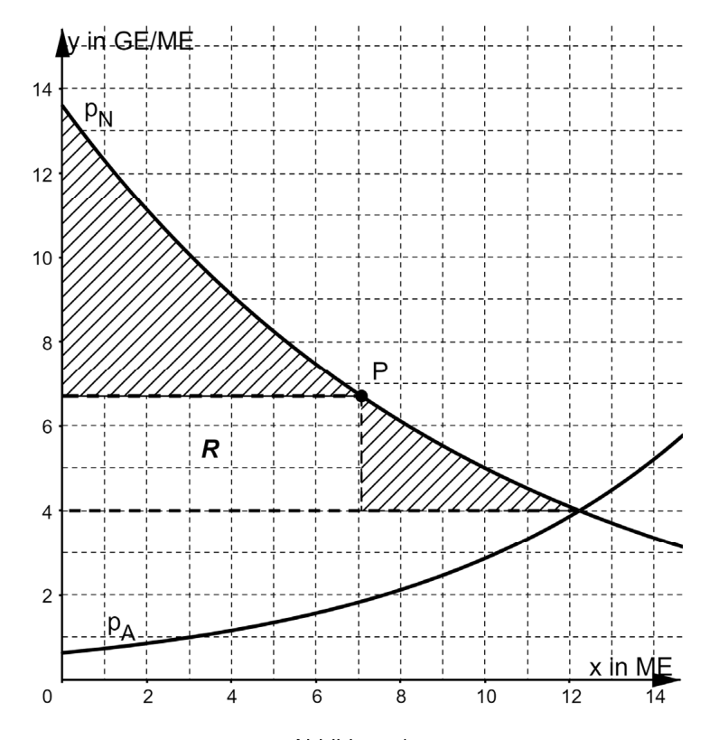

<!-- Regeln für die KI:
- Dezimalkomma ($0{,}2$), Formeln in LaTeX.
- Punkte nur per \punkte{n} hinter der Teilaufgabe angeben; die Gesamtpunktzahl
  je Aufgabe und insgesamt wird automatisch berechnet und in die Überschrift
  bzw. den Klausurkopf eingesetzt (nicht selbst in die Überschrift schreiben).
- Lösungen: je Teilaufgabe, Lösung und ggf. sehr kurzer Lösungsweg
-->

# Aufgaben

## Aufgabe 1

Einleitender Kontext...

a) Berechnen Sie ... \punkte{1}

b) Bestimmen Sie ... \punkte{3}

\newpage

## Aufgabe 2

Einleitender Kontext...

{width=60%}

a) Erläutern Sie ... \punkte{2}

b) Beurteilen Sie ... \punkte{3}

\newpage

# Lösungen

## Aufgabe 1

a) ...

b) ...