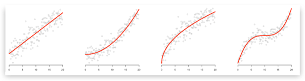
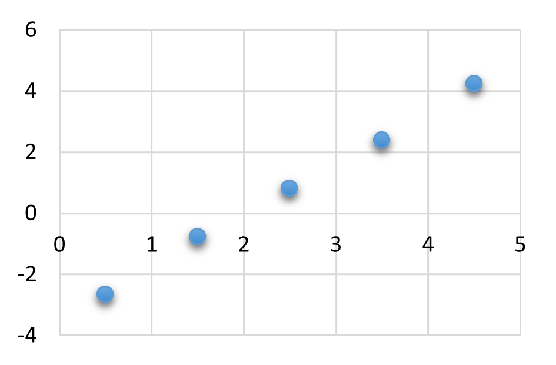
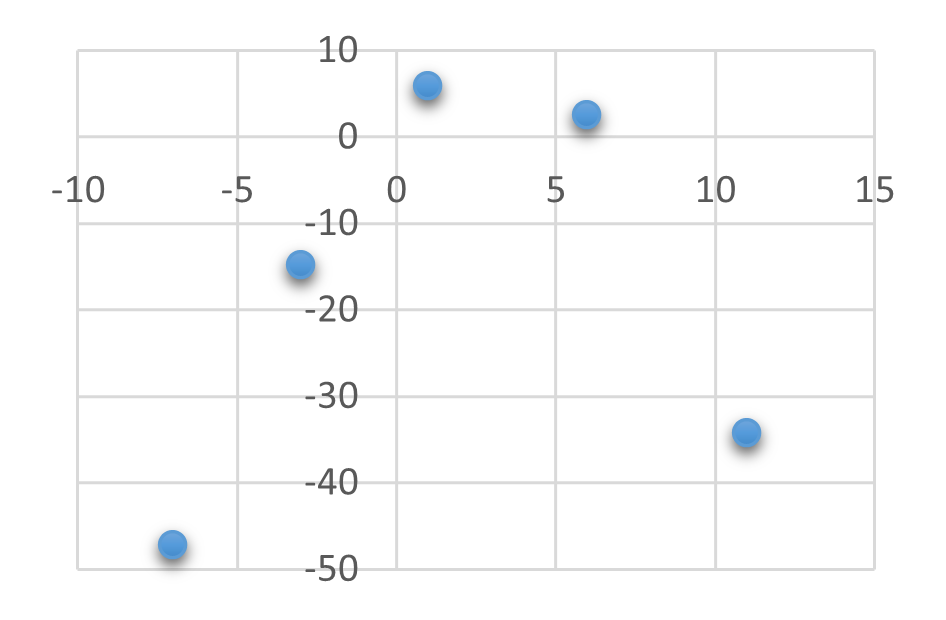
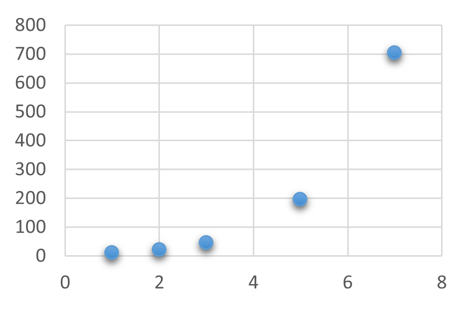

## Regression

Wie hängen zwei Größen voneinander ab? Diese Frage stellt sich in nahezu sämtlichen Gebieten, z.B. in der Wirtschaft (Wie hängt der Gewinn von der Absatzmenge ab?), in der Politik (Wie hängt die Bevölkerungsanzahl von der Zeit ab?) oder in den Naturwissenschaften (Wie hängt die zurückgelegte Fallstrecke eines frei fallenden Körpers von seiner Fallzeit ab?). Eine Antwort auf diese Frage kann aus einer konkreten mathematischen Funktion bestehen, die die beiden Größen zueinander in Beziehung setzt. Um eine solche Funktion zu finden, werden zunächst durch Umfragen, Messungen u.Ä. Datenpunkte ermittelt (z.B. x-Wert Jahreszahl, y-Wert Bevölkerungszahl). Im Anschluss sucht man dann nach einer Funktion, die diese Datenpunkte möglichst gut approximiert (annähert). Dieses Vorgehen heißt Regression. Dabei treten zwei Fragen auf:

1. Welche Funktionsart (linear, quadratisch, kubisch, exponentiell etc.) ist am ehesten geeignet?
2. Welchen Wert haben die Parameter der gewählten Funktionsart (bei linearen Funktionen müssen z.B. die Werte der Steigung und des y-Abschnitts bestimmt werden)?

Die erste Frage kann grob beantwortet werden, indem man die vorliegenden Datenpunkte graphisch darstellt und sich dann überlegt, welcher Funktionsgraph am besten zu der Punktwolke passt (hier gibt es natürlich auch systematischere Verfahren). Die 2. Frage kann direkt mit Hilfe des GTRs (siehe Beispiele) beantwortet werden. Hat man sich bei der 1. Frage für eine lineare Funktion entschieden, so spricht man auch von einer linearen Regression (entsprechend: quadratisch, exponentiell etc.).

Zum Schluss stellt sich die Frage, wie gut die gefundene Funktion die Daten beschreibt. Dafür wird in der Regel das Bestimmtheitsmaß $R^2$ verwendet. Es nimmt Werte zwischen 0 und 1 an. Je näher $R^2$ an 1 liegt, desto besser passt die gewählte Funktion zu den Daten. Auch dieser Wert wird direkt vom GTR angegeben. Vereinfacht gesagt ist die Regression für

- $R^2>0{,}9$ gut bis sehr,
- $0{,}7< R^2<0{,}9$ akzeptabel,
- $R^2< 0{,}7$ schwach.

Im folgenden verwenden [Casio fx-CG 20](https://www.casio-schulrechner.de/materialdatenbanken/data/Kurzanleitung_FX-CG20V2.pdf "Anleitung"). Andere Taschenrechner funktionieren ähnlich, z.B. der [Casio fx-CP400](https://www.casio-schulrechner.de/materialdatenbanken/data/Hilfekatalog%20Classpad%20400%20Sekundarstufe%20I.pdf "Anleitung").

### Beispiel: Lineare Regression

Gegeben sind folgende Werte:

| x   | 0,5   | 1,5   | 2,5  | 3,5  | 4,5  |
| --- | ----- | ----- | ---- | ---- | ---- |
| y   | -2,67 | -0,77 | 0,81 | 2,39 | 4,24 |

Wir vermuten, dass die Datenpunkte in etwa auf einer Geraden liegen, daher wird mit dem GTR eine lineare Regression durchgeführt:

- Menü 2 (Statistik) auswählen
- in List1 und List2 die x- und y-Werte der Datenpunkte eingeben
- Graph1 wählen um Datenpunkte anzeigen zu lassen
- CALC wählen und Regressionsart festlegen (hier: $X$ für eine lineare Regression)
- evtl.: Regressionsfunktion präzisieren (hier kann einfach $ax+b$ gewählt werden)
- im Anschluss werden die Parameter der Regressionsfunktion angezeigt (hier $a=1{,}70$ und $b=-3{,}45$)
- DRAW zeigt die Datenpunkte und den Graphen der Regressionsfunktion an
- Die Regressionsfunktion lautet also $f(x)=1{,}70x-3{,}45$.
- Das Bestimmtheitsmaß lautet $R^2=0{,}999$. Dieser Wert liegt sehr nah an $1$, die lineare Regression ist also gut geeignet, um den Zusammenhang zwischen den beiden Größen zu beschreiben.

### Beispiel: Quadratische Regression

Gegeben sind folgende Werte:

| x   | -7     | -3     | 1    | 6    | 11     |
| --- | ------ | ------ | ---- | ---- | ------ |
| y   | -47,24 | -14,85 | 5,83 | 2,42 | -34,33 |

Wir vermuten, dass die Datenpunkte in etwa auf einer Parabel liegen, daher wird mit dem GTR eine quadratische Regression durchgeführt:

- Menü 2 (Statistik) auswählen
- in List1 und List2 die x- und y-Werte der Datenpunkte eingeben
- Graph1 wählen um Datenpunkte anzeigen zu lassen
- CALC wählen und Regressionsart festlegen (hier: $X^2$ für eine quadratische Regression)
- evtl.: Regressionsfunktion präzisieren (hier gibt es keine Auswahl)
- im Anschluss werden die Parameter der Regressionsfunktion angezeigt (hier $a=-0{,}59$, $b=3{,}20$ und $c=2{,}74$)
- DRAW zeigt die Datenpunkte und den Graphen der Regressionsfunktion an
- Die Regressionsfunktion lautet also $f(x)=-0{,}59x^2+4{,}30x+2{,}74$.
- Das Bestimmtheitsmaß lautet $R^2=0{,}994$. Dieser Wert liegt sehr nah an $1$, die quadratische Regression ist also gut geeignet, um den Zusammenhang zwischen den beiden Größen zu beschreiben.

### Beispiel: Exponentielle Regression

Gegeben sind folgende Werte:

| x   | 1     | 2     | 3     | 5      | 7      |
| --- | ----- | ----- | ----- | ------ | ------ |
| y   | 11,08 | 20,91 | 45,02 | 195,77 | 703,49 |

Wir vermuten, dass die Datenpunkte in etwa aufdem Graphen einer Exponentialfunktion liegen, daher wird mit dem GTR eine lineare Regression durchgeführt:

- Menü 2 (Statistik) auswählen
- in List1 und List2 die x- und y-Werte der Datenpunkte eingeben
- Graph1 wählen um Datenpunkte anzeigen zu lassen
- CALC wählen und Regressionsart festlegen (hier: $EXP$ für eine exponentielle Regression, zuvor: mit F6 weiterblättern)
- evtl.: Regressionsfunktion präzisieren (hier: $ae^{bx}$)
- im Anschluss werden die Parameter der Regressionsfunktion angezeigt (hier $a=5{,}43$ und $b=0{,}70$)
- DRAW zeigt die Datenpunkte und den Graphen der Regressionsfunktion an
- Die Regressionsfunktion lautet also $f(x)=5{,}43x\cdot e^{0{,}70x}$.
- Das Bestimmtheitsmaß lautet $R^2=0{,}999$. Dieser Wert liegt sehr nah an $1$, die exponentielle Regression ist also gut geeignet, um den Zusammenhang zwischen den beiden Größen zu beschreiben.



