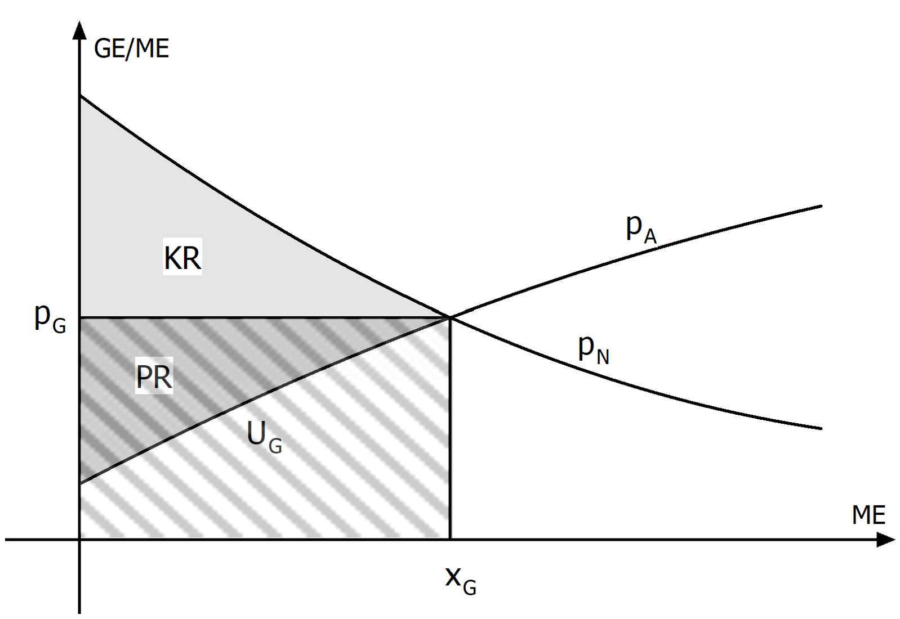
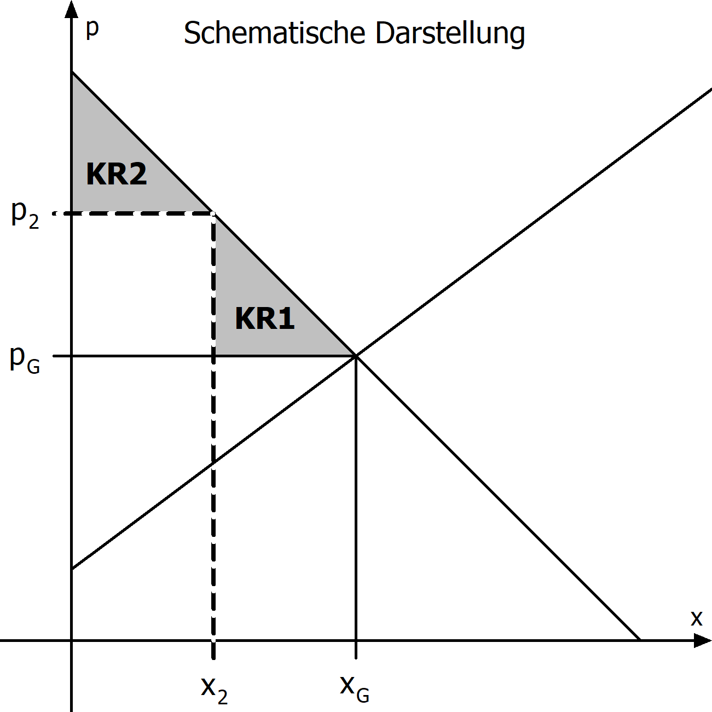

## Wiederholung

Die **Nachfragefunktion** $p_N(x)$ gibt an, wie hoch der Preis in Geldeinheiten (GE) pro nachgefragter Mengeneinheit (ME) ist. Da es keine negativen Preise geben kann, gilt stets $p_N(x)\geq0$. Weil die nachgefragte Menge in der Regel nur dann steigt, wenn der Preis sinkt, ist die Nachfragefunktion monoton fallend.

Die **Angebotsfunktion** $p_A(x)$ gibt an, wie hoch der Preis in Geldeinheiten (GE) pro angebotener Mengeneinheit (ME) ist. Auch hier gilt $p_A(x)\geq0$, da negative Preise nicht sinnvoll sind. Da Produzenten nur dann bereit sind, mehr anzubieten, wenn der Preis steigt, ist die Angebotsfunktion monoton steigend.

Wir verwenden folgende Kennzahlen zur Beschreibung von Nachfrage und Angebot:

- **Gleichgewichtsmenge:** Menge, bei der nachgefragter und angebotener Preis gleich sind.
- **Gleichgewichtspreis:** Preis, bei der nachgefragte und angebotene Menge gleich sind.
- **Höchstpreis:** Maximaler Preis, den ein Konsument zu zahlen bereit ist.
- **Sättigungsmenge:** Absatzmenge, bei der trotz Preis null keine Nachfrage mehr besteht.
- **Mindestangebotspreis:** Preis, ab dem Produzenten bereits, das Produkt anzubieten.
- **Umsatz im Marktgleichgewicht:** Gesamtumsatz, wenn auf dem Markt die Gleichgewichtsmenge zum Gleichgewichtspreis gehandelt wird.

### Graphische Bestimmungen



### Berechnungen

{% include info.html
index="2"
frage="Berechnung der Kennzahlen zum Marktgleichgewicht. Den Beispielen liegen folgende Funktionen zugrunde:

$$
\begin{align*}
p_N(x)&=45{,}75\cdot e^{-0{,}044x}-6{,}75\\
p_A(x)&=0{,}016x^2+0{,}022x+6\\
\end{align*}
$$

"

antwort="

### Höchstpreis

Der y-Achsenabschnitt von $p_N(x)$:

$$
45{,}75\cdot e^{-0{,}044\cdot 0}-6{,}75 = 39
$$

Der Höchstpreis beträgt 39 GE.

### Sättigungsmenge

Nullstelle von $p_N(x)$:

$$
\begin{align*}
45{,}75\cdot e^{-0{,}044x}-6{,}75 &= 0 \quad|\text{ TR}\\
x &= 43{,}4921
\end{align*}
$$

Die Sättigungsmenge beträgt 43,49 ME.

### Mindestangebotspreis

Der y-Achsenabschnitt von $p_A(x)$:

$$
0{,}016\cdot 0^2+0{,}022\cdot 0+6 = 6
$$

Der Mindestangebotspreis beträgt 6 GE.

### Gleichgewichtsmenge

Schnittstelle von $p_N$ und $p_A$:

$$
\begin{align*}
45{,}75\cdot e^{-0{,}044x}-6{,}75 &= 0{,}016x^2+0{,}022x+6 \quad|\text{ TR}\\
x &= 19{,}5903
\end{align*}
$$

Die Gleichgewichtsmenge beträgt 19,59 ME.

### Gleichgewichtspreis

y-Wert des Schnittpunkts von $p_N$ und $p_A$:

$$
p_N(19{,}5903)=12{,}5715
$$

(Oder gleichwertig:

$$
p_A(19{,}5903)=12{,}5715
$$

)

Der Gleichgewichtspreis beträgt 12,57 GE.

### Umsatz im Marktgleichgewicht

Produkt der Gleichgewichtsmenge und des Gleichgewichtspreis:

$$
19{,}5903\cdot 12{,}5715 = 246{,}2795
$$

Der Umsatz im Marktgleichgewicht beträgt 246,28 GE.

"
%}

## Konsumenten- und Produzentenrente

Die Konsumenten- und Produzentenrente und beschreiben, wie Konsumenten und Produzenten vom Marktgleichgewicht profitieren:

- Ein Konsument profitiert vom Marktgleichgewicht, wenn der Marktpreis geringer ist, als der Preis, den der Konsument bereit wäre zu zahlen.

- Ein Produzent profitiert vom Marktgleichgewicht, wenn der Marktpreis größer ist, als der Preis, zu dem der Produzent bereit wäre das Produkt anzubieten.

### Konsumentenrente: Diskretes Beispiel

Für das Erfrischungsgetränk Loca gibt es eine Gleichgewichtsmenge von 3 ME und einen Gleichgewichtspreis von 2 GE/ME. Vier Freunde analysieren ausgehend von ihrer Zahlungsbereitschaft die Konsumentenrente.

|       | ist bereit für eine ME Loca ... GE zu zahlen. |
| ----- | --------------------------------------------- |
| Anton | $4$                                           |
| Berta | $3$                                           |
| Cem   | $2$                                           |
| Daria | $1$                                           |

Die individuelle Konsumentenrente ist die Differenz aus der individuellen Zahlungssbereitschaft und dem Marktpreis:

|       | Individuelle Konsumentenrente |
| ----- | ----------------------------- |
| Anton | $4-2=2$                       |
| Berta | $3-2=1$                       |
| Cem   | $2-2=0$                       |
| Daria | ---                           |

Die kollektive Konsumentenrente (oder einfach Konsumentenrente) $KR$ ist die Summe der individuellen Konsumentenrenten:

$$
KR=2+1+0=3.
$$

Alternativ hätten wir auch die Differenz aus der gesamten Zahlungsbereitschaft (ohne die Zahlungsbereitschaft von Daria, die nichts konsumiert) und dem Umsatz im Marktgleichgewicht berechnen können:

$$
KR=(4+3+2)-3\cdot 2=3.
$$

Dieses Beispiel motiviert folgende

**Definition:** Die Konsumentenrente $KR$ ist die Differenz aus der Zahlungsbereitschaft des Markts und dem Umsatz im Marktgleich.

### Konsumentenrente: Kontinuierliches Beispiel

Für das Erfrischungsgetränk Loca gibt es eine Gleichgewichtsmenge von 2 ME und einen Gleichgewichtspreis von 2,5 GE/ME. Ein Marktforschungsinstitut analysiert ausgehend von der Nachfragefunktion $p_N(x)=-1{,}25x+5$ die Konsumentenrente.

Die Zahlungsbereitschaft der Konsumenten ist gleich dem Integral der Nachfragefunktion von 0 bis zur Gleichgewichtsmenge, weil die Nachfragefunktion angibt, wie viel für jede einzelne zusätzliche Einheit maximal bezahlt würde, und das Integral genau die Summe dieser marginalen Zahlungsbereitschaften über alle Einheiten bis zur nachgefragten Menge bildet. Wir erhalten:

$$
\begin{align*}
KR&=\text{Zahlungsbereitschaft des Markts} - \text{Umsatz im Marktgleichgewicht}\\
  &=\int_0^{2{,}5}-1{,}25x+5dx - 2{,}5\cdot 2\\
  &=7{,}5-5=2{,}5
\end{align*}
$$

### Produzenrente: Diskretes Beispiel

Für das Erfrischungsgetränk Loca gibt es eine Gleichgewichtsmenge von 3 ME und einen Gleichgewichtspreis von 4 GE/ME. Vier Unternehmen analysieren ausgehend von ihrer Angebotsbereitschaft die Produzentenrente.

|       | ist bereit, eine ME Loca für ... GE anzubieten. |
| ----- | ----------------------------------------------- |
| Alpha | $2$                                             |
| Beta  | $3$                                             |
| Gamma | $4$                                             |
| Delta | $5$                                             |

Die individuelle Produzentenrente ist die Differenz aus dem Marktpreis und der individuellen Angebotsbereitschaft:

|       | Individuelle Produzentenrente |
| ----- | ----------------------------- |
| Alpha | $4-2=2$                       |
| Beta  | $4-3=1$                       |
| Gamma | $4-4=0$                       |
| Delta | ---                           |

Die kollektive Produzentenrente (oder einfach Produzentenrente) $PR$ ist die Summe der individuellen Produzentenrenten:

$$
PR=2+1+0=3.
$$

Alternativ hätten wir auch die Differenz aus dem Umsatz im Marktgleichgewicht und der gesamten Angebotssbereitschaft (ohne die Angebotsbereitschaft von Delta, die nichts anbietet) berechnen können:

$$
PR=4\cdot 3-(2+3+4)=3.
$$

Dieses Beispiel motiviert folgende

**Definition:** Die Produzentenrente $PR$ ist die Differenz aus dem Umsatz im Marktgleichgewicht und der Angebotssbereitschaft des Markts.

### Produzentenrente: Kontinuierliches Beispiel

Für das Erfrischungsgetränk Loca gibt es eine Gleichgewichtsmenge von 2 ME und einen Gleichgewichtspreis von 2,5 GE/ME. Ein Marktforschungsinstitut analysiert ausgehend von der Angebotsfunktion $p_A(x)=0{,}75x+1$ die Produzentenrente.

Die Angebotsbereitschaft des Markts ist gleich dem Integral der Angebotsfunktion von 0 bis zur Gleichgewichtsmenge, weil die Angebotsfunktion angibt, zu welchem minimalen Preis jede einzelne zusätzliche Einheit gerade noch angeboten würde, und das Integral genau die Summe dieser marginalen Angebotsbereitschaften über alle Einheiten bis zur angebotenen Menge bildet. Wir erhalten:

$$
\begin{align*}
PR&=\text{Umsatz im Marktgleichgewicht} - \text{Angebotssbereitschaft des Markts}\\
  &=2{,}5\cdot 2 - \int_0^2 0{,}75x+1 dx\\
  &=5-3{,}5=1{,}5
\end{align*}
$$

### Zusammenfassung

Die Konsumentenrente beschreibt mit Hilfe der Differenz aus der Zahlungsbereitschaft und des Umsatz im Marktgleichgewicht, wie Konsumenten vom Marktgleichgewicht profitieren. Graphisch entspricht die Konsumentenrente der Fläche zwischen dem Graphen der Nachfragefunktion und dem Marktpreis von 0 bis zur Gleichgewichtsmenge.

Die Produzentenrente beschreibt mit Hilfe der Differenz aus dem Umsatz im Marktlgeichgewicht und der Angebotsbereitschaft, wie Produzenten vom Marktgleichgewicht profitieren. Graphisch entspricht die Produzentenrente der Fläche zwischen dem Marktpreis und dem Graphen der Angebotsfunktion von 0 bis zur Gleichgewichtsmenge.



## Abschöpfung der Konsumentenrente

Die Abschöpfung der Konsumentenrente bezeichnet eine Preissetzungsstrategie, bei der ein Anbieter versucht, möglichst viel von der Zahlungsbereitschaft der Nachfrager abzuschöpfen.

Normalerweise entsteht eine Konsumentenrente, wenn Konsumenten bereit wären, einen höheren Preis für ein Gut zu zahlen, es tatsächlich aber zu einem niedrigeren Marktpreis erwerben. Diese Differenz zwischen Zahlungsbereitschaft und tatsächlich gezahltem Preis ist ihr Vorteil.

Durch verschiedene Formen der Preisdifferenzierung kann ein Unternehmen diese Rente verringern oder vollständig abschöpfen. Beispiele sind:

- individuelle Preise je nach Zahlungsbereitschaft (erste Preisdifferenzierung),
- unterschiedliche Preise für verschiedene Kundengruppen (zweite oder dritte Preisdifferenzierung),
- zeitlich gestaffelte Preise (z. B. bei technischen Geräten oder Software).

Ziel ist es, den Gewinn des Anbieters zu maximieren, indem ein möglichst großer Anteil der Konsumentenrente in Produzentenrente umgewandelt wird.

{% include info.html
index="4"
frage="Abschöpfung der Konsumentenrente"
antwort="

Das folgende Diagramm erläutert den Sachverhalt:

Abgebildet ist das Marktgleichgewicht mit Gleichgewichtsmenge $x_G$ und Gleichgewichtspreis $p_G$. Mit Hilfe einer Preisdifferenzierung wird der Markt in zwei Teilmärkte aufgeteilt. Die Konsumentenrente ergibt sich dann aus der Summe der Konsumentenrente des ersten Teilmarkts KR1 und der Konsumentenrente des zweiten Teilmarkts KR2. Auf dem ersten Teilmarkt gilt der Gleichgewichtspreis. Auf dem zweiten Teilmarkt soll ein Preis $p_2$
so festgelegt werden, dass die Konsumentenrente maximal abgeschöpft wird. Wie muss $p_2$ gewählt werden?

Wir beobachten: Die Konsumentenrente wird minimal, falls der Inhalt des weißen Quadrats mit den Kantenlängen $x_2$ und $p_2-p_G$ maximal wird.

Der Flächeninhalt des Quadrats ist Abhängigkeit von $x_2$ lautet:

$$
\begin{align*}
A(x_2)&=x_2\cdot (p_2-p_G)\\
      &=x_2\cdot (p_N(x_2)-p_G)
\end{align*}
$$

Letzterer Ausdruck hängt, bei bekanntem $p_N(x)$ und $p_G$, nur noch von $x_2$ ab. Die Extremstelle für das Maximum von $A(x_2)$ kann nun mit den bekannten Methoden der Differentailrechnung bestimmt werden. Für das ermittelte $x_2$ ist dann der Flächeninhalt des weißen Quadrats maximal und die Produzenrente minimal. Der entsprechende Preis ist $p_N(x_2)$.

"
%}

