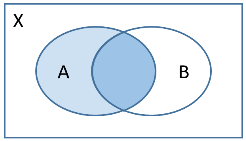

## Einführung

Wir betrachten ein mehrstufiges Zufallsexperiment mit den zwei Ereignissen

- $A$: Ein Schüler lernt für die Prüfung.
- $B$: Ein Schüler besteht die Prüfung.

Das Baumdiagramm habe die Gestalt



Hat ein Schüler gelernt, so besteht er mit einer Wahrscheinlichkeit von 90&nbsp;% die Prüfung, hat er nicht gelernt, besteht er die Prüfung nur mit einer Wahrscheinlichkeit von 20&nbsp;%. Die Wahrscheinlichkeit, dass ein Schüler die Prüfung besteht, hängt also davon ab, ob er gelernt hat. Mit anderen Worten: Die Wahrscheinlichkeit für $B$ (und auch für $\overline{B}$) hängt davon ab, ob $A$ eingetreten ist (oder nicht). Diese Wahrscheinlichkeiten der zweiten Stufe des Baumdiagramms heißen **bedingte Wahrscheinlichkeiten**, da für sie eine Bedingung $-$ hier $A$ oder $\overline{A}$ $-$ vorliegt.
Wir verwenden die folgenden Bezeichnungen



## Interpretation

Es ergeben sich die folgenden Interpretationen:

- $P_A(B)$ ist die Wahrscheinlichkeit, dass ein Schüler, der für die Prüfung gelernt hat, die Prüfung auch besteht.
- $P_A(\overline{B})$ ist die Wahrscheinlichkeit, dass ein Schüler, der für die Prüfung gelernt hat, die Prüfung nicht besteht.
- $P_{\overline{A}}(B)$ ist die Wahrscheinlichkeit, dass ein Schüler, der nicht für die Prüfung gelernt hat, die Prüfung dennoch besteht.
- $P_{\overline{A}}(\overline{B})$ ist die Wahrscheinlichkeit, dass ein Schüler, der nicht für die Prüfung gelernt hat, die Prüfung auch nicht besteht.

## Berechnung

Die Pfadmultiplikationsregel besagt, dass $P(A)\cdot P_A(B) = P(A\cap B)$. Damit folgt unmittelbar

$$
P_A(B)=\frac{P(A\cap B)}{P(A)}.
$$

Für $P_A(B)$ ist auch die Bezeichnung $P(B\|A)$ üblich. Wir nennen $P_A(B)$ die **Wahrscheinlichkeit von $B$ unter der Bedingung $A$**. Entsprechend gilt die Formel für andere Konstellationen, z.B. $P_B(A)=\frac{P(A\cap B)}{P(B)}$ oder $P_{\overline{A}}(B)=\frac{P(\overline{A}\cap B)}{P(\overline{A})}$.

Im Beispiel haben wir $P_A(B)=0{,}9$ und $P_{\overline{A}}(B)=0{,}2$. Die Wahrscheinlichkeit eine Prüfung zu bestehen ist also größer, wenn man gelernt hat.

Wichtig ist die Unterscheidung zwischen $P(A\cap B)$ und $P_A(B)$:

- $P(A\cap B)$ bezeichnet die Wahrscheinlichkeit, dass ein Schüler die Prüfung besteht **und** gelernt hat.
- $P_A(B)$ bezeichnet die Wahrscheinlichkeit, dass ein Schüler die Prüfung besteht, **wenn** er gelernt hat.

## Das Ganze und der Teil

Bedingte Wahrscheinlichkeiten lassen sich auch mit Hilfe relativer Häufigkeiten beschreiben. Allgemein können Wahrscheinlichkeiten als relative Häufigkeiten oder Anteile interpretiert werden:

$$
\text{Wahrscheinlichkeit} = \text{Anteil} =\frac{\text{Teil}}{\text{Ganze}}.
$$

Angenommen in unserem Beispiel haben 200 Schüler die Prüfung geschrieben. Dann haben

- 126 Schüler $-$ oder $\frac{126}{200}=63\\%$ $-$ gelernt und die Prüfung bestanden,
- 14 Schüler $-$ oder $\frac{14}{200}=7\\%$ $-$ gelernt und die nicht Prüfung bestanden,
- 12 Schüler $-$ oder $\frac{12}{200}=6\\%$ $-$ nicht gelernt und die Prüfung bestanden,
- 48 Schüler $-$ oder $\frac{48}{200}=24\\%$ $-$ nicht gelernt und die Prüfung nicht bestanden.

Für $P_A(B)$ betrachten wir nur die Schüler, die gelernt haben, das sind $126+14=140.$ Davon haben nun $126$ die Prüfung bestanden. Wir erhalten $P_A(B)=\frac{126}{140}=90\\%$.

Zusammengefasst:

- $P(A\cap B)$: Der Teil sind die Schüler, die die Prüfung bestanden und gelernt haben. Das Ganze sind **alle Schüler**.
- $P_A(B)$: Der Teil sind die Schüler, die die Prüfung bestanden und gelernt haben. Das Ganze sind **die Schüler, die gelernt haben**.

## Das inverse Baumdiagramm

Es ist wichtig zu erwähnen, dass im Baumdiagramm



die Wahrscheinlichkeiten $P_B(A)$, $P_B(\overline{A})$, $P_{\overline{B}}(A)$ und $P_{\overline{B}}({\overline{A}})$ **nicht** abgelesen werden können. Um diese bedingten Wahrscheinlichkeiten ablesen zu können, benötigen wir $B$ und $\overline{B}$ auf der ersten und $A$ und $\overline{A}$ auf der zweiten Stufe. Mit anderen Worten: Wir müssen ein neues Baumdiagramm aufstellen, das sogenannte **inverse Baumdiagramm**, indem $A$ und $B$ vertauscht sind.

Dafür berechnen wir zunächst $P(B)=0{,}05+0{,}15=0{,}2$. Damit ist $P(\overline{B})=0{,}8$. Aus $P(A\cap B)=P(B)\cdot P_B(A)$ (1.&nbsp;Pfadendwahrscheinlichkeit des inversen Baumdiagramms) folgt dann $P_B(A)=0{,}05:0{,}2=0{,}25$. Analog berechnen wir die weiteren bedingten Wahrscheinlichkeiten.

Das inverse Baumdiagramm lautet schließlich



Hier treten nun die Wahrscheinlichkeiten mit $B$- und $\overline{B}$-Bedingung auf. Wir können z.B. ablesen, dass $P_{\overline{B}}(A)=0{,}5625$ ist. Für das Beispiel bedeutet dies: Die Wahrscheinlichkeit, dass ein Schüler, der die Prüfung nicht besteht, gelernt hat, beträgt 56,25&nbsp;%.

## Der Satz von Bayes

Aus der Defintion der bedingten Wahrscheinlichkeit

$$
P_A(B)=\frac{P(A\cap B)}{P(A)}
$$

folgt $P(A\cap B)=P(A)\cdot P_A(B)$. Für die bedingte Wahrscheinlichkeit mit $A$ und $B$ vertauscht gilt dann

$$
\begin{align*}
P_B(A)&=\frac{P(A\cap B)}{P(B)}\\
P_B(A)&=\frac{P(A)\cdot P_A(B)}{P(B)}.\\
\end{align*}
$$

Mit letzterer Formel lassen sich bedingte Wahrscheinlichkeiten direkt umrechnen, sie wird auch **Satz von Bayes** genannt.

Im obigen Baumdiagramm gilt beispielsweise

$$
\begin{align*}
P_B(A)&=\frac{P(A)\cdot P_A(B)}{P(B)}\\
&=\frac{0{,}05\cdot 0{,}01}{0{,}2}\\
&=0{,}25.
\end{align*}
$$

<!--#### Urnenbeispiel
Ziehen ohne Zurücklegen
Ziehen mit Zurücklegen-->

## Stochastische Unabhängigkeit

Eng verbunden mit dem Begriff der stochastischen Unabhängigkeit ist die **stochastische Unabhängigkeit**. Wir erinnern an das Einführungsbeispiel mit den zwei Ereignissen

- $A$: Ein Schüler lernt für die Prüfung.
- $B$: Ein Schüler besteht die Prüfung.

und dem Baumdiagramm

Die Wahrscheinlichkeit von $B$ hängt hier davon ab, ob $A$ eingetreten ist. Wir sagen dazu auch, dass $A$ und $B$ **stochastisch abhängig** sind. Wäre dies nicht der Fall, hätte das Baumdiagramm also z.B. die Gestalt

so wäre die Wahrscheinlichkeit von $B$ nicht davon abhängig, ob $A$ eingetreten ist. Wir sagen dann, dass $A$ und $B$ **stochastisch unabhängig** sind. Mit anderen Worten: Zwei Ereignisse $A$ und $B$ sind stochastisch unabhängig, falls $P_A(B)=P_{\overline{A}}(B)$.

Auf unser Beispiel bezogen (mit dem 2. Baumdiagramm) bedeutet die stochastische Unabhängigkeit von $A$ und $B$, dass das Lernen für eine Prüfung unabhängig vom Bestehen der Prüfung ist.

### Baumdiagramme und stochastische Unabhängigkeit

Sind zwei Ereignisse $A$ und $B$ stochastisch unabhängig, so können wir diese Information beim Erstellen von Baumdiagrammen gezielt nutzen.

Ein Baumdiagramm habe die Gestalt

<figure>
  
</figure>

Zudem sei bekannt, dass $A$ und $B$ stochastisch unabhängig sind. Damit gilt $P_A(B)=P_{\overline{A}}(B)$. Die Wahrscheinlichkeit 5 ist also $0{,}3$. Das restliche Baumdigramm kann nun wie im Abschnitt [Baumdiagramme vervollständigen](skript.html?thema=Mehrstufige%20Zufallsexperimente#baumdiagramme-vervollständigen) vervollständigt werden.

Haben wir ein vollständig ausgefülltes Baumdiagramm vorliegen, können wir es interpretieren. Wir betonen nochmals, dass die Wahrscheinlichkeiten mit $B$- und $\overline{B}$-Bedingung aber nicht direkt im Baumdiagramm abgelesen werden können.

### Weitere Formulierungen der stochastischen Unabhängigkeit

Es gibt mehrere ähnliche Aussagen, die alle die stochastische Unabhängigkeit beschreiben. Die folgenden Aussagen sind äquivalent:

1. $P_A(B)=P_{\overline{A}}(B)$
2. $P(B)=P_A(B)$
3. $P(A\cap B)=P(A)\cdot P(B)$

Außerdem können hier beliebig $A$ durch $\overline{A}$ und $B$ durch $\overline{B}$ ersetzt werden. Das heißt: $A$ und $B$ sind genau dann stochastisch unabhängig, falls $A$ und $\overline{B}$ (oder $\overline{A}$ und $B$ oder $\overline{A}$ und $\overline{B}$) stochastisch unabhängig sind.

### Exkurs: Beweise

- 1 ist äquivalent zu 2:

  - Die Pfadadditionsregel besagt, dass

    $$
    P(B)=P(A\cap B)+P(\overline{A}\cap B).
    $$

  - Die Pfadmultiplikationsregel besagt, dass

    $$
    P(A\cap B)=P(A)\cdot P_A(B)
    $$

    und

    $$
    P(\overline{A}\cap B)=P(\overline{A})\cdot P_{\overline{A}}(B).
    $$

  - Damit folgt

  $$
  P(B) = P(A)\cdot P_A(B) + P(\overline{A})\cdot P_{\overline{A}}(B).
  $$

  - Es gilt $P_A(B)=P_{\overline{A}}(B)$ genau dann, wenn

  $$
  P(B) = P(A)\cdot P_A(B) + P(\overline{A})\cdot P_A(B).
  $$

  - Es folgt

  $$
  P(B)=(P(A)+P(\overline{A}))\cdot P_A(B).
  $$

  Da $P(A)+P(\overline{A})=1$ ist nun $P(B)=P_A(B)$.

- 2 ist äquivalent zu 3:
  - Die Pfadmultiplikationsregel besagt, dass $P(A\cap B)=P(A)\cdot P_A(B)$.
  - Nun gilt $P(B)=P_A(B)$ genau dann, wenn $P(A\cap B)=P(A)\cdot P(B)$.

### Prüfen auf stochastische Unabhängigkeit

Um festzustellen, ob zwei Ereinisse $A$ und $B$ stochastisch abhängig oder unabhängig sind, müssen wir eine der obigen drei Formulierungen prüfen. Sind die bedingten Wahrscheinlichkeiten bekannt, weil z.B. das Baumdiagramm gegeben ist, können wir die stochastische Unabhängigkeit direkt mit der 1. Formulierung ("die Pfadwahrscheinlichkeiten der 2. Stufe sind gleich") feststellen (siehe Beispiele oben).

Sind keine bedingten Wahrscheinlichkeiten bekannt, verwenden wir häufig die 3. Formulierung.

### Beispiel: Cannabis und Amphetamine (1)

Wir betrachten die Ereignisse

- A: Eine Person konsumiert Cannabis.
- B: Eine Person konsumiert Amphetamine.

Aus Studien sei bekannt, dass $P(A)=3\\%$ und $P(B)=1\\%$. Außerdem gelte $P(A\cap B)=0{,}02\\%$.

Sind $A$ und $B$ stochastisch unabhängig?

Es gilt $P(A)\cdot P(B)=0{,}03\cdot 0{,}01=0{,}0003$. Da $P(A\cap B)=0{,}0002\neq0{,}0003$ sind $A$ und $B$ stochastisch abhängig.

### Beispiel: Romeo und Julia (1)

Die Wahrscheinlichkeit, dass beide anwesend sind, beträgt 45&nbsp;%. Die Wahrscheinlichkeit, dass beide fehlen, beträgt 10&nbsp;%. Die Wahrscheinlichkeit, dass Romeo anwesend ist und Julia fehlt, beträgt 15&nbsp;%.

Wir betrachten die Ereignisse:

- A: Romeo ist anwesend.
- B: Julia ist anwesend.

Sind $A$ und $B$ stochastisch unabhängig?

Es gilt $P(A\cap B)=0{,}45$, $P(\overline{A}\cap \overline{B})=0{,}1$ und $P(A\cap \overline{B})=0{,}15$. Wir berechnen

- $P(A) = P(A\cap B) + P(A\cap \overline{B}) = 0{,}45 + 0{,}15 = 0{,}6$
- $P(\overline{B}) = P(A\cap \overline{B}) + P(\overline{A}\cap \overline{B}) = 0{,}15 + 0{,}1 = 0{,}25$

Nun ist $P(A)\cdot P(\overline{B})=0{,}6 \cdot 0{,}25 = 0{,}15$. Es gilt also $P(A)\cdot P(\overline{B}) = P(A\cap \overline{B})$. Damit sind $A$ und $\overline{B}$ stochastisch unabhängig, und somit auch $A$ und $B$. (Diese Berechnungen werden mit den Begriffen des nächsten Abschnitts übersichtlicher.)

## Vier-Felder-Tafeln

Neben Baumdiagrammen können Zufallsexperimente mit zwei Ereignissen auch durch Vier-Felder-Tafeln dargestellt werden. Die allgemeine Form lautet

|                | $B$                      | $\overline{B}$                      | $\Sigma$          |
| -------------- | ------------------------ | ----------------------------------- | ----------------- |
| $A$            | $P(A \cap B)$            | $P(A \cap \overline{B})$            | $P(A)$            |
| $\overline{A}$ | $P(\overline{A} \cap B)$ | $P(\overline{A} \cap \overline{B})$ | $P(\overline{A})$ |
| $\Sigma$       | $P(B)$                   | $P(\overline{B})$                   | $1$               |

Das Summenzeichen $\Sigma$ beschreibt, dass die äußeren Wahrscheinlichkeiten gleich der Summe zugehörigen inneren Wahrscheinlichkeiten sind:

- $P(A) = P(A \cap B) + P(A \cap \overline{B})$
- $P(\overline{A}) = P(\overline{A} \cap B) + P(\overline{A} \cap \overline{B})$
- $P(B) = P(A \cap B) + P(\overline{A} \cap B)$
- $P(\overline{B}) = P(A \cap \overline{B}) + P(\overline{A} \cap \overline{B})$

Diese Beobachtung ist wichtig, wenn wir Vier-Felder-Tafeln aufstellen wollen.

### Vier-Felder-Tafeln vervollständigen

### Beispiel: Cannabis und Amphetamine (2)

Wir hatten die Ereignisse

- A: Eine Person konsumiert Cannabis.
- B: Eine Person konsumiert Amphetamine.

Bekannt war, dass $P(A)=3\\%$, $P(B)=1\\%$ und $P(A\cap B)=0{,}02\\%$. Damit ergibt sich

|                | $B$                      | $\overline{B}$                      | $\Sigma$          |
| -------------- | ------------------------ | ----------------------------------- | ----------------- |
| $A$            | $0{,}0002$               | $P(A \cap \overline{B})$            | $0{,}03$          |
| $\overline{A}$ | $P(\overline{A} \cap B)$ | $P(\overline{A} \cap \overline{B})$ | $P(\overline{A})$ |
| $\Sigma$       | $0{,}01$                 | $P(\overline{B})$                   | $1$               |

Die übrigen Wahrscheinlichkeiten können wie folgt berechnet werden:

- $P(\overline{A}) = 1-0{,}03 = 0{,}97$
- $P(\overline{B}) = 1-0{,}01 = 0{,}99$
- $P(\overline{A} \cap B)= 0{,}01 - 0{,}0002 = 0{,}0098$
- $P(A \cap \overline{B}) = 0{,}03 - 0{,}0002 = 0{,}0298$
- $P(\overline{A} \cap \overline{B}) = 0{,}97 - 0{,}0098 = 0{,}9602$

Damit lautet die vollständige Vier-Felder-Tafel

|                | $B$        | $\overline{B}$ | $\Sigma$ |
| -------------- | ---------- | -------------- | -------- |
| $A$            | $0{,}0002$ | $0{,}0298$     | $0{,}03$ |
| $\overline{A}$ | $0{,}0098$ | $0{,}9602$     | $0{,}97$ |
| $\Sigma$       | $0{,}01$   | $0{,}99$       | $1$      |

Hier können wir z.B. ablesen, dass eine Person mit einer Wahrschheinlichkeit von 96,02&nbsp;% weder Cannabis noch Amphetamine konsumiert.

### Beispiel: Romeo und Julia (2)

Wir hatten die Ereignisse

- A: Romeo ist anwesend.
- B: Julia ist anwesend.

Bekannt war $P(A\cap B)=0{,}45$, $P(\overline{A}\cap \overline{B})=0{,}1$ und $P(A\cap \overline{B})=0{,}15$. Damit ergibt sich

|                | $B$                      | $\overline{B}$    | $\Sigma$          |
| -------------- | ------------------------ | ----------------- | ----------------- |
| $A$            | $0{,}45$                 | $0{,}15$          | $P(A)$            |
| $\overline{A}$ | $P(\overline{A} \cap B)$ | $0{,}1$           | $P(\overline{A})$ |
| $\Sigma$       | $P(B)$                   | $P(\overline{B})$ | $1$               |

Die übrigen Wahrscheinlichkeiten können wie folgt berechnet werden:

- $P(A) = 0{,}45 + 0{,}15 = 0{,}6$
- $P(\overline{A}) = 1- 0{,}6 = 0{,}4$
- $P(\overline{B}) = 0{,}15 + 0{,}1 = 0{,}25$
- $P(B) = 1 - 0{,}25 = 0{,}75$
- $P(\overline{A} \cap B) = 0{,}75 - 0{,}45 = 0{,}3$

Damit lautet die vollständige Vier-Felder-Tafel

|                | $B$      | $\overline{B}$ | $\Sigma$ |
| -------------- | -------- | -------------- | -------- |
| $A$            | $0{,}45$ | $0{,}15$       | $0{,}6$  |
| $\overline{A}$ | $0{,}3$  | $0{,}1$        | $0{,}4$  |
| $\Sigma$       | $0{,}75$ | $0{,}25$       | $1$      |

Hier können wir z.B. ablesen, dass Romeo mit einer Wahrschheinlichkeit von 60&nbsp;% anwesend ist.

### Vier-Felder-Tafeln und stochastische Unabhängigkeit

Eine Formulierung der stochastischen Unabhängigkeit ist $P(A\cap B)=P(A)\cdot P(B)$. Diese Bedingung kann leicht anhand einer Vier-Felder-Tafel geprüft werden: Der innere Wert $P(A\cap B)$ ist das Produkt der entsprechenden äußeren Wahrscheinlichkeiten $P(A)$ und $P(B)$. Ist dies der Fall, so sagen wir, dass die Vier-Felder-Tafel **multiplikativ** ist.

Sind zwei Ereignisse $A$ und $B$ stochastisch unabhängig, so können wir diese Information beim Erstellen von Vier-Felder-Tafeln gezielt nutzen.

Eine Vier-Felder-Tafel habe die Gestalt

|                | $B$     | $\overline{B}$ | $\Sigma$ |
| -------------- | ------- | -------------- | -------- |
| $A$            | $x$     |                | $0{,}7$  |
| $\overline{A}$ |         |                |          |
| $\Sigma$       | $0{,}2$ |                | $1$      |

Zudem sei bekannt, dass $A$ und $B$ stochastisch unabhängig sind. Damit ist die Vier-Felder-Tafel mutiplikativ, und es gilt $P(A\cap B)=P(A)\cdot P(B)$. Die Wahrscheinlichkeit $x$ ist also $0{,}2\cdot 0{,}7=0{,}14$. Die restliche Vier-Felder-Tafel kann nun wie im Abschnitt [Vier-Felder-Tafeln vervollständigen](#vier-felder-tafeln-vervollständigen) vervollständigt werden.

Haben wir eine vollständig ausgefüllte Vier-Felder-Tafel vorliegen, können wir sie interpretieren. Um dabei festzustellen, ob $A$ und $B$ stochastisch unabhägig sind, müssen wir prüfen, ob die Vier-Felder-Tafel multiplikativ ist.

### Beispiel: Cannabis und Amphetamine (3)

Die Vier-Felder-Tafel hatte die Gestalt

|                | $B$        | $\overline{B}$ | $\Sigma$ |
| -------------- | ---------- | -------------- | -------- |
| $A$            | $0{,}0002$ | $0{,}0298$     | $0{,}03$ |
| $\overline{A}$ | $0{,}0098$ | $0{,}9602$     | $0{,}97$ |
| $\Sigma$       | $0{,}01$   | $0{,}99$       | $1$      |

Wir erkennen, dass $0{,}03 \cdot 0{,}01 \neq 0{,}0002$ ist. Die Vier-Felder-Tafel ist nicht multiplikativ, und $A$ und $B$ sind stochastisch abhängig.

### Beispiel: Romeo und Julia (3)

Die Vier-Felder-Tafel hatte die Gestalt

|                | $B$      | $\overline{B}$ | $\Sigma$ |
| -------------- | -------- | -------------- | -------- |
| $A$            | $0{,}45$ | $0{,}15$       | $0{,}6$  |
| $\overline{A}$ | $0{,}3$  | $0{,}1$        | $0{,}4$  |
| $\Sigma$       | $0{,}75$ | $0{,}25$       | $1$      |

Wir erkennen, dass $0{,}6 \cdot 0{,}75 = 0{,}45$ ist. Die Vier-Felder-Tafel ist multiplikativ, und $A$ und $B$ sind stochastisch unabhängig.

## Vergleich von Baumdiagrammen und Vier-Felder-Tafeln

Baumdiagramme und Vierfeldertafeln stellen Wahrscheinlichkeiten, die beim Betrachten von zwei Ereignissen auftreten, auf unterschiedliche Weise dar. In Baumdiagrammen lassen sich die einzelnen Stufen eines Zufallsexperiments gut nachvollziehen: Zunächst tritt das Ereignis $A$ ein, anschließend das Ereignis $B$. Dabei können bedingte Wahrscheinlichkeiten wie $P_A(B)$ direkt abgelesen werden. Vierfeldertafeln hingegen behandeln die Ereignisse $A$ und $B$ symmetrisch. Sowohl $P(A)$ als $P(B)$ sind direkt aus den Tabellenwerten ersichtlich.



## Bedingte Wahrscheinlichkeiten und stochastische Unabhängigkeit ohne Strukturhilfen

Stehen weder ein Baumdiagramm noch eine Vierfeldertafel zur Verfügung, kann ausschließlich mit den in diesem Abschnitt vorgestellten Formeln gearbeitet werden. Dabei kann es hilfreich sein, sich das Baumdiagramm oder die Vierfeldertafel gedanklich vorzustellen.

## Venn-Diagramme

Bedingte Wahrscheinlichkeiten können auch in Venn-Diagrammen dargestellt werden. Das Ereignis, auf das die jeweilige Bedingung nicht zutrifft, wird weiß gefärbt. Das dunkle Blau bezeichnet den Teil, das dunkle zusammen mit dem hellen Blau das Ganze:

| $P_A(B)$                                                | $P_B(\overline{A})$                                      | $P_A(\overline{B})$                                      |
| ------------------------------------------------------- | -------------------------------------------------------- | -------------------------------------------------------- |
| <figure></figure> | <figure> </figure> | <figure> </figure> |

