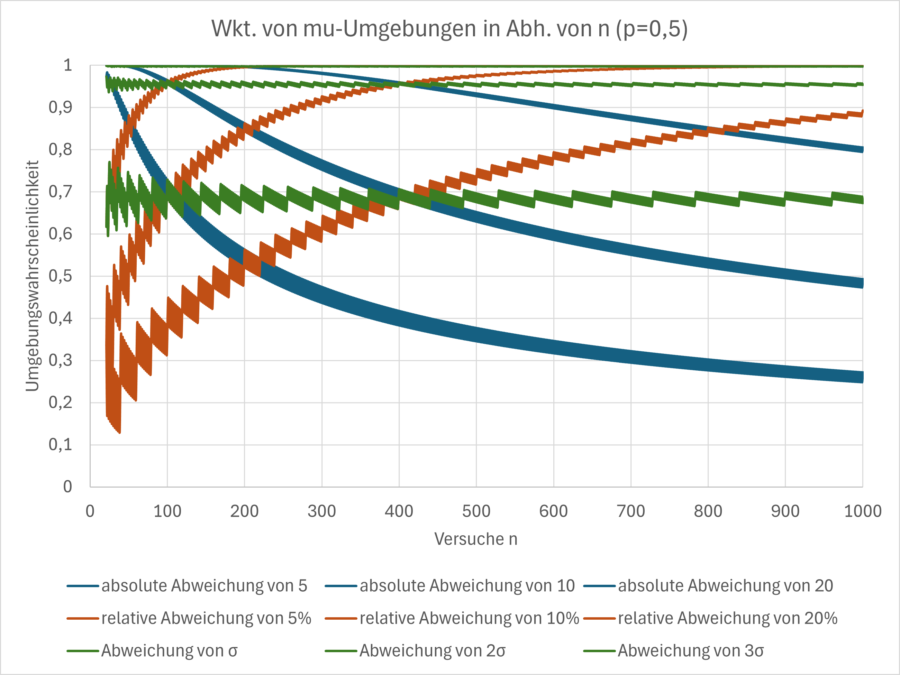
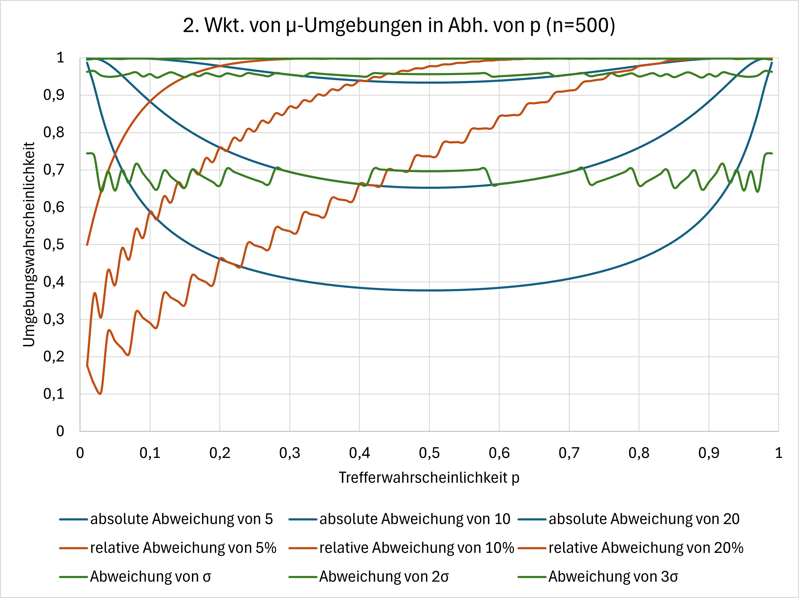

---
layout: module
title: Binomialverteilung - Skript
description: Lernbereich Binomialverteilung, Modul Skript.
page_context: Lernbereich
nav: dashboard
body_class: page-module
module_key: skript
published: true
lernbereich: binomialverteilung
gebiet: stochastik
permalink: /lernbereiche/stochastik/binomialverteilung/skript.html
---

## Einführung

Ein **Bernoulli-Experiment** ist ein Zufallsexperiment mit nur zwei möglichen Ergebnissen: Treffer oder Niete. Die Wahrscheinlichkeit für einen Treffer wird in der Regel mit $p$ bezeichnet, für eine Niete mit $q=1-p$. Wird ein Bernoulli-Experiment $n$-mal hintereinander bei gleichbleibender Trefferwahrscheinlichkeit durchgeführt, so sprechen wir von einer **Bernoulli-Kette** der Länge $n$. Eine gleichbleibende Trefferwahrscheinlichkeit bedeutet im Übrigen, dass die auftretenden Ereignisse voneinander unabhängig sind.
Eine Zufallsgröße, die bei einer Bernoulli-Kette die Anzahl der Treffer angibt, heißt **binomialverteilt**. Ob eine Situation wirklich binomialverteilt ist, entscheidet also nicht ein einzelnes Schlagwort, sondern die Struktur des Experiments.

Für die Prüfung sind vor allem drei Fragen entscheidend:

- Gibt es eine feste Anzahl von Versuchen $n$?
- Gibt es pro Versuch genau zwei mögliche Ausgänge?
- Bleibt die Trefferwahrscheinlichkeit $p$ in allen Versuchen gleich?

Genau diese drei Bedingungen greifen die Tipps und Aufgaben des ersten Checks auf. Erst wenn sie erfüllt sind, lohnt sich der Einsatz der Binomialverteilung.



## Die Bernoulli-Formel

### Herleitung

Wir betrachten eine Bernoulli-Kette der Länge $n$ mit Trefferwahrscheinlichkeit $p$ und fragen nach der Wahrscheinlichkeit für genau $k$ Treffer. Das zugehörige Baumdiagramm hat folgende Gestalt:



Am Baumdiagramm kann man zwei Bausteine der Rechnung gut unterscheiden: Wie viele passende Pfade gibt es überhaupt, und wie groß ist die Wahrscheinlichkeit für jeden einzelnen dieser Pfade?

Um die Wahrscheinlichkeit für genau $k$ Treffer zu berechnen, benötigen wir erstens die Anzahl der Pfade mit genau $k$ Treffern und zweitens die Endwahrscheinlichkeit eines solchen Pfades.

- **Pfadanzahl:** Der sogenannte Binomialkoeffizient (lies: n über k)

  $$
    \begin{align}
    \binom{n}{k} & =\frac{n!}{k!\cdot (n-k)!}\\
    & =\frac{1\cdot 2 \cdot \ldots n}{(1\cdot 2 \cdot \ldots k)\cdot (1\cdot 2 \cdot \ldots (n-k))}
    \end{align}
  $$

  gibt diese Anzahl an Pfaden an. Er kann mit den meisten Taschenrechnern direkt bestimmt werden.

- **Pfadendwahrscheinlichkeit:** Jeder dieser Pfade hat nach der Pfadmultiplikationsregel dieselbe Pfadwahrscheinlichkeit
  $$
  p^k \cdot (1−p)^{n−k},
  $$
  denn auf jedem dieser Pfade treten genau $k$ Treffer und $n−k$ Nieten auf.

Damit ergibt sich mit der Pfadadditionsregel die **Bernoulli-Formel** für genau $k$ Treffer:

$$
P(X=k)=\binom{n}{k}\cdot p^k\cdot (1-p)^{n-k}
$$

Diese Formel bildet die Grundlage für viele Wahrscheinlichkeitsberechnungen. Sie ist in einigen Taschenrechnern als Funktion integriert und in Tafelwerken dokumentiert.

### Beispiele

Eine Basketballspielerin habe von der Freiwurflinie eine Trefferwahrscheinlichkeit von 70 % und wirft 4 Mal. Wie groß ist die Wahrscheinlichkeit, dass sie genau 3 Treffer erzielt?

$$
\begin{align*}
P(X=3)&=\binom{4}{3}\cdot 0{,}7^3\cdot (1-0{,}7)^{4-3}\\
&=0{,}4116
\end{align*}
$$

Ein Virentest erkennt eine Infektion mit 92 % Wahrscheinlichkeit. Bei 12 getesteten infizierten Personen: Wie groß ist die Wahrscheinlichkeit, dass genau 11 positive Tests erfolgen?

$$
\begin{align*}
P(X=11)&=\binom{12}{11}\cdot 0{,}92^{11}\cdot 0{,}08^{12-11}\\
&=0{,}2855
\end{align*}
$$

### Interpretationen

Durch den häufigen Einsatz von Taschenrechnern oder Tafelwerken gerät die Bedeutung der Bernoulli-Formel in den Hintergrund. Dabei ist gerade diese Formel die Grundlage dafür, dass solche Hilfsmittel Wahrscheinlichkeiten so zuverlässig angeben können. Es ist daher wichtig, die Formel inhaltlich interpretieren zu können.



## Intervallwahrscheinlichkeiten

Im vorherigen Abschnitt interessierten wir uns für die Wahrscheinlichkeit für **genau** $k$ Treffer. In diesem Abschnitt erweitern wir die Fragestellung und fragen nach der Wahrscheinlichkeit, dass die Anzahl der Treffer in einem vorgegebenen Bereich liegt.

### Beispiel

Eine Basketballspielerin habe von der Dreierlinie eine Trefferwahrscheinlichkeit von 10 % und wirft 20 Mal. Die Zufallsgröße $X$, die die Anzahl der Treffer angibt, ist binomialverteilt mit $n=20$ und $p=0{,}1$.

Wie groß ist die Wahrscheinlichkeit für höchstens 2 Treffer? Höchstens 2 Treffer bedeutet, dass sie 0, 1 oder 2 Mal trifft. Die gesuchte Wahrscheinlichkeit wird mit $P(X\leq 2)$ bezeichnet und ist

$$
\begin{align*}
P(X \leq 2) &= P(X = 0) + P(X = 1) + P(X = 2) \\
&= \binom{20}{0} \cdot 0{,}1^0 \cdot 0{,}9^{20} + \binom{20}{1} \cdot 0{,}1^1 \cdot 0{,}9^{19} + \binom{20}{2} \cdot 0{,}1^2 \cdot 0{,}9^{18}\\
&=0,1216 + 0,2702 + 0,2852\\
&=0,6769.
\end{align*}
$$

Die Bernoulli-Formel muss also lediglich mehrmals nacheinander angewendet werden.

### Symbolische Formulierungen

Damit wir die Bernoulli-Formel geeignet anwenden können, müssen wir gut auf die Beschreibung des gesuchten Bereichs achten: Um welche Trefferanzahlen geht es? Dazu ist es hilfreich, textuelle Beschreibungen in symbolische, d.h. mit Symbolen der Art $<$, $>$ etc., umformen zu können. (weiterhin sei $n=20$).

| Textuelle Beschreibung | Symbolische Formulierung |
| ---------------------- | ----------------------- |
| Wkt für genau 3 Treffer | $P(X=3)$ |
| Wkt für höchstens 4 Treffer | $P(X\leq 4)=P(X=0)+P(X=1)+\ldots+P(X=4)$ |
| Wkt für mindestens 12 Treffer | $P(X\geq 12)=P(X=12)+P(X=13)+\ldots+P(X=20)$ |
| Wkt für weniger als 10 Treffer | $P(X< 10)=P(X=0)+P(X=1)+\ldots+P(X=9)$ |
| Wkt für mehr als 7 Treffer | $P(X> 7)=P(X=8)+P(X=9)+\ldots+P(X= 20)$ |
| Wkt für mehr als 11 und höchstens 18 Treffer | $P(11< X\leq 18)=P(X=12)+P(X=13)+\ldots+P(X= 18)$ |
| Wkt für zwischen einschließlich 2 und ausschließlich 9 Treffer | $P(2\leq X<9)=P(X=2)+P(X=3)+\ldots+P(X= 8)$ |

### Berechnungen

Für Bereichswahrscheinlichkeiten werden die Bernoulli-Formeln mehrfach nacheinander angewendet. Dies kann bei vielen Summanden aufwendig und fehleranfällig sein. Typischerweise werden Bereichswahrscheinlichkeiten daher mit Tafelwerken oder Taschenrechnern bestimmt. In Tafelwerken befinden sich in der Regel die **kumulierten Wahrscheinlichkeiten** $P(X\leq k)$. Daher müssen die gesuchten Bereichswahrscheinlichkeiten in Ausdrücke umgeformt werden, die nur kumulierte Wahrscheinlichkeiten enthalten. 

Typische Umformungen sind dabei:

- genau $k$ Treffer: $P(X=k)=P(X\leq k)-P(X\leq k-1)$
- mindestens $k$ Treffer: $P(X\geq k)=1-P(X\leq k-1)$
- Treffer zwischen $a$ und $b$: $P(a\leq X\leq b)=P(X\leq b)-P(X\leq a-1)$

Genau diese Übersetzungen stehen im Mittelpunkt des nächsten Checks. Das Beispiel zeigt die Struktur an einem konkreten Sachzusammenhang, und die Aufgaben variieren anschließend nur die sprachliche Formulierung des Bereichs.



Wenn statt Tafelwerk ein Taschenrechner mit einer Funktion wie $Bcd(a;b;n;p)$ verwendet wird, muss dieselbe Bereichsidee in Eingabegrenzen übersetzt werden. Dann sind nicht mehr Differenzen kumulierter Wahrscheinlichkeiten gefragt, sondern passende untere und obere Intervallgrenzen.



### Weitere Hinweise

Bevor wir Bereichswahrscheinlichkeiten bestimmen können, müssen wir die folgenden Fragen beantworten:

- Liegt überhaupt eine binomialverteilte Zufallsgröße vor?
- Wie lauten die Bernoulli-Parameter $n$ und $p$?
- Was ist im Sachzusammenhang ein Treffer, was ist eine Niete?
- Müssen die Intervallgrenzen des angegebenen Bereichs eventuell noch berechnet werden?
- Möglicherweise entstehen Ausdrücke mit nicht-ganzzahligen Intervallgrenzen. Hier müssen wir richtig runden: Ist z.B. $X\leq 3{,}8$ so darf $X$ auf keinen Fall größer als $3{,}8$ sein, es gilt also $P(X\leq 3{,}8)=P(X\leq 3)$. Ist z.B. $X> 5{,}1$, so darf $X$ auf keinen Fall kleiner oder gleich als $5{,}1$ sein, es gilt also $P(X> 5{,}1)=P(X\geq 6)$.

Genau dieser Fragenkatalog ist der Kern des nächsten Checks. Die Aufgaben mischen bewusst Standardfälle, Prozentangaben, Vereinigungen von Ereignissen und Situationen, die gar nicht binomialverteilt sind.



## Histogramme

Wie jede Zufallsgröße können binomialverteilte Zufallsgrößen in Histogrammen dargestellt werden. Es gibt zwei Varianten:

- Einzelwahrscheinlichkeiten: Hier wird jeder Trefferanzahl $k$ die Wahrscheinlichkeit $P(X=k)$ zugeordnet.
- Kumulierte Wahrscheinlichkeiten: Hier wird jeder Trefferanzahl $k$ die kumulierte Wahrscheinlichkeit $P(X\leq k)$ zugeordnet.

Die folgende Übersicht zeigt die Histogramme und zugehörigen Intervallwahrscheinlichkeiten.



Damit können wir auch mit Hilfe von Histogrammen Intervallwahrscheinlichkeiten bestimmen. Im Histogramm der Einzelwahrscheinlichkeiten liest man einzelne Balkenhöhen als Werte von $P(X=k)$ ab und addiert passende Balken für ein Intervall.



Im Histogramm der kumulierten Wahrscheinlichkeiten bedeutet die Balkenhöhe bei $k$ dagegen direkt $P(X\leq k)$. Bereichswahrscheinlichkeiten entstehen dort typischerweise durch Differenzen zweier Balkenhöhen.



## Bestimmung von n, p und k

Mit Hilfe der Bernoulli-Formel $P(X=k)=\binom{n}{k}p^k(1-p)^{n-k}$ lassen sich Intervallwahrscheinlichkeiten binomialverteilter Zufallsgrößen bestimmen:

$$
\begin{align*}
P(X\leq k)&=P(X=0) + P(X=1) + \ldots P(X=k)\\
&=\binom{n}{0}p^0(1-p)^{n} + \binom{n}{1}p^{1}(1-p)^{n-1} + \ldots + \binom{n}{k}p^k(1-p)^{n-k}\\
& =\sum_{i=0}^k \binom{n}{i}p^i(1-p)^{n-i}
\end{align*}
$$

Wie wir gesehen haben, lässt sich dieser komplizierte Ausdruck mit Hilfe von Tafelwerken oder Taschenrechnern bestimmen. Das bedeutet: Wenn $n$, $p$ und $k$ gegeben sind, können wir die Wahrscheinlichkeit $P(X\leq k)$ bestimmen.

Wir ändern nun die Perspektive: Angenommen $P(X\leq k)$ und z. B. $p$ und $k$ seien gegeben. Was ist dann $n$?

Dazu müsste die oben erwähnte Formel nach $n$ aufgelöst werden. Dies ist jedoch nicht elementar möglich. Stattdessen probieren wir mit Hilfe von Wertetabellen systematisch aus.

### Beispiel 1

Gegeben: $P(X\leq 3)\approx 0{,}71$ und $p=0{,}4$

Gesucht: $n$

Mit Hilfe eines Tafelwerks oder Taschenrechners stellen wir folgende Tabelle auf:

| $n$ | $P(X\leq 3)$ |
| --- | ------------ |
| 1   | 1,0000       |
| 2   | 1,0000       |
| 3   | 1,0000       |
| 4   | 0,9744       |
| 5   | 0,9130       |
| 6   | 0,8208       |
| 7   | 0,7102       |
| 8   | 0,5941       |
| 9   | 0,4826       |
| 10  | 0,3823       |

Wir entnehmen der Tabelle, dass $P(X\leq 3)=0{,}7102\approx 0{,}71$ für $n=7$ ist.

### Beispiel 2

Gegeben: $P(X\geq 14)\approx 0{,}15$ und $n=20$

Gesucht: $p$

Mit Hilfe eines Tafelwerks oder Taschenrechners stellen wir folgende Tabelle auf:

| $p$  | $P(X\geq 14)$ |
| ---- | ------------- |
| 0,51 | 0,0688        |
| 0,52 | 0,0814        |
| 0,53 | 0,0958        |
| 0,54 | 0,1119        |
| 0,55 | 0,1299        |
| 0,56 | 0,1499        |
| 0,57 | 0,1719        |
| 0,58 | 0,1959        |
| 0,59 | 0,2220        |
| 0,60 | 0,2500        |

Wir entnehmen der Tabelle, dass $P(X\geq 14)=0{,}1499\approx 0{,}15$ für $p=0{,}56$ ist.

### Beispiel 3

Gegeben: $P(X\leq k)\approx 0{,}10$ und $n=200$ und $p=0{,}9$

Gesucht: $k$

Mit Hilfe eines Tafelwerks oder Taschenrechners stellen wir folgende Tabelle auf:

| $k$ | $P(X\leq k)$ |
| --- | ------------ |
| 171 | 0,0271       |
| 172 | 0,0434       |
| 173 | 0,0672       |
| 174 | 0,1005       |
| 175 | 0,1449       |
| 176 | 0,2017       |
| 177 | 0,2710       |
| 178 | 0,3516       |
| 179 | 0,4408       |
| 180 | 0,5345       |

Wir entnehmen der Tabelle, dass $P(X\leq 174)=0{,}1005\approx 0{,}10$. Es ist also $k=174$.

Häufig stehen wir auch vor der Frage, dass ein minimales oder maximales $n$, $p$ oder $k$ gesucht ist, so dass eine vorgegebene Wahrscheinlichkeit unter- oder überschritten wird. Dazu suchen wir die zwei benachbarten Einträge in der Wahrscheinlichkeitstabelle, zwischen denen die vorgegebene Wahrscheinlichkeit liegt.



Dasselbe Vorgehen lässt sich auf die Trefferwahrscheinlichkeit $p$ übertragen: Jetzt sind $a$, $b$ und $n$ bekannt, und $p$ wird durch systematisches Probieren bestimmt.



Die dritte Variante fragt nach einer Intervallgrenze $k$, wenn $n$, $p$ und eine Wahrscheinlichkeitsbedingung vorgegeben sind.



## Erwartungswert und Standardabweichung

### Die Formeln

Wir erinnern daran, dass der Erwartungswert den im langfristigen Mittel zu erwartenden Wert einer Zufallsgröße beschreibt und die Standardabweichung ein Maß für deren Schwankung ist. Bei der Binomialverteilung verwenden wir häufig das Symbol $\mu$ für den Erwartungswert und wie gewohnt $\sigma$ für die Standardabweichung.

Die allgemeinen Berechnungsmethoden für Zufallsgrößen vereinfachen sich bei der Binomialverteilung. Es gilt:

$$
\mu=n\cdot p
$$

$$
\sigma=\sqrt{n\cdot p\cdot (1-p)}
$$

### Exkurs: Beweise

Für den Erwartungswert $\mu=E(X)$ gilt:

$$
\begin{align*}
E(X) &= \sum_{i=0}^n x_i \cdot P(X = x_i) && \text{Definition des Erwartungswerts} \\
     &= \sum_{k=0}^n k \cdot P(X = k) && \text{Index umbenannt: } x_i \to k \\
     &= \sum_{k=0}^n k \cdot \binom{n}{k} \cdot p^k \cdot (1 - p)^{n - k} && \text{Wahrscheinlichkeit bei Binomialverteilung} \\
     &= \sum_{k=0}^n k \cdot \frac{n!}{k! (n - k)!} \cdot p^k \cdot (1 - p)^{n - k} && \text{Binomialkoeffizient ausgeschrieben} \\
     &= \sum_{k=1}^n \frac{n \cdot (n - 1)!}{(k - 1)! (n - k)!} \cdot p^k \cdot (1 - p)^{n - k} && k \text{ gekürzt, Summand } k=0 \text{ entfällt und } n! \text{ durch } n(n-1)! \text{ ersetzt}  \\
     &= np \cdot \sum_{k=1}^n \binom{n - 1}{k - 1} \cdot p^{k - 1} \cdot (1 - p)^{n - k} && \text{Faktoren ausgelagert, Umformung in Binomialkoeffizient} \\
     &= np \cdot \left( p+(1-p)\right)^{n - 1} && \text{Binomischer Lehrsatz mit } n-1 \text{ und } k-1 \\
     &= np && \text{da } ( p+1-p)^{n - 1} = 1
\end{align*}
$$

Der Beweis für die Standardabweichung,

$$
\sqrt{n\cdot p\cdot (1-p)}= \sqrt{\sum_{i=0}^{n} (x_i - E(X))^2\cdot P(X=x_i)},
$$

ist noch aufwendiger und wird hier übersprungen.

### Anwendung der Formeln

Sind $n$ und $p$ gegeben, so können wir mit den Formeln $\mu=n\cdot p$ und $\sigma=\sqrt{n\cdot p\cdot (1-p)}$ den Erwartungswert und die Standardabweichung direkt berechnen.

Der erste Check in diesem Abschnitt trainiert genau diesen Standardfall: gegebene Versuchsanzahl, gegebene Trefferwahrscheinlichkeit, daraus $\mu$ und $\sigma$ bestimmen.



In den beiden Gleichungen

$$
\mu=n\cdot p \text{ und } \sigma=\sqrt{n\cdot p\cdot (1-p)}
$$

werden die vier Größen $n$, $p$, $\mu$ und $\sigma$ miteinander verknüpft. Damit können wir häufig, wenn zwei Werte dieser vier Größen bekannt sind, die Werte der anderen beiden Größen berechnen.

Es lohnt sich dabei ein klarer Ablauf:

- zuerst festhalten, welche zwei Größen gegeben sind,
- falls möglich dann die einfachere Formel $\mu=n\cdot p$ zum Umstellen nutzen,
- anschließend die fehlende Größe in die Formel für $\sigma$ einsetzen,
- bei schwierigeren Fällen beide Formeln gezielt kombinieren.

Genau dieser Perspektivwechsel steckt in den nächsten vier Checks. Die Formeln bleiben gleich, aber die gegebenen und gesuchten Größen wechseln.









### Umgebungen des Erwartungswerts

Häufig interessieren wir uns dafür, was die "normalen" Werte einer Zufallsgröße sind, welche Werte sie also typischerweise annimmt. Dies lässt sich beispielsweise in folgenden Situationen beobachten:

- Medizin: Bei Laborwerten (z. B. Blutzucker, Blutdruck oder Cholesterin) werden sogenannte Referenzbereiche angegeben, innerhalb derer der Wert bei gesunden Personen mit hoher Wahrscheinlichkeit liegt. Werte außerhalb dieses Bereichs können ein Hinweis auf eine Erkrankung sein.
- Qualitätskontrolle: In der Produktion wird überprüft, ob Produkte innerhalb zulässiger Toleranzen liegen. Ist der Ausschussanteil zu hoch, liegt ein Qualitätsproblem vor.
- Wahlumfragen: Wenn in Umfragen ein Anteil (z. B. Zustimmung zu einer Partei) erhoben wird, interessiert man sich für ein Vertrauensintervall um diesen Wert, also für den Bereich, in dem der „wahre“ Wert mit hoher Wahrscheinlichkeit liegt.

Zur Veranschaulichung betrachten wir weiter eine binomialverteilte Zufallsgröße mit $n=10$ und $p=0{,}4$.



Was versteht man nun genau unter normalen Werten bzw. dem Normbereich?

Es handelt sich dabei um einen Bereich, in dem die Zufallsgröße mit hoher Wahrscheinlichkeit ihre Werte annimmt. Wie hoch diese Wahrscheinlichkeit genau sein soll, ist nicht allgemein festgelegt. Daher ist die Definition eines Normbereichs in gewissem Sinne subjektiv.

Allgemein gilt: Die größten Wahrscheinlichkeiten liegen in der Nähe des Erwartungswerts $\mu = n \cdot p$. Falls $\mu$ nicht ganzzahlig ist, liegen die wahrscheinlichsten ganzzahligen Werte in seiner Nähe. Normbereiche beschreiben also, wie weit man sich vom Erwartungswert entfernen darf, wenn ein Wert noch als typisch gelten soll.

Es gibt verschiedene Möglichkeiten, Umgebungen des Erwartungswerts anzugeben:

1. Absolute Umgebung
2. Relative Umgebung
3. Sigma-Umgebung

### Absolute Umgebungen

Eine mögliche Idee ist es, Normbereiche einfach mit Hilfe absoluter Abweichungen vom Erwartungswert anzugeben.

Typisch ist dann eine Formulierung wie „höchstens 2 vom Erwartungswert entfernt". Mathematisch bedeutet das: Gesucht ist ein Bereich der Form

$$
\mu-d \leq X \leq \mu+d.
$$

Da $X$ nur ganzzahlige Werte annehmen kann, müssen die Intervallgrenzen danach gegebenfalls noch passend auf ganze Trefferzahlen gerundet werden. Außerdem müssen wir beachten, ob nach Werten **innerhalb** oder **außerhalb** der Umgebung gefragt ist.



### Relative Umgebungen

Um die Höhe des Erwartungswerts berücksichtigen zu können, betrachten wir alternativ eine relative Abweichung vom Erwartungswert.

Hier wird also nicht um eine feste Zahl $d$, sondern um einen prozentualen Anteil des Erwartungswerts erweitert. Auch daraus entsteht am Ende wieder ein Intervall, dessen Grenzen anschließend auf sinnvolle ganzzahlige Trefferzahlen übersetzt werden.



### Sigma-Umgebungen

Eine gute Idee ist es, Normbereiche mit Hilfe der Standardabweichung $\sigma$ anzugeben, da $\sigma$ ein Maß für die Schwankung ist: Schwanken die Werte der Zufallsgröße relativ stark, sollte auch der Normbereich relativ groß gefasst werden.

Eine Sigma-Umgebung hat also die Form

$$
\mu-c\sigma \leq X \leq \mu+c\sigma,
$$

wobei $c$ festlegt, wie breit die Umgebung ist. 



### Exkurs: Bedeutung der Standardabweichung

Zur Festlegung von Normbereichen eignen sich Sigma-Umgebungen besser als absolute oder relative Umgebungen.

Um dies zu veranschaulichen, betrachten wir die Umgebungswahrscheinlichkeiten

1. in Abhängigkeit von $n$ bei festem $p$,
2. in Abhängigkeit von $p$ bei festem $n$.

  
  

Man erkennt, dass die Umgebungswahrscheinlichkeiten bei absoluten und relativen Umgebungen stark von $n$ und $p$ abhängen. Im Gegensatz dazu bleiben die Wahrscheinlichkeiten bei Sigma-Umgebungen vergleichsweise konstant.

In diesem Zusammenhang gelten die sogenannten **Sigma-Regeln**: Die Wahrscheinlichkeiten für die Sigma-Umgebungen konvergieren für $n\to\infty$ gegen folgende Werte:

- $P(\mu-\sigma\leq X\leq\mu+\sigma)\approx 0{,}683$
- $P(\mu-2\sigma\leq X\leq\mu+2\sigma)\approx 0{,}954$
- $P(\mu-3\sigma\leq X\leq\mu+3\sigma)\approx 0{,}997$

Als Faustregel hat sich die sogenannte Laplace-Bedingung etabliert. Sie besagt, dass für $\sigma>3$ die Sigma-Regeln angewendet werden können.

Eine weitere tiefe theoretische Begründung für die Bedeutung der Standardabweichung: Die Binomialverteilung konvergiert für $n\to\infty$ gegen die Normalverteilung (die sogenannte 'Glockenkurve'). Die Normalverteilung hat ihr Maximum beim Erwartungswert $\mu$ und ihre Wendestellen gerade bei $\mu-\sigma$ und $\mu+\sigma$.

