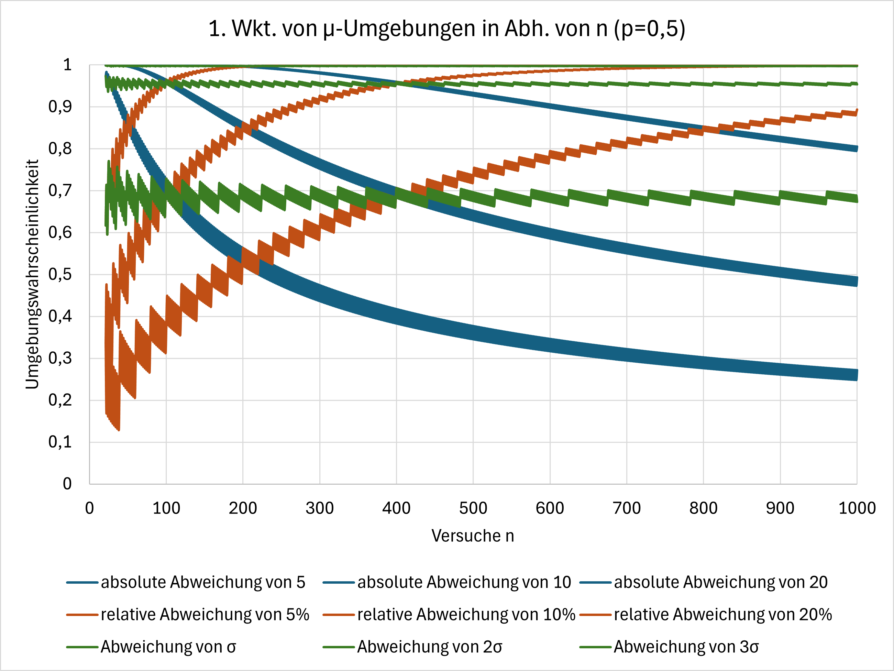

## Einführung

Ein **Bernoulli-Experiment** ist ein Zufallsexperiment mit nur zwei möglichen Ergebnissen: Treffer oder Niete. Die Wahrscheinlichkeit für einen Treffer wird in der Regel mit $p$ bezeichnet, für eine Niete mit $q=1-p$. Wird ein Bernoulli-Experiment $n$-mal hintereinander bei gleichbleibender Trefferwahrscheinlichkeit durchgeführt, so sprechen wir von einer **Bernoulli-Kette** der Länge $n$. Eine gleichbleibende Trefferwahrscheinlichkeit bedeutet im Übrigen, dass die auftretenden Ereignisse voneinander unabhängig sind.
Eine Zufallsgröße, die bei einer Bernoulli-Kette die Anzahl der Treffer angibt, heißt **binomialverteilt**. Aufgrund dieser klaren Struktur werden sich viele systematische Rechenverfahren ergeben.



## Die Bernoulli-Formel

### Herleitung

Wir betrachten eine Bernoulli-Kette der Länge $n$ mit Trefferwahrscheinlichkeit $p$ und fragen nach der Wahrscheinlichkeit für genau $k$ Treffer. Das zugehörige Baumdiagramm hat folgende Gestalt:



Um die Wahrscheinlichkeit für genau $k$ Treffer zu berechnen, benötigen wir die erstens Anzahl der Pfade mit genau $k$ Treffern und zweitens die Endwahrscheinlichkeit eines solchen Pfades.

- **Pfadanzahl:** Der sogenannte Binomialkoeffizient (lies: n über k)

  $$
    \begin{align}
    \binom{n}{k} & =\frac{n!}{k!\cdot (n-k)!}\\
    & =\frac{1\cdot 2 \cdot \ldots n}{(1\cdot 2 \cdot \ldots k)\cdot (1\cdot 2 \cdot \ldots (n-k))}
    \end{align}
  $$

  gibt diese Anzahl an Pfaden an. Er kann mit den meisten Taschenrechnern direkt bestimmt werden.

- **Pfadendwahrscheinlichkeit:** Jeder dieser Pfade hat nach der Pfadmultipliaktionsregel dieselbe Pfadwahrscheinlichkeit
  $$
  p^k \cdot (1−p)^{n−k},
  $$
  denn auf jedem dieser Pfade treten genau $k$ Treffer und $n−k$ Nieten auf.

Damit ergibt sich mit der Pfadadditionsregel die **Bernoulli-Formel** für genau $k$ Treffer:

$$
P(X=k)=\binom{n}{k}\cdot p^k\cdot (1-p)^{n-k}
$$

Diese Formel bildet die Grundlage für viele Wahrscheinlichkeitsberechnungen. Sie ist in einigen Taschenrechnern als Funktion integriert und in Tafelwerken dokumentiert.

### Anwendung

{% include flip-card.html
frage="Eine Basketballspielerin habe von der Freiwurflinie eine Trefferwahrscheinlichkeit von 70 % und wirft 4 Mal. Wie groß ist die Wahrscheinlichkeit, dass sie genau 3 Treffer erzielt?"
antwort="

$$
\begin{align*}
P(X=4)&=\binom{4}{3}\cdot 0{,}7^3\cdot (1-0{,}7)^{4-3}\\
&=0{,}4116
\end{align*}
$$

"
%}

{% include flip-card.html
frage="Ein Virentest erkennt eine Infektion mit 92 % Wahrscheinlichkeit. Bei 12 getesteten infizierten Personen: Wie groß ist die Wahrscheinlichkeit, dass genau 11 positive Tests erfolgen?"
antwort="

$$
\begin{align*}
P(X=11)&=\binom{12}{11}\cdot 0{,}92^{11}\cdot 0{,}08^{12-11}\\
&=0{,}2855
\end{align*}
$$

" %}

{% include flip-card.html
frage="Die Wahrscheinlichkeit, dass ein Paket zu spät geliefert wird, beträgt 10 %. Bei 8 Sendungen: Wie wahrscheinlich ist es, dass genau 2 zu spät ankommen?"
antwort="

$$
\begin{align*}
P(X=2)&=\binom{8}{2}\cdot 0{,}1^2\cdot 0{,}9^{8-2}\\
&=0{,}1488
\end{align*}
$$

" %}

### Interpretationen

Durch den häufigen Einsatz von Taschenrechnern oder Tafelwerken gerät die Bedeutung der Bernoulli-Formel in den Hintergrund. Dabei ist gerade diese Formel die Grundlage dafür, dass solche Hilfsmittel Wahrscheinlichkeiten so zuverlässig angeben können. Es ist daher wichtig, die Formel auch inhaltlich interpretieren zu können.



## Intervallwahrscheinlichkeiten

Im vorherigen Abschnitt interessierten wir uns für die Wahrscheinlichkeit für **genau** $k$ Treffer. In diesem Abschnitt erweitern wir die Fragestellung und fragen nach der Wahrscheinlichkeit, dass die Anzahl der Treffer in einem vorgegebenen Bereich liegt.

### Beispiel

Eine Basketballsperin habe von der Dreierlinie eine Trefferwahrscheinlichkeit von 10% und wirft 20 Mal. Die Zufallsgröße $X$, die die Anzahl der Treffer angibt, ist binomialverteilt mit $n=20$ und $p=0{,}1$.

Wie groß ist die Wahrscheinlchkeit für höchstens 2 Treffer? Höchstens 2 Treffer bedeutet, dass sie 0, 1 oder 2 Mal trifft. Die gesuchte Wahrscheinlichkeit wird mit $P(X\leq 2)$ bezeichnet und ist

$$
\begin{align*}
P(X \leq 2) &= P(X = 0) + P(X = 1) + P(X = 2) \\
&= \binom{20}{0} \cdot 0{,}1^0 \cdot 0{,}9^{20} + \binom{20}{1} \cdot 0{,}1^1 \cdot 0{,}9^{19} + \binom{20}{2} \cdot 0{,}1^2 \cdot 0{,}9^{18}\\
&=0,1216 + 0,2702 + 0,2852\\
&=0,6769.
\end{align*}
$$

Die Bernoulli-Formel muss also lediglich mehrmals nacheinander angewendet werden.

### Symbolische Formulierungen

Damit wir die Bernoulli-Formel geeignet anwenden können, müssen wir gut auf die Beschreibung des gesuchten Bereichs achten: Um welche Trefferanzahlen geht es? Dazu ist es hilfreich, textuelle Beschreibungen in symbolische umzuformen.

Beschreiben Sie die folgenden Wahrscheinlichkeiten symbolisch (weiterhin ist $n=8$).















Wir beobachten die folgenden Regeln:

$$
P(X<k)=P(X\leq k-1)
$$

$$
P(X>k)=P(X\geq k+1)
$$

$$
P(a\leq X\leq b)=P(X\leq b) - P(X\leq a-1)
$$

Das Gegenereignis zu "mindestens $k$ Treffer" ist "höchstens $k-1$ Treffer". Der Satz von der Gegenwahrscheinlichkeit lautet hier also

$$
P(X\geq k)=1-P(X\leq k-1).
$$

### Berechnungen

Für Bereichswahrscheinlichkeiten werden die Bernoulli-Formeln mehrfach nacheinander angewendet. Dies kann bei vielen Summanden aufwendig und fehleranfällig sein. Typischerweise werden Bereichswahrscheinlichkeiten daher mit Tafelwerken oder Taschenrechnern bestimmt. In Tafelwerken befinden sich in der Regel die **kumulierten Wahrscheinlichkeiten** $P(X\leq k)$.





### Weitere Hinweise

Bevor wir Bereichswahrscheinlichkeiten bestimmen können, müssen wir die folgenden Fragen beantworten:

- Liegt überhaupt eine binomialverteilte Zufallsgröße vor?
- Wie lauten die Bernoulli-Parameter $n$ und $p$?
- Was ist im Sachzusammenhang ein Treffer, was ist eine Niete?
- Müssen die Intervallgrenzen des angegebenen Bereichs eventuell noch berechnet werden?
- Möglicherweise entstehen Ausdrücke mit nicht-ganzzahligen Intervallgrenzen. Hier müssen wir richtig runden: Ist z.B. $X\leq 3{,}8$ so darf $X$ auf keinen Fall größer als $3{,}8$ sein, es gilt also $P(X\leq 3{,}8)=P(X\leq 3)$. Ist z.B. $X> 5{,}1$, so darf $X$ auf keinen Fall kleiner oder gleich als $5{,}1$ sein, es gilt also $P(X> 5{,}1)=P(X\geq 6)$.

### Beispiele

Wir suchen die Wahrscheinlichkeiten der angegebnen Ereignisse

1. mit Hilfe kumulierter Wahrscheinlichkeiten,
2. mit Hilfe des Taschenrechners.

Die Basketballspielerin erzielt (weiterhin ist $n=20$ und $p=0{,}1$)

















{% include flip-card.html
frage="in höchstens 13% der Würfe Treffer."
antwort="Hier berechnen wir zunächst die Intervallgrenzen: $0,13\cdot 20=2,6$. Dann haben wir:

$$
\begin{align*}
P(X \leq 2{,}6) &= P(X \leq 2) = 0{,}6769\\
P(X \leq 2{,}6) &= Bcd(0;2;20;0{,}1) = 0{,}6769
\end{align*}
$$

" %}











## Histogramme

Wie jede Zufallsgröße können binomialverteilte Zufallsgrößen in Histogrammen dargestellt werden. Es gibt zwei Varianten:

- Einzelwahrscheinlichkeiten: Hier wird jeder Trefferanzahl $k$ die Wahrscheinlichkeit $P(X=k)$ zugeordnet.
- Kumulierte Wahrscheinlichkeiten: Hier wird jeder Trefferanzahl $k$ die kumulierte Wahrscheinlichkeit $P(X\leq k)$ zugeordnet.







## Bestimmung von n, p und k

Mit Hilfe der Bernoulli-Formel $P(X=k)=\binom{n}{k}p^k(1-p)^{n-k}$ lassen sich Intervallwahrscheinlichkeiten binomialverteilter Zufallsgrößen betimmen:

$$
\begin{align*}
P(X\leq k)&=P(X=0) + P(X=1) + \ldots P(X=k)\\
&=\binom{n}{0}p^0(1-p)^{n} + \binom{n}{1}p^{1}(1-p)^{n-1} + \ldots + \binom{n}{k}p^k(1-p)^{n-k}\\
& =\sum_{i=0}^k \binom{n}{i}p^i(1-p)^{n-i}
\end{align*}
$$

Wie wir gesehen haben, lässt sich dieser komplizierte Ausdruck mit Hilfe von Tafelwerken oder Taschenrechnern bestimmen. Das bedeutet: Wenn $n$, $p$ und $k$ gegeben sind, können wir die Wahrscheinlickeit $P(X\leq k)$ bestimmen.

Wir ändern nun die Perspektive: Angenommen $P(X\leq k)$ und z.b. $p$ und $k$ seien gegeben. Was ist dann $n$?

Dazu müsste die oben erwähnte Formel nach $n$ aufgelöst werden. Dies ist jedoch nicht elementar möglich. Stattdessen probieren wir mit Hilfe von Wertetabellen systematisch aus.

### Beispiel 1

Gegegen: $P(X\leq 3)\approx 0{,}71$ und $p=0,4$

Gesucht: $n$

Mit Hilfe eines Tafelswerks und Taschenrechners stellen wir folgende Tabelle auf:

| $n$ | $P(X\leq 3)$ |
| --- | ------------ |
| 1   | 1,0000       |
| 2   | 1,0000       |
| 3   | 1,0000       |
| 4   | 0,9744       |
| 5   | 0,9130       |
| 6   | 0,8208       |
| 7   | 0,7102       |
| 8   | 0,5941       |
| 9   | 0,4826       |
| 10  | 0,3823       |

Wir entnehmen der Tabelle, dass $P(X\leq 3)=0{,}7102\approx 0{,}71$ für $n=3$ ist.

### Beispiel 2

Gegegen: $P(X\geq 14)\approx 0{,}15$ und $n=20$

Gesucht: $p$

Mit Hilfe eines Tafelswerks und Taschenrechners stellen wir folgende Tabelle auf:

| $p$  | $P(X\geq 14)$ |
| ---- | ------------- |
| 0,51 | 0,0688        |
| 0,52 | 0,0814        |
| 0,53 | 0,0958        |
| 0,54 | 0,1119        |
| 0,55 | 0,1299        |
| 0,56 | 0,1499        |
| 0,57 | 0,1719        |
| 0,58 | 0,1959        |
| 0,59 | 0,2220        |
| 0,60 | 0,2500        |

Wir entnehmen der Tabelle, dass $P(X\geq 14)=0{,}1499\approx 0{,}15$ für $p=0{,}56$ ist.

### Beispiel 3

Gegegen: $P(X\leq k)\approx 0{,}10$ und $n=200$ und $p=0{,}9$

Gesucht: $k$

Mit Hilfe eines Tafelswerks und Taschenrechners stellen wir folgende Tabelle auf:

| $k$ | $P(X\leq k)$ |
| --- | ------------ |
| 171 | 0,0271       |
| 172 | 0,0434       |
| 173 | 0,0672       |
| 174 | 0,1005       |
| 175 | 0,1449       |
| 176 | 0,2017       |
| 177 | 0,2710       |
| 178 | 0,3516       |
| 179 | 0,4408       |
| 180 | 0,5345       |

Wir entnehmen der Tabelle, dass $P(X\leq 174)=0{,}1005\approx 0{,}10$. Es ist also $k=174$.

Häufig stehen wir auch vor der Frage, dass ein minimales oder maximales $n$, $p$ oder $k$ gesucht ist, so dass eine vorgegebene Wahrscheinlichkeit unter- oder überschritten wird. Dazu suchen wir die zwei benachbarte Einträge in der Wahrscheinlichkeitstabelle, zwischen denen die vorgegebene Wahrscheinlichkeit liegt.

{% include info.html
index="8"
frage="Beispiel zur Bestimmung von $n$:"
antwort="
Der Besitzer eines Restaurants untersucht, wie viele Gäste vegetarische Gerichte bestellen. Allgemeine Statistiken zeigen, dass 61% aller Gäste vegetarische Gerichte bestellen. Wie viele Gerichte müssen mindestens untersucht werden, damit die Wahrscheinlichkeit für mindestens 144 vegetarische Gerichte mindestens 29% beträgt?

Gegeben ist $p=0{,}61$ und $k=144$. Gesucht ist das kleinste $n$, so dass $P(X\geq 144)\geq 0{,}29$ ist. Wir bestimmen:

$$
\begin{align*}
\text{für }n=228 \text{ gilt: } P(X\geq 144)=0{,}2753<0{,}29\\
\text{für }n=229 \text{ gilt: } P(X\geq 144)=0{,}3042\geq 0{,}29
\end{align*}
$$

Das kleinste $n$, für das $P(X\geq 144)\geq 0{,}29$ gilt, ist also $n=229$.

"
%}

{% include info.html
index="9"
frage="Beispiel zur Bestimmung von $p$:"
antwort=" Ein Unternehmen untersucht, wie zufrieden seine Mitarbeiter sind. Dazu werden 274 Mitarbeiter befragt. Wie hoch muss der Anteil der zufriedenen Mitarbeiter mindestens sein, damit die Wahrscheinlichkeit für höchstens 142 zufriedene Mitarbeiter höchstens 31% beträgt (auf 2 NKS gerundet)?

Gegeben ist $n=274$ und $k=142$. Gesucht ist das kleinste $p$, so dass $P(X\leq 142)\leq 0{,}31$ ist. Wir bestimmen:

$$
\begin{align*}
\text{für }p=0{,}53 \text{ gilt: } P(X\leq 142)=0{,}3706>0{,}31\\
\text{für }p=0{,}54 \text{ gilt: } P(X\leq 142)=0{,}2538\leq 0{,}31
\end{align*}
$$

Das kleinste $p$, für das $P(X\leq 142)\leq 0{,}31$ gilt, ist also $p=0{,}54$.
"
%}

{% include info.html
index="10"
frage="Beispiel zur Bestimmung von $k$:"
antwort="
Ein potentieller Werbepartner studiert den Bekanntheitsgrad einer Influencerin. An einer Umfrage zum Bekanntheitsgrad der Influencerin nehmen 158 User teil. Man weiß, dass jeder 2. User der Influencerin folgt. Wie viele Follower der Influencerin dürfen höchstens in der Stichprobe vorhanden sein, damit die Wahrscheinlichkeit für mindestens diese Anzahl der Follower der Influencerin mindestens 87% beträgt?

Gegeben ist $n=158$ und $p=0{,}5$. Gesucht ist das größte $k$, so dass $P(X\geq k)\geq 0{,}87$ ist. Wir bestimmen:

$$
\begin{align*}
\text{Es gilt: } P(X\geq 72)=0{,}8837\geq 0{,}87\\
\text{Es gilt: } P(X\geq 73)=0{,}8495< 0{,}87
\end{align*}
$$

Das größte $k$, für das $P(X\geq k)\geq 0{,}87$ gilt, ist also $k=72$.
"
%}

## Erwartungswert und Standardabweichung

### Die Formeln

Wir erinnern daran, dass der Erwartungswert den im langfristigen Mittel zu erwartenden Wert einer Zufallsgröße beschreibt und die Standardabweichung ein Maß für deren Schwankung ist. Bei der Binomialverteilung verwenden wir häufig das Symbol $\mu$ für den Erwartungswert und wie gewohnt $\sigma$ für die Standardabweichung.

Die allgemeinen Berechnungsmethoden für Zufallsgrößen vereinfachen sich bei der Binomialverteilung. Es gilt:

$$
\mu=n\cdot p
$$

$$
\sigma=\sqrt{n\cdot p\cdot (1-p)}
$$

### Exkurs: Beweise

Für den Erwartungswert $\mu=E(X)$ gilt:

$$
\begin{align*}
E(X) &= \sum_{i=0}^n x_i \cdot P(X = x_i) && \text{Definition des Erwartungswerts} \\
     &= \sum_{k=0}^n k \cdot P(X = k) && \text{Index umbenannt: } x_i \to k \\
     &= \sum_{k=0}^n k \cdot \binom{n}{k} \cdot p^k \cdot (1 - p)^{n - k} && \text{Wahrscheinlichkeit bei Binomialverteilung} \\
     &= \sum_{k=0}^n k \cdot \frac{n!}{k! (n - k)!} \cdot p^k \cdot (1 - p)^{n - k} && \text{Binomialkoeffizient ausgeschrieben} \\
     &= \sum_{k=1}^n \frac{n \cdot (n - 1)!}{(k - 1)! (n - k)!} \cdot p^k \cdot (1 - p)^{n - k} && \text{Zähler } k = n \cdot \frac{(n - 1)!}{(k - 1)!} \text{ und } k=0 \text{ entfällt, da Summand } 0 \\
     &= np \cdot \sum_{k=1}^n \binom{n - 1}{k - 1} \cdot p^{k - 1} \cdot (1 - p)^{n - k} && \text{Faktoren ausgelagert, Umformung in Binomialkoeffizient} \\
     &= np \cdot \left( (p+(1-p)\right)^{n - 1} && \text{Binomischer Lehrsatz mit } n-1 \text{ und } k-1 \\
     &= np && \text{da } ( p+1-p)^{n - 1} = 1
\end{align*}
$$

Der Beweis für die Standardabweichung,

$$
\sqrt{n\cdot p\cdot (1-p)}= \sqrt{\sum_{i=1}^{n} (x_i - E(X))^2\cdot P(X=x_i)},
$$

ist noch aufwendiger und wird hier übersprungen.



### Kombination der Formeln

In den beiden Gleichungen

$$
\mu=n\cdot p \text{ und } \sigma=\sqrt{n\cdot p\cdot (1-p)}
$$

werden die vier Größen $n$, $p$, $\mu$ und $\sigma$ miteinander verknüpft. Damit können wir häufig, wenn zwei Werte dieser vier Größen bekannt sind, die Werte der anderen beiden Größen berechnen.

{% include info.html
index="12"
frage="Bestimmung von $p$ und $\sigma$"
antwort="Umstellen der Formeln $\mu=n\cdot p$ und $\sigma=\sqrt{n\cdot p\cdot (1-p)}$.

Beispiel: Polizisten kontrollieren in der Nähe einer Diskothek insgesamt 200 Autofahrer. Sie gehen davon aus, dass unter diesen etwa 25 alkoholisierte Personen am Steuer sitzen. Mit welcher Wahrscheinlichkeit ist ein kontrollierter Autofahrer alkoholisiert? Wie groß ist die Standardabweichung der binomialverteilten Zufallsgröße, die die Anzahl alkoholisierter Fahrer beschreibt?

Gegeben sind $n=200$ und $\mu=25$, gesucht sind $p$ und $\sigma$. Wegen $\mu=n\cdot p$ ist $25=200 \cdot p$ und so $p=\frac{25}{200}=0{,}4$. Dann ist $\sigma=\sqrt{200\cdot 0{,}4\cdot (1-0{,}4)}=6{,}9282$.
"
%}

{% include info.html
index="13"
frage="Bestimmung von $n$ und $\sigma$"
antwort="Umstellen der Formeln $\mu=n\cdot p$ und $\sigma=\sqrt{n\cdot p\cdot (1-p)}$.

Beispiel: Auf einem gebührenpflichtigen Parkplatz parken erfahrungsgemäß 15 % der Autofahrer ohne gültigen Parkschein. Eine Mitarbeiterin des Ordnungsamts beginnt ihren Dienst mit 12 Überweisungsträgern, die sie bei festgestellten Verstößen hinter die Scheibenwischer der Fahrzeuge legt. Mit wie vielen Fahrzeugen ohne gültigen Parkschein rechnet die Mitarbeiterin an diesem Tag? Wie groß ist die Standardabweichung der binomialverteilten Zufallsgröße, die die Anzahl der Falschparker beschreibt?

Gegeben sind $p=0{,}15$ und $\mu=12$, gesucht sind $n$ und $\sigma$.
Wegen $\mu=n\cdot p$ ist $12=n \cdot 0{,}15$ und so $n=\frac{12}{0{,}15}=80$.
Dann ist $\sigma=\sqrt{80\cdot 0{,}15\cdot (1-0{,}15)}=3{,}1937$.
"
%}

{% include info.html
index="14"
frage="Bestimmung von $n$ und $\sigma$"
antwort="Umstellen der Formeln $\mu=n\cdot p$ und $\sigma=\sqrt{n\cdot p\cdot (1-p)}$.

Beispiel: Im Rahmen einer Umfrage vor einer Wahl wurde untersucht, wie viele Wahlberechtigte noch unentschlossen sind. Es wird die Zufallsgröße betrachtet, die die Anzahl der unentschlossenen Wahlberechtigten angibt. Die Auswertung erfolgte mithilfe einer statistischen Software. In der Ergebnisübersicht sind folgende Werte angegeben: $\mu=175$ und $\sigma=10{,}6653$. Wie viele Wahlberechtigte wurden befragt? Mit welcher Wahrscheinlichkeit ist ein zufällig ausgewählter Wahlberechtigter noch unentschlossen?

Gegeben sind $\mu=175$ und $\sigma=10{,}6653$, gesucht sind $n$ und $p$.
Wegen $\mu=n\cdot p$ und $\sigma=\sqrt{n\cdot p\cdot (1-p)}$ ist $\sigma=\sqrt{\mu\cdot (1-p)}$. Mit Werten ergibt sich:

$$
\begin{align*}
10{,}6653&=\sqrt{175\cdot (1-p)}\quad |()^2\\
113{,}7486&=175\cdot (1-p)\quad|:175\\
0{,}65&=1-p\quad\\
p&=0{,}35
\end{align*}
$$

Dann ist $n=\frac{175}{0{,}35}=500$.
"
%}

{% include info.html
index="15"
frage="Bestimmung von $n$ und $\mu$"
antwort="Umstellen der Formeln $\mu=n\cdot p$ und $\sigma=\sqrt{n\cdot p\cdot (1-p)}$.

Beispiel: Eine Maschine produziert ein bestimmtes Bauteil. Erfahrungsgemäß ist etwa jedes zehnte Bauteil fehlerhaft. Bei einer Qualitätskontrolle ergibt sich eine Standardabweichung von $4{,}6476$ für die Anzahl fehlerhafter Bauteile. Wie viele Bauteile wurden kontrolliert? Wie viele fehlerhafte Bauteile werden in der Stichprobe erwartet?

Gegeben sind $p=0{,}1$ und $\sigma=4{,}6476$, gesucht sind $n$ und $\mu$.
Wegen $\sigma=\sqrt{n\cdot p\cdot (1-p)}$ ist:

$$
\begin{align*}
4{,}6476&=\sqrt{n\cdot 0{,}1\cdot (1-0{,}1)}\quad |()^2\\
21,6002&=n\cdot 0{,}09\quad |:0{,}09\\
n&=240
\end{align*}
$$

Dann ist $\mu=240\cdot 0{,}1=24$.
"
%}

### Umgebungen des Erwartungswerts

Häufig interssieren wir uns dafür, was die "normalen" Werte einer Zufallsgröße sind, welche Werte sie also typischerweise annimmt. Dies lässt sich beispielsweise in folgenden Situationen beobachten:

- Medizin: In Bei Laborwerten (z. B. Blutzucker, Blutdruck oder Cholesterin) werden sogenannte Referenzbereiche angegeben, innerhalb derer der Wert bei gesunden Personen mit hoher Wahrscheinlichkeit liegt. Werte außerhalb dieses Bereichs können ein Hinweis auf eine Erkrankung sein.
- Qualitätskontrolle: In der Produktion wird überprüft, ob Produkte innerhalb zulässiger Toleranzen liegen. Ist der Ausschussanteil zu hoch, liegt ein Qualitätsproblem vor.
- Wahlumfragen: Wenn in Umfragen ein Anteil (z. B. Zustimmung zu einer Partei) erhoben wird, interessiert man sich für ein Vertrauensintervall um diesen Wert, also für den Bereich, in dem der „wahre“ Wert mit hoher Wahrscheinlichkeit liegt.

Wir betrachten beispielhaft die Binomialverteilung mit $n=10$ und $p=0{,}4$:



Was versteht man nun genau unter normalen Werten bzw. dem Normbereich?

Es handelt sich dabei um einen Bereich, in dem die Zufallsgröße mit hoher Wahrscheinlichkeit ihre Werte annimmt. Wie hoch diese Wahrscheinlichkeit genau sein soll, ist nicht allgemein festgelegt. Daher ist die Definition eines Normbereichs in gewissem Sinne subjektiv.

Allgemein gilt: Die größte Wahrscheinlichkeit liegt beim Erwartungswert $\mu = n \cdot p$ vor. Falls $\mu$ nicht ganzzahlig ist, ist einer der benachbarten ganzzahligen Werte am wahrscheinlichsten. Im betrachteten Beispiel liegt der Erwartungswert bei $\mu = 4$ und seine Wahrscheinlichkeit ist $P(X=\mu)=0{,}2508$. Auch die benachbarten Werte treten mit vergleichsweise hoher Wahrscheinlichkeit auf: $P(X=3)=0{,}2150$ und $P(X=5)=0{,}2007$. Ein möglicher Normbereich wäre $[3;5]$, die Zufallsgröße hat mit einer Wahrscheinlichkeit von $0{,}2508 + 0{,}2150 + 0{,}2007=0{,}6665$ ihre Werte in diesem Bereich.

Es gibt verschiedene Möglichkeiten, eine Umgebungen des Erwartungswerts anzugeben:

1. Absolute Umgebung
2. Relative Umgebung
3. Sigma-Umgebung

### Absolute Umgebungen

Eine mögliche Idee ist es, Normbereiche mit Hilfe absoluter Abweichungen vom Erwartungswert anzugeben.

{% include info.html
index="16"
frage="Beispiel: $n=25$ und $p=0{,}3$. Wie groß ist die Wahrscheinlichkeit, dass $X$ um höchstens $2$ vom Erwartungswert abweicht?"
antwort="
Wir berechnen $\mu=7{,}5$. Gesucht ist:

$$
\begin{align*}
P(\mu-2\leq X\leq \mu +2)&=P(7{,}5-2\leq X\leq 7{,}5 +2)\\
                        &=P(5{,}5\leq X\leq 9{,}5)\\
                        &=P(6\leq X\leq 9) \\
                        &=0{,}6171
\end{align*}
$$

Alternativ könnten wir auch nach der Wahrscheinlichkeit für 'nicht-normale' Werte fragen: Mit welcher Wahrscheinlichkeit weicht $X$ um mehr als $2$ vom Erwartungswert ab (symbolisch: $P(\|\mu-X\|>2)$)? Dies entspricht dem Gegenereignis zum oben betrachteten Ereignis, daher ist

$$
P(|\mu-X|>2)=1-0{,}6171=0{,}3929
$$

"
%}

### Relative Umgebungen

Um die Höhe des Erwartungswerts berücksichtigen zu können, betrachten wir nun alternativ eine relative Abweichung vom Erwartungswert.

{% include info.html
index="17"
frage="Beispiel: $n=25$ und $p=0{,}3$. Wie groß ist die Wahrscheinlichkeit, dass $X$ um höchstens $10\%$ vom Erwartungswert abweicht?"
antwort="
Wir berechnen $\mu=7{,}5$. Gesucht ist:

$$
\begin{align*}
P(0{,}9\cdot \mu\leq X\leq 1{,}1\cdot \mu)&=P(0{,}9\cdot 7{,}5\leq X\leq 1{,}1\cdot 7{,}5)\\
                        &=P(6{,}75\leq X\leq 8{,}25)\\
                        &=P(7\leq X\leq 8) \\
                        &=0{,}3363
\end{align*}
$$

Alternativ könnten wir auch nach der Wahrscheinlichkeit für 'nicht-normale' Werte fragen: Mit welcher Wahrscheinlichkeit weicht $X$ um mehr als $10\%$ vom Erwartungswert ab (symbolisch: $P(\|\mu-X\|>0{,}1\cdot\mu=0{,}75)$)? Dies entspricht dem Gegenereignis zum oben betrachteten Ereignis, daher ist

$$
P(|\mu-X|>0{,}75)=1-0{,}3363=0{,}6637
$$

"
%}

### Sigma-Umgebungen

Eine gute Idee ist es, Normbereiche mit Hilfe der Standardabweichung $\sigma$ anzugeben, da $\sigma$ ein Maß für die Schwankung ist: Schwanken die Werte der Zufallsgröße relativ stark, sollte acuh der Normbereich relativ groß gefasst werden.

{% include info.html
index="18"
frage="Beispiel: $n=25$ und $p=0{,}3$. Wie groß ist die Wahrscheinlichkeit, dass $X$ um höchstens die doppelte Standardabweichung vom Erwartungswert abweicht?"
antwort="
Wir berechnen $\mu=7{,}5$ und $\sigma\approx 2{,}29$. Gesucht ist:

$$
\begin{align*}
P(\mu-2\sigma\leq X\leq \mu+2\sigma)&=P(7{,}5+2\cdot 2{,}29\leq X\leq 7{,}5-2\cdot 2{,}29)\\
                        &=P(2{,}92\leq X\leq 12{,}08)\\
                        &=P(3\leq X\leq 12) \\
                        &=0{,}9736
\end{align*}
$$

Alternativ könnten wir auch nach der Wahrscheinlichkeit für 'nicht-normale' Werte fragen: Mit welcher Wahrscheinlichkeit weicht $X$ um mehr als die doppelte Standardabweichung vom Erwartungswert ab (symbolisch: $P(\|\mu-X\|>2\sigma)$)? Dies entspricht dem Gegenereignis zum oben betrachteten Ereignis, daher ist

$$
P(|\mu-X|>2\sigma)=1-0{,}9736=0{,}0264
$$

"
%}

### Exkurs: Bedeutung der Standardabweichung

Zur Festlegung von Normbereichen eignen sich Sigma-Umgebungen besser als absolute oder relative Umgebungen.

Um dies zu veranschaulichen, betrachten wir die Umgebungswahrscheinlichkeiten

1. in Abhängigkeit von $n$ bei festem $p$,
2. in Abhängigkeit von $p$ bei festem $n$.

  
  

Man erkennt, dass die Umgebungswahrscheinlichkeiten bei absoluten und relativen Umgebungen stark von $n$ und $p$ abhängen. Im Gegensatz dazu bleiben die Wahrscheinlichkeiten bei Sigma-Umgebungen vergleichsweise konstant.

Ferner gelten die sogenannten **Sigma-Regeln**: Die Wahrscheinlichkeiten für die Sigma-Umgebungen konvergieren für $n\to\infty$ gegen folgende Werte:

- $P(\mu-\sigma\leq X\leq\mu+\sigma)\approx 0{,}683$
- $P(\mu-2\sigma\leq X\leq\mu+3\sigma)\approx 0{,}954$
- $P(\mu-2\sigma\leq X\leq\mu+3\sigma)\approx 0{,}997$

Als Faustregel hat sich die sogenannten Laplace-Bedingung etabliert. Die besagt, dass für $\sigma>3$ die Sigma-Regeln gelten.
