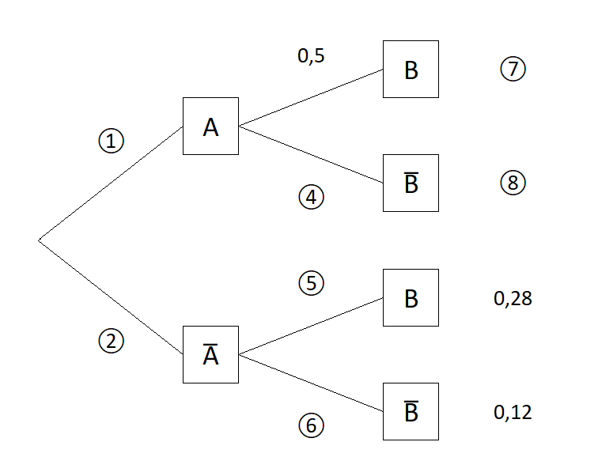
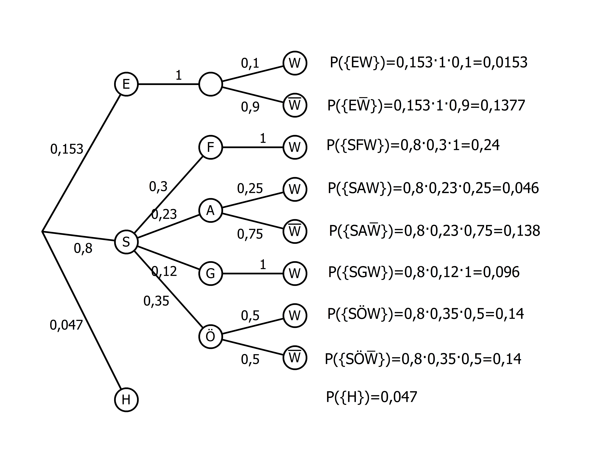
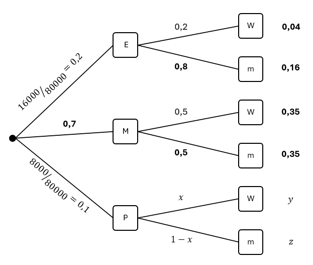
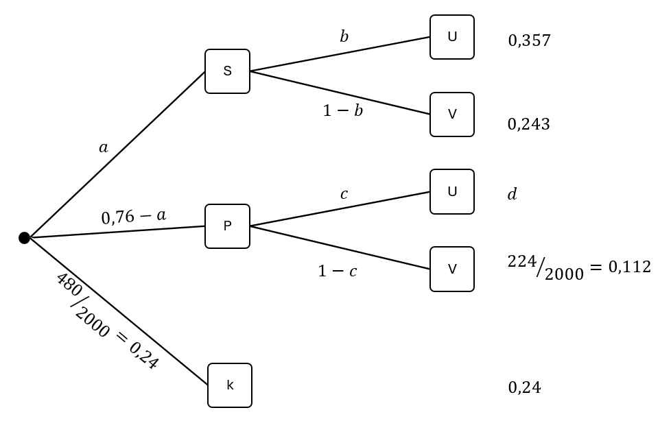

## Einführung

Wenn mehrere Zufallsexperimente nacheinander durchgeführt werden, sprechen wir von einem mehrstufigen Zufallsexperiment. Zur übersichtlichen Darstellung nutzen wir häufig Baumdiagramme. Für jede Stufe des Zufallsexperiments werden die Ergebnisse des einzelnen Zufallsexperiments als Knotenpunkte dargestellt. Die Stufen werden dann durch Pfade miteinander verbunden. Ein Ergebnis des mehrstufigen Zufallsexperiments entspricht dann einem vollständigen Pfad im Baumdiagramm. An den einzelnen Pfaden stehen die entsprechenden Wahrscheinlichkeiten. Es gibt zwei wichtige Regeln:

- **Pfadmultiplikationsregel:** Die Wahrscheinlichkeit eines Ergebnisses ist das Produkt der Wahrscheinlichkeiten entlang des entsprechenden Pfades.
- **Pfadadditionsregel:** Die Wahrscheinlichkeit eines Ereignisses ist die Summe der Wahrscheinlichkeiten der Ergebnisse, die zu diesem Ereignis führen.

Da generell die Summe aller Wahrscheinlichkeiten eines Zufallsexperiments immer gleich 1 ist, ist auch die Summe der Wahrscheinlichkeiten aller Pfade, die von einem Knotenpunkt starten, gleich 1. Ebenso ist auch die Summe der Endwahrscheinlichkeiten gleich 1.

### Beispiel: Zweimaliger Münzwurf

Kopf ($K$) und Zahl ($Z$) treten bei einem einmaligen Wurf beide mit einer Wahrscheinlichkeit von 50&nbsp;% auf. Daraus ergibt sich folgendes Baumdiagramm:



Nach der Pfadmultiplikationsregel haben wir jede Endwahrscheinlichkeit mit $0{,}5\cdot 0{,}5=0{,}25$ berechnet.

Betrachten wir z.B. das Ereignis $E$: "Es wird zweimal das Gleiche geworfen.", so ist $E=\\{KK, ZZ\\}$, und nach der Pfadadditionsregel folgt nun

$$
\begin{align*}
P(E)&=P(\{KK\})+P(\{ZZ\})\\
&=0{,}25+0{,}25\\
&=0{,}5.
\end{align*}
$$

## Baumdiagramme vervollständigen

Häufig stehen wir vor der Aufgabe, ein unvollständiges Baumdiagramm zu vervollständigen. Dazu verwenden wir, dass die Summe der Wahrscheinlichkeiten der Pfade, die von einem Knotenpunkt starten, gleich 1 ist. Außerdem wenden wir die Pfadregeln geschickt an.

### Beispiel 1

Sind alle Pfadwahrscheinlichkeiten gegeben – gegebenenfalls durch Berechnung von Gegenwahrscheinlichkeiten –, so lässt sich das Baumdiagramm wie unmittlebar mit Hilfe der Pfadmultiplikationsregel vervollständigen.

### Beispiel 2

Gegeben ist das folgende Baumdiagramm:

 <figure>
  
</figure>
Die Wahrscheinlichkeit 4 wird mit $x$ bezeichnet und kann wie folgt berechnet werden $0{,}2\cdot x = 0{,}06$ $\Rightarrow$ $x=0{,}3$. Dann kann sukzessive das Baumdiagramm vervollständigt werden.

### Beispiel 3

Gegeben ist das folgende Baumdiagramm:

 <figure>
  
</figure>
Die Wahrscheinlichkeit 2 wird mit $x$ bezeichnet und kann wie folgt berechnet werden $ x = 0{,}28+0{,}12=0{,}4$. Dann kann sukzessive das Baumdiagramm vervollständigt werden.

## Baumdiagramme interpretieren

Häufig liegt eine Situation vor, in der zwei Ereignisse $A$ und $B$ und deren Gegenereignisse auftreten. Zum Beispiel:

- $A$: Eine Person putzt sich regelmäßig die Zähne.
- $B$: Eine Person hat gesunde Zähne.

Das Baumdiagramm habe die Gestalt


Hinweise:

- Die Ergebnisemenge ist $S=\\{AB, A\overline{B}, \overline{A}B, \overline{A}\overline{B}\\}$.
- Es gilt $A=\\{AB, A\overline{B}\\}$ und $B=\\{AB, \overline{A}B\\}$.
- Auf der ersten Stufe stehen die Wahrscheinlichkeiten von $A$ und $\overline{A}$: $P(A)=0{,}5$ und $P(\overline{A})=0{,}5$.
- Auf der zweiten Stufe stehen die Wahrscheinlichkeiten von $B$ und $\overline{B}$ **in Abhängigkeit** davon, ob $A$ eingetreten ist oder nicht (diese Wahrscheinlichkeiten sind im Allgemeinen nicht $P(B)$ und $P(\overline{B})$).
- Da $B=\\{AB, \overline{A}B\\}$ haben wir $P(B)=0{,}2+0{,}05=0{,}25$. Die Wahrscheinlichkeit, dass eine Person gesunde Zähne hat, beträgt also 25&nbsp;%.
- "$\cap$-Ereignisse": Wegen $A\cap B=\\{AB\\}$ etc. entspricht jeder Pfad genau dem entsprechenden "$\cap$-Ereignis". Dann folgt $P(A\cap B)=0{,}2$. Die Wahrscheinlichkeit, dass eine Person sich regelmäßig die Zähne putzt und gesunde Zähne hat, beträgt also 20&nbsp;%.
- "$\cup$-Ereignisse": Wegen $\overline{A}\cup B=\\{AB, \overline{A}B, \overline{A}\overline{B}\\}$ etc. gehören zu jedem "$\cup$-Ereignis" immer genau drei Pfade. Dann folgt

  $$
  \begin{align*}
  P(\overline{A}\cup B)&=P(\{AB\}) + P(\{\overline{A}B\}) + P(\{\overline{A}\overline{B}\})\\
  &=0{,}2+0,05+0{,}45\\
  &=0{,}7.
  \end{align*}
  $$

  Die Wahrscheinlichkeit, dass eine Person sich nicht regelmäßig die Zähne putzt oder gesunde Zähne hat, beträgt also 70&nbsp;%.

## Weitere Baumdigramme

### Beispiel: Jugendliche auf dem Weg zur Schule

Baumdiagramme eignen sich auch dazu, komplexere Zufallsexperimente zu veranschaulichen:

Es sei bekannt, dass 4,7&nbsp;% aller Jugendlichen aus unterschiedlichen Gründen nicht zur Schule kommen und zu Hause bleiben ($H$). Vier Fünftel kommen selbstständig ($S$) zur Schule, die übrigen werden von ihren Eltern ($E$) gebracht. Von denjenigen, die selbstständig zur Schule kommen, nutzen 30&nbsp;% das Fahrrad ($F$), 23&nbsp;% das Auto ($A$), 12&nbsp;% gehen zu Fuß ($G$) und die restlichen Schülerinnen und Schüler benutzen den öffentlichen Personennahverkehr (Ö).
Alle Jugendlichen, die den Großteil ihres Schulwegs an der frischen Luft verbringen, sind in der ersten Unterrichtsstunde wach ($W$). Bei den mit dem Auto gebrachten Jugendlichen ist es lediglich ein Viertel, bei den Nutzern des öffentlichen Personennahverkehrs immerhin noch die Hälfte.
Von den Jugendlichen, die von ihren Eltern zur Schule gebracht werden, ist nur jeder 10. wach.

Das entsprechende Baumdiagramm lautet:

 <figure>
  
</figure>
Hier haben wir für jede Endwahrscheinlichkeit die Pfadmultiplikationsregel angewendet.

Betrachten wir z.B. das Ereignis $E$: "Ein Jugendlicher in der Schule ist in der ersten Stunde müde.", so ist $E=\\{E\overline{W}, SA\overline{W},SÖ\overline{W}\\}$, und nach der Pfadadditionsregel folgt nun

$$
\begin{align*}
P(E)&=P(\{E\overline{W}\})+P(\{SA\overline{W}\})+P(\{SÖ\overline{W}\})\\
&=0{,}1377+0{,}138+0{,}14\\
&=0{,}4157.
\end{align*}
$$

### Elektronikfachmarkt

Für eine statistische Untersuchung wurden in einem großen Elektronikfachmarkt Aufzeichnungen über die Verkäufe von Laptops mit Windows (W)- bzw. macOS (m)-Betriebssystem geführt. Zusätzlich wurden drei Gerätekategorien erfasst: Einsteigergeräte (E), Mittelklassegeräte (M) und Premiumgeräte (P). Von den Einsteigergeräten liefen ein Fünftel und von den Mittelklassegeräten die Hälfe mit Windows. Von den insgesamt 80.000 erfassten Laptops waren 45&nbsp;% mit Windows ausgestattet, es wurden 16.000 Einsteigergeräte und 8.000 Premiumgeräte verkauft.

Mithilfe dieser Angaben ergibt sich das folgende Baumdiagramm. Dabei wurde bereits berücksichtigt, dass die Summe aller Pfadwahrscheinlichkeiten, die von einem Knoten ausgehen, gleich 1 ist. Außerdem wurden die Pfadendwahrscheinlichkeiten berechnet.

 <figure>
  
</figure>

Welchen Wert hat $y$ ?

Da insgesamt 45 % der Laptops mit Windows ausgestattet sind, gilt
$$
0{,}04+0{,}35+y=0{,}45 \Rightarrow y=0{,}06.
$$

Welchen Wert hat $x$ ?

Die Multiplikationsregel auf den $P$–$W$-Pfad angewendet ergibt
$$
0{,}1\cdot x = 0{,}06 \Rightarrow x=0{,}6.
$$

Welchen Wert hat $z$ ?

$$
z=0{,}1\cdot (1-0{,}6)=0{,}04.
$$

Wie lauten die Wahrscheinlichkeiten der folgenden Ereignisse?

$E$: Ein zufällig ausgewählter Laptop ist entweder mit macOS ausgestattet oder ein Einsteigergerät.

  \begin{align*}
  P(E)&=P(\{EW\})+P(\{Em\})+P(\{Mm\})+P(\{Pm\})\\
  &=0{,}04+0{,}16+0{,}35+0{,}04\\
  &=0{,}59
  \end{align*}

$F$: Ein zufällig ausgewählter Premium-Laptop ist mit Windows ausgestattet.

$$
  P(F)=0{,}6
  $$
  

### Lern-Apps

Was halten Jugendliche von Lern-Apps? Zu dieser Frage wurde eine Befragung unter 2.000 Schülerinnen und Schülern durchgeführt. 35,7&nbsp;% der Befragten nutzen kostenlose Starter-Versionen (S) von Lern-Apps zur Unterhaltung (U), beispielsweise für Quizspiele. 24,3&nbsp;% verwenden Starter-Versionen gezielt zur Vorbereitung auf Prüfungen (V).
224 Jugendliche nutzen kostenpflichtige Pro-Versionen (P) zur gezielten Vorbereitung auf Prüfungen. Darüber hinaus gibt es auch einige Jugendliche mit Pro-Versionen, die die App lediglich zur Unterhaltung nutzen.
480 Befragten haben bislang noch keine Lern-App (k) verwendet.

Mithilfe dieser Angaben ergibt sich das folgende Baumdiagramm. Dabei wurde bereits berücksichtigt, dass die Summe aller Pfadwahrscheinlichkeiten, die von einem Knoten ausgehen, gleich 1 ist.

 <figure>
  
</figure>

Welchen Wert hat $d$ ?

Da die Summe aller Pfadenwahrscheinlichkeiten 1 ergeben muss, haben wir
$$
d=1-0{,}357-0{,}243-0{,}112-0{,}24=0{,}048.
$$

Welchen Wert hat $a$ ?

Die Pfadadditionsregel auf den  $S$–$U$- und  $S$–$V$-Pfad angewendet ergibt
$$
a=0{,}357+0{,}243=0{,}6.
$$

Welchen Wert hat $b$ ?

Die Multiplikationsregel auf den $S$–$U$-Pfad angewendet ergibt
$$
0{,}6\cdot b=0{,}357 \Rightarrow b=0{,}595.
$$

Welchen Wert hat $c$ ?

Die Multiplikationsregel auf den $P$–$U$-Pfad angewendet ergibt
$$
(0{,}76-0{,}6)\cdot c=0{,}048 \Rightarrow c=0{,}3.
$$

Wie lauten die Wahrscheinlichkeiten der folgenden Ereignisse?

$E$: Ein zufällig ausgewählter Jugendlicher verwendet eine Pro-Version.

    $$
  P(E)=0{,}76 - 0{,}6 = 0{,}16
  $$

$F$: Ein zufällig ausgewählter Jugendlicher verwendet eine Lern-App zur Unterhaltung.

    \begin{align*}
  P(F)&=P(\{SU\})+P(\{PU\})\\
  &=0{,}357+0{,}048\\
  &=0{,}405
  \end{align*}

<!--### Urnenmodelle
Ein wichtiges Beipsiel für mehrstufige Zufallsexperimente sind das Ziehen von Kugeln aus einer Urne. Hier müssen wir unterscheiden, ob Kugeln zurückgegelgt werden oder nicht.

#### Beispiel: Ziehen mit Zurücklegen
In einer Urne

und dann ein alltägliches zufallsexpeirment, das als urnenmodell interpretiert werden kann

-->
