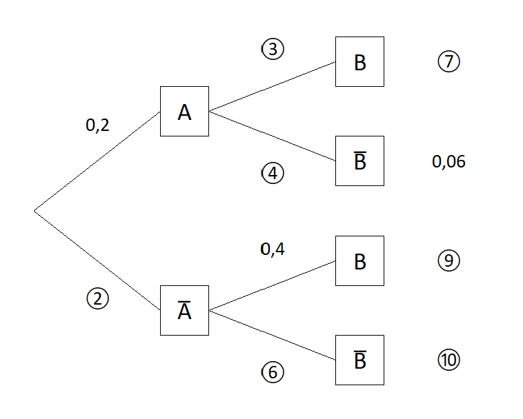

## Einführung

Wenn mehrere Zufallsexperimente nacheinander durchgeführt werden, sprechen wir von einem mehrstufigen Zufallsexperiment. Zur übersichtlichen Darstellung nutzen wir häufig Baumdiagramme. Für jede Stufe des Zufallsexperiments werden die Ergebnisse des einzelnen Zufallsexperiments als Knotenpunkte dargestellt. Die Stufen werden dann durch Pfade miteinander verbunden. Ein Ergebnis des mehrstufigen Zufallsexperiments entspricht dann einem vollständigen Pfad im Baumdiagramm. An den einzelnen Pfaden stehen die entsprechenden Wahrscheinlichkeiten. Es gibt zwei wichtige Regeln:

- **Pfadmultiplikationsregel:** Die Wahrscheinlichkeit eines Ergebnisses ist das Produkt der Wahrscheinlichkeiten entlang des entsprechenden Pfades.
- **Pfadadditionsregel:** Die Wahrscheinlichkeit eines Ereignisses ist die Summe der Wahrscheinlichkeiten der Ergebnisse, die zu diesem Ereignis führen.

Da generell die Summe aller Wahrscheinlichkeiten eines Zufallsexperiments immer gleich 1 ist, ist auch die Summe der Wahrscheinlichkeiten aller Pfade, die von einem Knotenpunkt starten, gleich 1. Ebenso ist auch die Summe der Endwahrscheinlichkeiten gleich 1.

### Beispiel: Zweimaliger Münzwurf

Kopf ($K$) und Zahl ($Z$) treten bei einem einmaligen Wurf beide mit einer Wahrscheinlichkeit von 50&nbsp;% auf. Daraus ergibt sich folgendes Baumdiagramm:



Nach der Pfadmultiplikationsregel haben wir jede Endwahrscheinlichkeit mit $0{,}5\cdot 0{,}5=0{,}25$ berechnet.

Betrachten wir z.B. das Ereignis $E$: "Es wird zweimal das Gleiche geworfen.", so ist $E=\\{KK, ZZ\\}$, und nach der Pfadadditionsregel folgt nun

$$
\begin{align*}
P(E)&=P(\{KK\})+P(\{ZZ\})\\
&=0{,}25+0{,}25\\
&=0{,}5.
\end{align*}
$$

## Baumdiagramme vervollständigen

Häufig stehen wir vor der Aufgabe, ein unvollständiges Baumdiagramm zu vervollständigen. Dazu verwenden wir, dass die Summe der Wahrscheinlichkeiten der Pfade, die von einem Knotenpunkt starten, gleich 1 ist. Außerdem wenden wir die Pfadregeln geschickt an.







## Baumdiagramme interpretieren

Häufig liegt eine Situation vor, in der zwei Ereignisse $A$ und $B$ und deren Gegenereignisse auftreten. Zum Beispiel:

- $A$: Eine Person putzt sich regelmäßig die Zähne.
- $B$: Eine Person hat gesunde Zähne.

Das Baumdiagramm habe die Gestalt


Hinweise:

- Die Ergebnisemenge ist $S=\\{AB, A\overline{B}, \overline{A}B, \overline{A}\overline{B}\\}$.
- Es gilt $A=\\{AB, A\overline{B}\\}$ und $B=\\{AB, \overline{A}B\\}$.
- Auf der ersten Stufe stehen die Wahrscheinlichkeiten von $A$ und $\overline{A}$: $P(A)=0{,}5$ und $P(\overline{A})=0{,}5$.
- Auf der zweiten Stufe stehen die Wahrscheinlichkeiten von $B$ und $\overline{B}$ **in Abhängigkeit** davon, ob $A$ eingetreten ist oder nicht (diese Wahrscheinlichkeiten sind im Allgemeinen nicht $P(B)$ und $P(\overline{B})$).
- Da $B=\\{AB, \overline{A}B\\}$ haben wir $P(B)=0{,}2+0{,}05=0{,}25$. Die Wahrscheinlichkeit, dass eine Person gesunde Zähne hat, beträgt also 25&nbsp;%.
- "$\cap$-Ereignisse": Wegen $A\cap B=\\{AB\\}$ etc. entspricht jeder Pfad genau dem entsprechenden "$\cap$-Ereignis". Dann folgt $P(A\cap B)=0{,}2$. Die Wahrscheinlichkeit, dass eine Person sich regelmäßig die Zähne putzt und gesunde Zähne hat, beträgt also 20&nbsp;%.
- "$\cup$-Ereignisse": Wegen $\overline{A}\cup B=\\{AB, \overline{A}B, \overline{A}\overline{B}\\}$ etc. gehören zu jedem "$\cup$-Ereignis" immer genau drei Pfade. Dann folgt

  $$
  \begin{align*}
  P(\overline{A}\cup B)&=P(\{AB\}) + P(\{\overline{A}B\}) + P(\{\overline{A}\overline{B}\})\\
  &=0{,}2+0,05+0{,}45\\
  &=0{,}7.
  \end{align*}
  $$

  Die Wahrscheinlichkeit, dass eine Person sich nicht regelmäßig die Zähne putzt oder gesunde Zähne hat, beträgt also 70&nbsp;%.

{% include info.html
index="4"
frage="Bestimmung von Wahrscheinlichkeiten anhand eines Baumdiagramms (1. Stufe A und 2. Stufe B):
"
antwort="

$$
\begin{align*}
P(A)&: \text{entsprechnde Wkt. auf der 1. Stufe}\\
P(B)&: \text{Achtung: Diese Wahrscheinlchkeit kann nicht direkt abgelesen werden (wenn $A$ und $B$ stochastisch abhängig sind). Stattdessen verwenden wir $P(B)=P(A\cap B)+P(\overline{A}\cap B)$.}\\
P(A\cup B)&: \text{Summe der drei entsprechenden Pfadendwahrscheinlichkeiten}\\
P(A\cap B)&: \text{entsprechende Pfadendwahrscheinlichkeit}\\
P(A\cup B)-P(A\cap B) \text{ oder } P(A\cap\overline{B})+P(\overline{A}\cap B)&: \text{Summe der zwei entsprechenden Pfadendwahrscheinlichkeiten}\\
\end{align*}
$$

"
%}

## Weitere Baumdigramme

Baumdiagramme eignen sich auch dazu, komplexere Zufallsexperimente zu veranschaulichen:



<!--### Urnenmodelle
Ein wichtiges Beipsiel für mehrstufige Zufallsexperimente sind das Ziehen von Kugeln aus einer Urne. Hier müssen wir unterscheiden, ob Kugeln zurückgegelgt werden oder nicht.

#### Beispiel: Ziehen mit Zurücklegen
In einer Urne

und dann ein alltägliches zufallsexpeirment, das als urnenmodell interpretiert werden kann

-->
